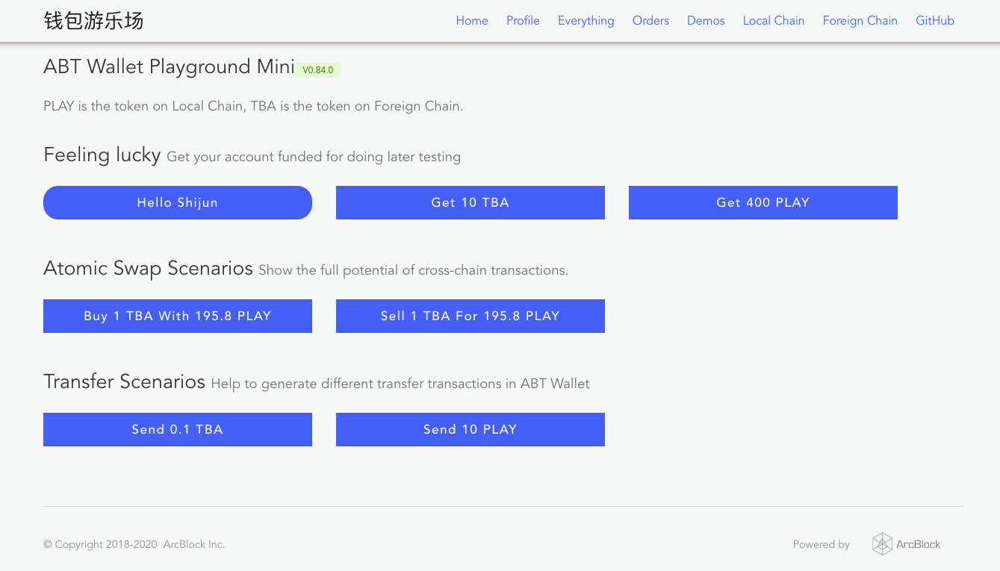
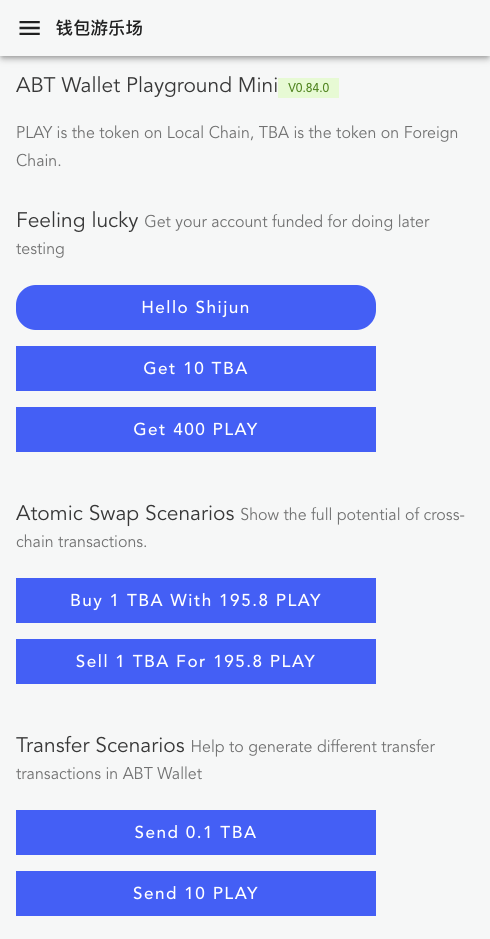
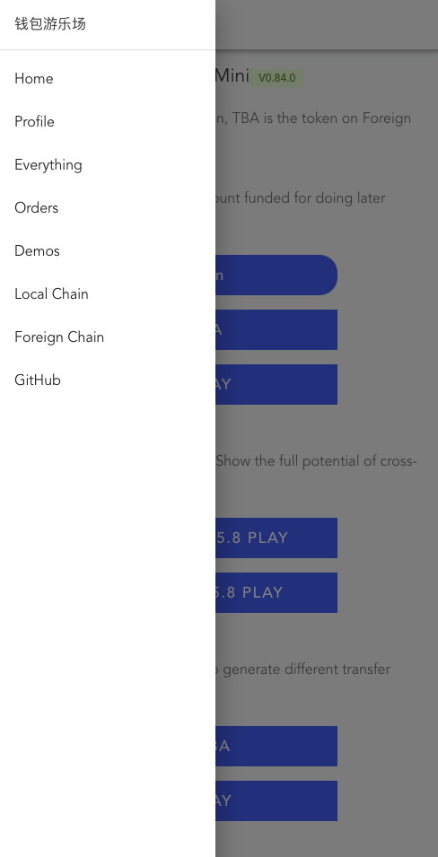

<style>table {display:table}</style>

## Why support Webview?

In the initial [ABT wallet](https://abtwallet.io) product design, for the security of the data in the wallet, we directly cut off the idea of supporting Webview in the wallet, so that the wallet is just a pure DID management tool. After all, users of ABT wallets will store digital assets in it, regardless of tokens. Still NFT.

With [DID Auth protocol](https://github.com/ArcBlock/abt-did-spec) support all applications developed based on ArcBlock technology will use the QR code as an entrance to initiate multiple types of interactions to complete point-to-point communication between the application and the user, such as requesting the user to provide a profile, requesting the user to sign a transfer transaction, and signing swap transactions.

With the iteration of the wallet, we are more and more aware of the security restrictions of the mobile phone operating system during the development of various small applications: for example, when the ABT wallet is called from the mobile browser and the authorization operation is completed, it may be called back to another browser ( see [Here](https://community.arcblockio.cn/t/topic/54)with [Here](https://github.com/ArcBlock/forge-js/issues/436)), The wallet user experience problems brought about by these security restrictions just likes lingering in the throat, we cannot live with it.

In the long run, user experience determines the development of the ecology, and this problem must be solved. After careful discussion and research, we found that in the current environment, supporting WebView in the wallet has more advantages than disadvantages:

- Webview is a relatively mature technology. After several security incidents, the mobile phone operating system has made many improvements. We can stand on the shoulders of giants.
- The biggest security risk of Webview may be the code injected into the native application by JS. This is not allowed and not supported in the ABT wallet.
- In Webview, the user-triggered interaction with the native wallet (called a DID-Auth session) is actually a point-to-point communication between the application and the wallet. There is asymmetric encryption technology to ensure security. The session result is directly referred to the application backend, which also guarantees Application security

## What changes will Webview bring?

What's changed since ABT wallet supports Webview?

- First of all, the code scanning function of the ABT wallet can directly open the URL. If the URL happens to be a dApp, it will be remembered by the wallet after one interaction.
- Secondly, all applications that have been interacted with the ABT wallet will be remembered. The next time they can be opened directly in the wallet's application list, making the user's search path shorter.
- Finally, any dApp developed using ArcBlock technology, if you want to open it in the wallet, you can open the application directly in the wallet through Deep Link supported by the wallet to provide the smoothest experience

If you want to experience these scenarios, you can scan the following two QR codes. You need to upgrade the ABT wallet to v2.5 before scanning. [Wallet Global Station](https://abtwallet.io)or [Wallet China](https://demo.wallet.arcblockio.cn)）：

| Open regular URL         | Open the app directly        |
| ------------------------ | ---------------------------- |
|  |  |

Some classmates may ask:**What's so special about ABT Wallet's Webview?**In fact, in addition to the security restrictions mentioned above, it is a standard Webview with a modern browser kernel embedded, and has very good support for HTML5 and CSS3.

## How to make dApp support Webview?

If you are not a developer, you can close this article now.

Next, we will introduce how to make your application experience in the wallet Webview better.

### Use Blocklet

This method is suitable for creating brand-new projects. We have updated all Starter Blocklets. The applications created using these Blocklets have adapted the ABT wallet well, such as automatic login, basic responsive layout, and so on. Built-in basic session management, user management, payment cases, and the steps to use Blocklet are very simple:

```shell
npm install -g @arcblock/forge-cli
forge blocklet:use forge-react-starter
```

::: warning
If you haven't used the Forge CLI (Swiss Army Knife developed by ArcBlock for dApps), please smash [Here](/handbook/1-introduction/install-forge-cli)。
:::

The currently released Javascript Blocklet front-ends use [React.js](https://reactjs.org/) Writing, backend used [Express.js](http://expressjs.com/)You can choose the following blocklets according to your preferences and actual needs:

- [forge-react-starter](https://blocklet.arcblockio.cn/starter/forge-react-starter)To integrate our Forge SDK into [create-react-app](https://github.com/facebook/create-react-app) Made, perfect for getting started
- [forge-next-starter](https://blocklet.arcblockio.cn/starter/forge-next-starter)To integrate our Forge SDK into [next.js](https://nextjs.org/) Made for students who need server rendering
- [forge-keystone-starter](https://blocklet.arcblockio.cn/starter/forge-keystone-starter)To integrate our Forge SDK into [next.js](https://nextjs.org/) with [keystone.js](https://www.keystonejs.com/) Made, suitable for scenarios that require server-side rendering and management background

### Integrated responsive layout

If you already have a running application that needs to adapt to the WebView of the ABT wallet, the first thing to consider is the responsive layout. Responsive layout allows any WebApp to flexibly scale on different screen sizes. We put the internal responsive layout After encapsulation, you can use it as follows:

First, install the dependencies:

```shell
yarn add @arcblock/ux
# OR
# npm install @arcblock/ux -S
```

Then, use it in the layout component of the WebApp `Layout` Components:

```javascript
import React from 'react';
import PropTypes from 'prop-types';
import BaseLayout from '@arcblock/ux/lib/Layout';

export default function Layout({ title, children }) {
  const links = [
    { url: '/', title: 'Home' },
    { url: '/profile', title: 'Profile' },
  ];

  if (env.chainHost) {
    links.push({
      url: getExplorerUrl(env.chainHost, 'local'),
      title: 'Local Chain',
    });
  }

  return (
    <BaseLayout title={title} brand={env.appName} links={links} baseUrl={env.baseUrl}>
      {children}
    </BaseLayout>
  );
}

Layout.propTypes = {
  title: PropTypes.string.isRequired,
  children: PropTypes.any.isRequired,
};
```

This responsive layout looks like this on the PC:



It looks like this on the mobile end:

| Menu collapse style           | Menu open style               |
| ----------------------------- | ----------------------------- |
|  |  |

### Conditional rendering of components

In some scenarios, some page elements may only be displayed or hidden in the wallet Webview. At this time, the User Agent needs to be checked, but we have also done out-of-the-box packaging.

First, install the dependencies:

```shell
yarn add @arcblock/react-hooks
# OR
# npm install @arcblock/react-hooks -S
```

Then, use it in the WebApp page `useBrowser` Hook：

```javascript
import React from 'react';
import useBrowser from '@arcblock/react-hooks/lib/useBrowser';

export default function MyComponent() {
  const browser = useBrowser();

  return (
    <div>
      {browser.wallet && <p>I am only visible when in ABT Wallet webview</p>}
      {!browser.wallet && <p>I am not visible when in ABT Wallet webview</p>}
    </div>
  );
}
```

### Automatically DID Login

When the user opens the application, if they need to log in automatically, they can do this:

First, install the dependencies:

```shell
yarn add @arcblock/did-react @arcblock/react-hooks
# OR
# npm install @arcblock/did-react @arcblock/react-hooks -S
```

Then, in the login page of the WebApp, use `useBrowser` Hook 和 `DidAuth` Component, for more complete code see [forge-react-starter](https://github.com/ArcBlock/forge-dapp-starters/tree/master/packages/forge-react-starter/templates)：

```javascript
import React, { useState, useEffect } from 'react';
import api from 'axios';
import useBrowser from '@arcblock/react-hooks/lib/useBrowser';
import DidAuth from '@arcblock/did-react/lib/Auth';

export function Login({ onLogin, loading }) {
  const browser = useBrowser();
  const [open, setOpen] = useState(false);

  // 检测到在钱包中就自动打开 DID 登录，DID 登录会自动唤起钱包原生界面
  useEffect(() => {
    if (browser.wallet) {
      setTimeout(() => {
        setOpen(true);
      }, 0);
    }
  }, [browser.wallet]);

  return (
    <div>
      {open && (
        <DidAuth
          responsive
          action="login"
          checkFn={api.get}
          onClose={() => setOpen(false)}
          onSuccess={() => console.log('login success')}
          checkTimeout={5 * 60 * 1000}
          messages={{
            title: 'Login Required',
            scan: 'Provide profile to login',
            confirm: 'Confirm on your ABT Wallet',
            success: 'Login Success',
          }}
        />
      )}
    </div>
  );
}
```

## FAQ

Here are some suggestions on how to get your dApp to run in ABT Wallet in the development environment:

### Use Chrome Developer Tools to simulate a wallet?

reference [Here](https://developers.google.com/web/updates/2015/07/add-a-new-custom-device-as-a-preset)The tutorial adds a few custom devices to your Chrome browser. The User Agent string for the new device can be set as follows:

- ABT Wallet for Android: `Mozilla/5.0 (Linux; Android 9; MIX 2 Build/PKQ1.190118.001; wv) AppleWebKit/537.36 (KHTML, like Gecko) Version/4.0 Chrome/80.0.3987.99 Mobile Safari/537.36 ABTWallet/2.5.0`
- ABT Wallet for iOS: `Mozilla/5.0 (iPhone; CPU iPhone OS 5_1 like Mac OS X) AppleWebKit/534.46 (KHTML, like Gecko) Version/5.1 Mobile/9B176 Safari/7534.48.3 ABTWallet/2.3.24`

In this way, after opening the debugging tool, you can see how your dApp behaves in ABT Wallet Webview.

### Use the wallet to directly open the dApp of the development environment?

Two conditions are required:

- Install on Chrome [This plugin](https://chrome.google.com/webstore/detail/quick-qr-code-generator/afpbjjgbdimpioenaedcjgkaigggcdpp), One-click to convert the URL of the current address bar into a QR code
- Make sure your wallet and computer are in the same network, otherwise the wallet cannot open the dApp of the development environment

### Encounter problems?

If you encounter other problems, please go to [Developer community](https://community.arcblockio.cn)For help, or to [GitHub repository](https://github.com/ArcBlock/forge-dapp-starters)Give us an issue.
