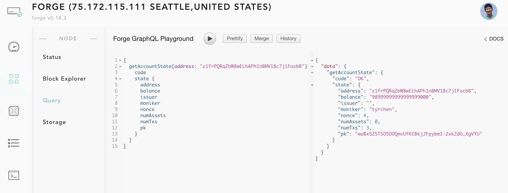

Unlike most of the blockchain platforms, Forge doesn't use JSON RPC as its public interface. JSON RPC is slow, error prone (type insecure), and inefficient (both payload and connection).

Forge support both [gRPC](https://grpc.io/) and [GraphQL](https://graphql.org/) for its RPC. gRPC is good for building backend services - so if you're building services on top of Forge, you should consider gRPC. GraphQL is good for web / mobile access, normally, if you want to serve mobile or web users with Forge API, GraphQL may better fit your requirement. We provide this flexibility so that you can choose best technologies to fit for your specific purpose.

Internally, GraphQL APIs are a wrap to the gRPC interfaces. To make things easy, we integrated a GraphQL playground for you to interact with the APIs Forge provided. You can choose one of the following methods to access the playground:

* Any public Forge Node. For example: [ArcBlock Test Chain](http://abt-test.arcblock.co:8210/node/query).
* The local node you started with `forge start`. Make sure your local node is started, then open this link: [http://localhost:8210/node/query](http://localhost:8210/node/query).

You should see a page like below. Write a GraphQL query and execute it. Here we query the account state with address `z1frPQRqZbW8wELhAPh1nBMV18c7j1FocbB`.



The query looks like this:

```graphql
{
  getAccountState(address: "z1frPQRqZbW8wELhAPh1nBMV18c7j1FocbB") {
    code
    state {
      address
      balance
      issuer
      moniker
      nonce
      numAssets
      numTxs
      pk
    }
  }
}
```

If you're not familiar with GraphQL, I recommended you to quickly go through the [GraphQL Tutorials](https://www.graphql.com/tutorials/).

After you execute the query, you'll see the result:

```json
{
  "data": {
    "getAccountState": {
      "code": "OK",
      "state": {
        "address": "z1frPQRqZbW8wELhAPh1nBMV18c7j1FocbB",
        "balance": "98999999999999999000",
        "issuer": "",
        "moniker": "tyrchen",
        "nonce": 4,
        "numAssets": 0,
        "numTxs": 3,
        "pk": "waBx5ZSTSO5DOQmvUfKCBkjJFpybm1-Zxk2dO_XgVYU"
      }
    }
  }
}
```

For more information about Forge RPC, please visit [Forge RPC](../rpc/).

## Why gRPC?

gRPC (Google Remote Procedure Calls) is an open source remote procedure call (RPC) system initially developed at Google. It uses HTTP/2 for transport, Protocol Buffers as the interface description language, and provides features such as authentication, bidirectional streaming and flow control, blocking or nonblocking bindings, and cancellation and timeouts. It generates cross-platform client and server bindings for many languages. Most common usage scenarios include connecting services in microservices style architecture and connect mobile devices, browser clients to backend services[^1].

[^1]: See [Wikipedia: gRPC](https://en.wikipedia.org/wiki/GRPC)


## Why GraphQL?

GraphQL is an open-source data query and manipulation language for APIs, and a runtime for fulfilling queries with existing data. It provides an efficient, powerful and flexible approach to developing web APIs by allowing clients to define the structure of the data required, and exactly the same structure of the data is returned from the server. Therefore no excessively large amounts of data from being returned. If you get familiar with GraphQL, from a client's point of view, the API is more powerful, secure (strong type system made server either fulfill the query, or fail, but server would never return a data that client didn't recognize)[^2].

[^2]: See [Wikipedia: GraphQL]([https://en.wikipedia.org/wiki/GRPC](https://en.wikipedia.org/wiki/GraphQL))
