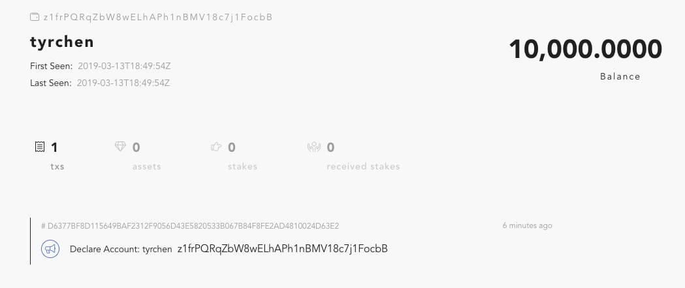

forge 的一个重要设计方面是使新手尽可能容易地熟悉 Forge。如果您按照[概览](../../intro)的“快速入门”部分操作，应该已经使用了其中很多：forge cli、forge 网页和 forge 模拟器。现在，您应该可以发送第一笔交易了，但在此之前，您需要一个钱包。

## 关于钱包

如果您熟悉区块链技术，可跳过下个部分。

在区块链世界，钱包其实是一个地址，而地址是被通过公共密钥加密算法生成的密钥对支持。如果您用过比特币或以太坊，可能已经知道[ECDSA（椭圆曲线数字签名算法）](https://en.wikipedia.org/wiki/Elliptic_Curve_Digital_Signature_Algorithm)了——ECDSA 是 DSA（数字签名算法）的一个变体，它使用椭圆曲线密码学。基本来说，如果您拥有一个钱包，您便会拥有密钥，密钥可生成其公共密钥，而公共密钥可被用于生成钱包地址。如果您想从钱包发送交易，需要生成交易数据并用自己的密钥签名。因为您的公共密钥包含在交易内，其他任何人都可以用它验证交易是否真正由您签署。这是区块链技术“信任”的基础。因为每个人都可以验证交易的真实性，它也被称为“公共可验证”。

比特币和以太坊使用 secp256k1 对其钱包进行公共密钥加密，为了生成钱包地址，他们使用固定的哈希算法。在 forge，我们在这方面灵活并可扩展——开发者或用户可选择其最喜欢的算法组合。例如，默认情况下，forge 的公共密钥加密使用 ED25519，公共密钥哈希使用 Sha3，地址使用 base58（实际上是带[multibase](https://github.com/multiformats/multibase)前缀的 base58）。

## 创建一个钱包

### 通过 Forge CLI 创建钱包

您可以通过使用 forge CLI 轻松创建钱包。请注意，在通常情况下，您不应用它创建一个存储贵重资产的钱包，除非您拥有当前的节点且节点位于安全环境。在这个例子中，因为我们在本地运行，便如下所示：

```bash
$ forge account:create
? Please input passphrase: helloworld
? Please input moniker: tyrchen
? Please select a account role type? ROLE_ACCOUNT
? Please select a key pair algorithm? ED25519
? Please select a hash algorithm? SHA3
──────────────
✔ account create success!
──────────────
{
  type: {
    pk: 'ED25519',
    hash: 'SHA3',
    address: 'BASE58',
    role: 'ROLE_ACCOUNT'
  },
  sk: '',
  pk: 'waBx5ZSTSO5DOQmvUfKCBkjJFpybm1+Zxk2dO/XgVYU=',
  address: 'z1frPQRqZbW8wELhAPh1nBMV18c7j1FocbB'
}
──────────────
✔ account unlocked!
ℹ run forge account z1frPQRqZbW8wELhAPh1nBMV18c7j1FocbB to inspect account state
```

通过您的密码加密（AES256），这个 CLI 会创建一个钱包并将其保存为密钥库（钱包位于：`$FORGE_HOME/core/keystore/z1f/rPQRqZbW8wELhAPh1nBMV18c7j1FocbB.key`[^1]）。在 forge CLI 中创建钱包后，该钱包会被解锁，即您可以在一段时间内用其发出交易。

[^1]：请注意，在运行上述 CLI 后，您创建的钱包地址会与这个不同。所以，密钥库文件不同。

### 通过 forge 控制台创建钱包

还记得在运行`forge start`时，它提出命令连接至 forge 远程控制台吗？

```bash
ℹ If you want to access interactive console, please run /Users/tchen/.forge_cli/release/forge/0.18.2/bin/forge remote_console
```

如果您想自己操作，可以连接至控制台，然后创建您的钱包，包含在`forge start`上提示的命令：

```bash
$ ~/.forge_cli/release/forge/0.18.2/bin/forge remote_console
Erlang/OTP 21 [erts-10.2.3] [source] [64-bit] [smp:8:8] [ds:8:8:10] [async-threads:1] [hipe]

Interactive Elixir (1.8.1) - press Ctrl+C to exit (type h() ENTER for help)
iex(forge@127.0.0.1)1> ForgeSdk.create_wallet(moniker: "cynthia", passphrase: "helloworld")
{%ForgeAbi.WalletInfo{
   address: "z115hJtnrYgyFTepXQbBEWHRPb1ZPydMvkis",
   pk: <<250, 96, 58, 155, 134, 18, 94, 46, 31, 170, 134, 4, 54, 129, 30, 147,
     120, 139, 208, 168, 87, 140, 12, 83, 110, 179, 248, 141, 69, 90, 9, 193>>,
   sk: "",
   type: %ForgeAbi.WalletType{address: 0, hash: 0, pk: 0, role: 0}
 }, "9981b5debd415bf85e94f8136a026d89"}
```

因为 Forge 的构建包含 erlang/elixir，这是 erlang 的默认控制台，即您可以在其中运行多种类型的 erlang/elixir 代码。 `ForgeSdk.create_wallet(moniker: "cynthia", passphrase: "helloworld")`是我们创建钱包时执行的函数。钱包创建后，返回的钱包里没有密钥(sk)，而是有一个凭证。之后您可以通过这个凭证来解锁钱包并签署交易。

如需退出 forge 控制台，请按下"CTRL+c"两次。

现在，如果您查看密钥库文件夹，会看到两个密钥库：

```bash
$ tree ~/.forge_release/core/keystore/
/Users/tchen/.forge_release/core/keystore/
├── z11
│   └── 5hJtnrYgyFTepXQbBEWHRPb1ZPydMvkis.key
└── z1f
    └── rPQRqZbW8wELhAPh1nBMV18c7j1FocbB.key
```

尽管我们使用相同的名字和密码，每次创建钱包时，都会生成一个新的密钥对，和一个新的钱包（地址）。

<!-- ### Create a wallet with Forge SDK

You can also create wallet with forge SDK easily, please refer [Forge SDK](../../instruction/sdk). -->

### 通过 Wallet 应用程序创建钱包

对普通大众来说，创建钱包最安全的方法便是使用钱包应用程序——一个 forge 兼容的钱包应用程序。目前，您可以使用 ArcBlock 钱包应用程序进行操作。

### 关于钱包的更多信息

我们使用第一个钱包地址 `z1frPQRqZbW8wELhAPh1nBMV18c7j1FocbB` 来看看我们在 forge 区块搜索器中可以找到什么。将地址粘贴（在这里请粘贴您通过 Forge CLI 创建的地址）到搜索器的搜索栏，然后点击回车键：


然后您会看到：



我们只是通过 Forge CLI 创建了一个钱包，为什么已经有已发出的交易？

您看到的交易是**声明账户**交易，如果您点击交易哈希，会看到：


在 forge，若不声明 tx，则钱包不能被使用。TX 的目的有几个：

- 为地址创建默认状态
- 在链上登记地址/钱包类型/公共密钥

在比特币/以太坊，其他人可在没有任何前提条件的情况下向您的钱包发送硬币/代币。您可以有一个只接收代币的钱包，尽管该钱包的状态不存在[^2]。在 Forge，因为它的主要目的是允许用户创建丰富的应用程序，提前将钱包状态放入链可解锁并简化很多用例。

[^2]：事实上，比特币是一个 UTXO 系统，它没有钱包状态；对于以太坊，如果钱包曾经发出过交易，则有钱包状态。

## 发出交易

现在，您有一个钱包，发出交易就很简单了。我们还是会使用钱包`z1frPQRqZbW8wELhAPh1nBMV18c7j1FocbB` 发出转移 tx。接收者是我们在 forge 控制台创建的那一个：`z115hJtnrYgyFTepXQbBEWHRPb1ZPydMvkis`。在发出交易前，您可以需要看看声明 tx 创建的钱包账户的状态。您可以使用 forge cli 这样做：

```bash
$ forge account z1frPQRqZbW8wELhAPh1nBMV18c7j1FocbB
{
  balance: '10000 TOKEN',
  nonce: 2,
  numTxs: 1,
  address: 'z1frPQRqZbW8wELhAPh1nBMV18c7j1FocbB',
  pk: 'waBx5ZSTSO5DOQmvUfKCBkjJFpybm1+Zxk2dO/XgVYU=',
  type: {
    pk: 'ED25519',
    hash: 'SHA3',
    address: 'BASE58',
    role: 'ROLE_ACCOUNT'
  },
  moniker: 'tyrchen',
  context: {
    genesisTx: 'D6377BF8D115649BAF2312F9056D43E5820533B067B84F8FE2AD4810024D63E2',
    renaissanceTx: 'D6377BF8D115649BAF2312F9056D43E5820533B067B84F8FE2AD4810024D63E2',
    genesisTime: '2019-03-13T18:49:54.707Z',
    renaissanceTime: '2019-03-13T18:49:54.707Z'
  },
  issuer: '',
  migratedTo: [],
  migratedFrom: [],
  numAssets: 0,
  stake: {
    totalStakes: '0',
    totalUnstakes: '0',
    totalReceivedStakes: '0',
    recentStakes: {
      items: [],
      typeUrl: 'fg:x:address',
      maxItems: 128,
      circular: true,
      fifo: false
    },
    recentReceivedStakes: {
      items: [],
      typeUrl: 'fg:x:address',
      maxItems: 128,
      circular: true,
      fifo: false
    }
  }
}
```

 钱包创建的账户状态非常大。目前，请不要担心您不理解的数据。为了开发方便，所有新声明的钱包的状态中都会有 10,000 个代币。我们可以将其用户互相转移代币。

### 通过 forge CLI 转移

我们可以使用`forge tx:send` CLI 发出交易。如果您选择发送 tx 的钱包未被解锁，Forge CLI 会提醒您输入密码，以便其解锁钱包并使用密钥签署交易：

```bash
$ forge tx:send
? Use cached wallet <z1frPQRqZbW8wELhAPh1nBMV18c7j1FocbB>? Yes
? Please enter passphrase of the wallet: helloworld
? Select transaction type you want to send: TransferTx
? Please enter the itx data object (js supported): Received
──────────────
{
  to: 'z115hJtnrYgyFTepXQbBEWHRPb1ZPydMvkis',
  value: '1000',
  assets: [],
  data: null
}
──────────────
✔ tx send success! EAF6A091136A7D95AFA704993F43CA175844EFFAA8908A7A2F8F5BF1EE08F4A4
```

请注意，当您在`Please enter the itx data object`后点击回车键时，会弹出一个含默认值的编辑器，您可以复制粘贴上面显示的 json 数据：

```json
{
  "to": "z115hJtnrYgyFTepXQbBEWHRPb1ZPydMvkis",
  "value": "1000",
  "assets": [],
  "data": null
}
```

这个`TransferTx`会将 1000 单位发送至`z115hJtnrYgyFTepXQbBEWHRPb1ZPydMvkis`。请注意，默认情况下，$1 个代币 = 10^{16}单位$，当我们转移时，最小转移单位是 1 单位。

我们看看发送到链上的整个 tx：

```bash
$ forge tx EAF6A091136A7D95AFA704993F43CA175844EFFAA8908A7A2F8F5BF1EE08F4A4
{
  from: 'z1frPQRqZbW8wELhAPh1nBMV18c7j1FocbB',
  nonce: 3,
  signature: 'OjxrrpPr+6Xx76TTzX+u7m73Dvci8gWyhCqG58v8utjNceqSnEhN6hywrnOs6uk0XBwPUfqWdfzhPxK1D9uSCQ==',
  chainId: 'forge',
  signatures: [],
  itx: {
    type: 'TransferTx',
    value: {
      to: 'z115hJtnrYgyFTepXQbBEWHRPb1ZPydMvkis',
      value: '1000',
      assets: []
    }
  }
}
```

Forge CLI 会为交易为您填写几个值：

- **from**：发出者地址。
- **nounce**：此 tx 的随机值。
- **signature**：发出者此 tx 的签名。
- **chain_id**：这个 tx 所属的链。如果您没有改变`forge_release.toml`，默认链 id 是**forge**。

在链上执行 tx 后（您可能需要等待 5 秒），您可以得到两个地址的更新账户地址`z1frPQRqZbW8wELhAPh1nBMV18c7j1FocbB`和`z115hJtnrYgyFTepXQbBEWHRPb1ZPydMvkis`：

```bash
$ forge account z1frPQRqZbW8wELhAPh1nBMV18c7j1FocbB
{
  balance: '9999.9999999999999 TOKEN',
  nonce: 3,
  numTxs: 2,
  ...
}
```

发出者的余额减少 100 单位，接收者的余额则增加 100 单位。

```bash
$ forge account z115hJtnrYgyFTepXQbBEWHRPb1ZPydMvkis
{
  balance: '10000.0000000000001 TOKEN',
  nonce: 2,
  numTxs: 2,
  ...
}
```

祝贺您！您以发出自己的第一笔转移交易了！如果您想知道魔法是怎么发生的，请阅读[Forge 核心的交易章节](../../core/tx_protocol)。

### 通过 Forge 控制台转移（可选）

这个部分为勇敢或 elixir/erlang 用户提供。如果您知道 elixir/erlang 或不怕进行有点奇怪的操作，那就请继续读下去。

现在，再次输入 forge 控制台(`~/.forge_cli/release/forge/0.18.2/bin/forge remote_console`)。

首先，让我们创建一个`TransferTx`，我们想给`z115hJtnrYgyFTepXQbBEWHRPb1ZPydMvkis` 100 个代币，所以我们将地址放在`to`，值放在`ForgeAbi.token_to_arc(100)`：

```elixir
iex(forge@127.0.0.1)1> itx = ForgeAbi.TransferTx.new(to: "z115hJtnrYgyFTepXQbBEWHRPb1ZPydMvkis", value: ForgeAbi.token_to_arc(100))
%ForgeAbi.TransferTx{
  assets: [],
  data: nil,
  to: "z115hJtnrYgyFTepXQbBEWHRPb1ZPydMvkis",
  value: %ForgeAbi.BigUint{value: <<13, 224, 182, 179, 167, 100, 0, 0>>}
}
```

您可能在此看到`BigUint`，它的值很奇怪。我们之前提到，默认情况下，$1 个代币 = 10^{16}单位$，我们转移时，最低的转移值为 1 单位。因此，如果我们想转移 100 个代币，即为$100\*10^{16}$。这个数字很大。因此，我们需要一个方式，在所有语言间解码大整数（尽管 elixir、python 之类的语言支持任何数位的大数字，但很多语言只支持固定大小的整数）。如需有效编码大数据（字符串格式是最低效的方式），我们用其最小的二进制格式。如需了解`BigUint`的更多信息，请参考：[Forge 中的大整数处理](../../core/bigint)。

在我们发出交易前，和在 Forge CLI 中的操作一样，需要解锁钱包：

```
iex(forge@127.0.0.1)2> {w, t} = ForgeSdk.load_wallet(address: "z1frPQRqZbW8wELhAPh1nBMV18c7j1FocbB", passphrase: "helloworld")
{%ForgeAbi.WalletInfo{
   address: "z1frPQRqZbW8wELhAPh1nBMV18c7j1FocbB",
   pk: <<193, 160, 113, 229, 148, 147, 72, 238, 67, 57, 9, 175, 81, 242, 130, 6,
     72, 201, 22, 156, 155, 155, 95, 153, 198, 77, 157, 59, 245, 224, 85, 133>>,
   sk: "",
   type: %ForgeAbi.WalletType{address: 1, hash: 1, pk: 0, role: 0}
 }, "bedd6df719d6e142eef856f88fd7c847"}
```

在此，我们有钱包数据和凭证，可用其告诉 Forge 加载密钥，以签署 tx 并发出。`ForgeSdk.transfer`是一个辅助函数，会为您提供以下服务：

- 将`TransferTx`包裹在`Transaction`。
- 用钱包和凭证签署交易。
- 将交易发出到链。

```elixir
iex(forge@127.0.0.1)3> ForgeSdk.transfer(itx, wallet: w, token: t)
"9C2CD01B5EA739AEB430F300757DA74AB5D17F2F660DD090BD0BB80CA4D6F95C"
```

您可以使用`ForgeSdk.get_tx`找回交易单据：

```elixir
iex(forge@127.0.0.1)4> ForgeSdk.get_tx(hash: "9C2CD01B5EA739AEB430F300757DA74AB5D17F2F660DD090BD0BB80CA4D6F95C")
%ForgeAbi.TransactionInfo{
  code: 0,
  extra_meta: nil,
  hash: "9C2CD01B5EA739AEB430F300757DA74AB5D17F2F660DD090BD0BB80CA4D6F95C",
  height: 118,
  index: 0,
  tags: [],
  time: %Google.Protobuf.Timestamp{nanos: 348370000, seconds: 1552503566},
  tx: %ForgeAbi.Transaction{
    chain_id: "forge",
    from: "z1frPQRqZbW8wELhAPh1nBMV18c7j1FocbB",
    itx: %Google.Protobuf.Any{
      type_url: "fg:t:transfer",
      value: <<10, 36, 122, 49, 49, 53, 104, 74, 116, 110, 114, 89, 103, 121,
        70, 84, 101, 112, 88, 81, 98, 66, 69, 87, 72, 82, 80, 98, 49, 90, 80,
        121, 100, 77, 118, 107, 105, ...>>
    },
    nonce: 2,
    signature: <<153, 85, 120, 117, 178, 235, 91, 29, 57, 81, 114, 67, 14, 163,
      250, 131, 82, 250, 161, 75, 244, 20, 240, 169, 66, 228, 135, 242, 3, 179,
      149, 14, 240, 25, 89, 185, 209, ...>>,
    signatures: []
  }
}
```

请注意，`code`在此为 0，即 tx 成功执行。不是 0 的代码意味着 tx 执行失败。如需了解状态代码的更多信息，请查看：[Forge 状态代码](../../reference/code)。

现在，我们看看余额的格式：

```elixir
iex(forge@127.0.0.1)5> ForgeSdk.get_account_state(address: "z1frPQRqZbW8wELhAPh1nBMV18c7j1FocbB")
%ForgeAbi.AccountState{
  address: "z1frPQRqZbW8wELhAPh1nBMV18c7j1FocbB",
  balance: %ForgeAbi.BigUint{value: <<5, 93, 230, 167, 121, 187, 171, 252, 24>>},
  ...
}
```

这个读起来比较难，因此我们提供了一个`ForgeSdk.display`，显示更加人类可读的结果：

```elixir
iex(forge@127.0.0.1)6> ForgeSdk.get_account_state(address: "z1frPQRqZbW8wELhAPh1nBMV18c7j1FocbB") |> ForgeSdk.display()
%{
  address: "z1frPQRqZbW8wELhAPh1nBMV18c7j1FocbB",
  balance: 98999999999999999000,
  ...
}
```

我们可以看到，余额进一步减少了 100 个代币($100\*10^{16}$)。当然，接收者的余额增加了 100 个代币：

```elixir
iex(forge@127.0.0.1)7> ForgeSdk.get_account_state(address: "z115hJtnrYgyFTepXQbBEWHRPb1ZPydMvkis") |> ForgeSdk.display()
%{
  address: "z115hJtnrYgyFTepXQbBEWHRPb1ZPydMvkis",
  balance: 101000000000000001000,
  ...
}
```

希望您看得懂我在说什么。如果您没有完全理解一切，也不必担心。再次说明，您可以随意访问[Forge 核心交易章节](../tx_protocol)获取详情。

<!--stackedit_data:
eyJoaXN0b3J5IjpbMTUyNDY4NzQwMiwtNDM3NTQ0MzM0LDk4NT
YxODc1NCwtMTY2MDQzMzQxLC0xMTQxNDEzODc2LC0xNjQ3NzA3
NDg5LDEwMjc1NTk3MiwtMTUyMTIyMjMyMiwtOTI5NjYwLC00OT
czMjg1MTEsMzAxNDY4OTg0LDE2MTQzMjYxODUsLTE4MDEyNzA0
MzMsLTE5MzM2MTA5NDIsLTMzMDU3MDFdfQ==
-->
