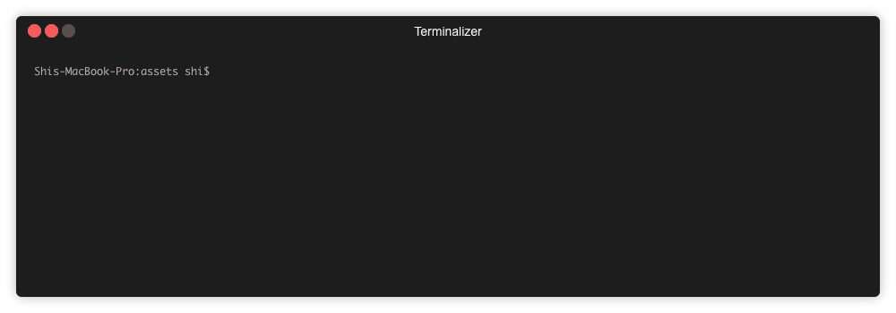

# How to Install Forge on CentOS Linux

This guide will show you how to install Forge on a machine running CentOS Linux.

Note: Do not run Forge on CentOS Linux 6 (or earlier).

## Step 1: Set Up Your Users

**Notes**:

* You can skip this step if you are already a sudo user.
* If you are using a cloud-hosted version of CentOS Linux, your installation may already come with a root user. If so, you'll need to disable it.

To create a sudo user called `arcblock` (or the name of your choice) and add it to the `wheel` group of the `sudoers` file, run:

```bash
adduser arcblock
usermod -aG wheel arcblock
```

Next, run `visudo` to allow the `wheel` group to run `sudo` commands without having to prompt the user for their password:

```bash
## Allows users in the wheel group to run all commands:
# %wheel        ALL=(ALL)       ALL

## Allows users in the wheel group to run all commands without a password
%wheel  ALL=(ALL)       NOPASSWD: ALL
```

At this point, switch to this sudo user.

If you've previously created an SSH connection to the host using the root account, you can switch the user over to your sudo user `arcblock` using:

```bash
cat ~/.ssh/id_rsa.pub | ssh root@host "mkdir -p ~arcblock/.ssh && touch ~arcblock/.ssh/authorized_keys && chown -R arcblock ~arcblock/.ssh && chmod -R go= ~arcblock/.ssh && cat >> ~/.ssh/authorized_keys"
```

## Step 2: Install Common Dependencies

The standard installation of CentOS Linux is missing several dependencies on which Forge relies. The following command will install all of the dependencies that are typically missing:

```bash
sudo yum -y update
sudo yum install -y autoconf automake epel-release git gcc libtool m4 make ncurses-devel openssl-devel perl-core rpm-build tar vim wget zlib-devel
```

## Step 3: Install Node.js

Force CLI requires Node.js, which is available in the [NodeSource Node.js Binary Distributions repository](https://github.com/nodesource/distributions). In short, the command to run is as follows (be sure to update the version number indicated):

```bash
curl -sL https://rpm.nodesource.com/setup_11.x | sudo bash -
sudo yum install -y nodejs
```

Once the process is complete, check the Node.js version installed:

```bash
$ node -v
```

While Node.js ships with the **npm** package manager, we recommend that you install the **yarn** package manager as well:

```bash
curl -sL https://dl.yarnpkg.com/rpm/yarn.repo | sudo tee /etc/yum.repos.d/yarn.repo
sudo yum install -y yarn
```

## Step 4: Install the Forge CLI

Using Yarn, install the Forge CLI:

```bash
sudo yarn global add @arcblock/forge-cli
```

### Step 5: Add a Non-Privileged User

We don't recommend running Forge using a sudo user, so create a new non-privileged user (in this case, we'll call it **forge**) and add a proper path so that it is accessible:

```bash
sudo adduser forge
echo 'export PATH=/usr/local/bin:/usr/local/ssl/bin:/usr/local/sbin:$PATH' | sudo tee --append ~forge/.bashrc
```

Use the sudo user `arcblock` SSH to the host and install assets whenever necessary. Otherwise, use the non-privileged `forge` user to run the CLI. 

Switch to the `forge` user with `sudo su forge` and check if Forge CLI is installed successfully with `forge -h`:



🎉 Forge CLI has been installed successfully! Checkout [Quickstart](../../../intro/quickstart) to launch your chain！
