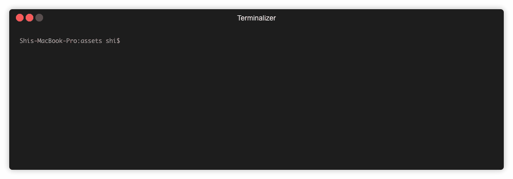

全新 centos 机器缺少几个 Forge 所需的依赖。如果您在 MacOS 下运行 Forge 时遇到问题，请往下读。

## 基础设置

1. 设置编译基础设施

```bash
$ xcode-select --install
```

2. 安装[Homebrew](https://brew.sh/)

```bash
$ /usr/bin/ruby -e "$(curl -fsSL https://raw.githubusercontent.com/Homebrew/install/master/install)"
```

如果您的 Mac 上已经安装了`Homebrew`，可以运行`brew update`升级您的 Homebrew。

3. 安装必要的系统包

```bash
brew install automake libtool pkg-config libffi gmp openssl
```

## 安装 Node.js

```bash
brew install node
```

为了确保您正确地安装了 Node，请在终端输入`node -v`。您应该可以看到：

```bash
$ node -v

v10.5.0
```

为了确保您正确地安装了 NPM，请在终端输入`npm -v`。您应该可以看到：

```bash
$ npm -v

6.1.0
```

您也可以运行`brew upgrade node`升级您的`Node`和`npm`

## 安装 Forge CLI

```bash
$ npm install -g @arcblock/forge-cli
```

在您的电脑上安装 Forge CLI 可能需要一些时间

运行`forge -h` 检查 Forge CLI 是否已成功安装：



🎉 Forge CLI 已经安装成功了，现在去 [快速入门](../../../intro/quickstart) 尝试发一条链吧！
