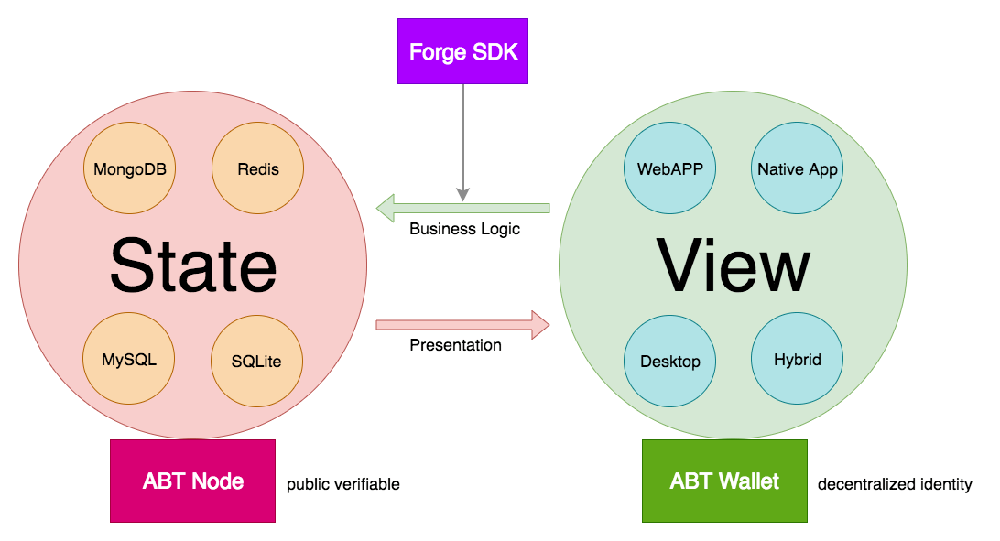
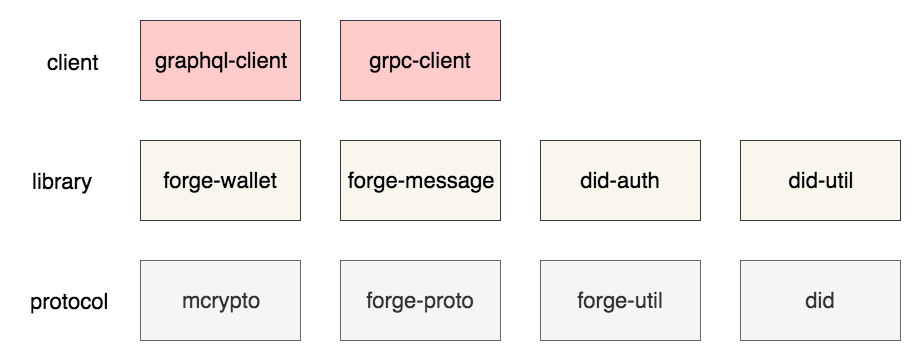

## SDK 定位

站在很高的高度去看，任何应用，不论是传统的互联网应用还是区块链应用，都是在处理数据状态和应用视图之间的来回变换，SDK 负责简化这个变换过程中的各种必要操作。



从这个视角看，Forge 链是应用状态存储的一种有效方式，而 Forge SDK 是链接状态和应用的桥梁。

Forge 在设计的时候，尽可能的保证了各层、各面的可扩展性。不论什么语言的 Forge SDK，都服务于以下 3 个目标：

- 支持基本的区块链数据操作，比如哈希、签名、加密、解密等
- 支持基本的链上数据读写，将应用代码和 Forge 链链接起来
- 尽可能简化第一个目标中开发者需要做的各种操作

## 必要组件

> 模块化，以及模块的高内聚和低耦合是实现软件可扩展性和可维护性的重要手段。

为完成上述目标，Forge SDK 需要的功能模块划分如下：



- 协议层：定义了各种数据结构（Forge 中使用 protobuf 定义）、数据变化方式（哈希、签名、加解密等）、 DID 生成过程
- 类库层：定义如何组装 Forge 能识别的消息，怎么解码从 Forge 拿回来的数据，比如对钱包的封装、对 Forge 能收发的交易消息的封装
- 客户端：定义如何连接 Forge 链节点（Forge 支持 gRPC 和 GraphQL 两种方式），如何执行常见的链上操作等

不同语言应用的领域会有很大不同，对应的 SDK 实现也有侧重点，比如：

- 如果是偏后端的语言 SDK，侧重实现 gRPC 就可以了
- 如果不需要支持 ABT Wallet 交互的逻辑处理，不需要实现 DID 认证相关逻辑
- 如果不需要支持丰富的数据哈希、加解密、签名算法，支持 Forge 选取的标准算法即可

## 基本步骤

做完模块划分之后再去实现 Forge SDK，只需要按部就班即可。

### 数据哈希和加解密

这部分功能主要包括在 `mcrypto` 模块中，不同语言的实现参考：

- [Elixir/Erlang](https://github.com/ArcBlock/mcrypto)
- [Javascript/Node.js](https://github.com/ArcBlock/forge-js/tree/master/forge/mcrypto)

该模块中需要实现的主要功能包括：

- `Hasher`：对数据做哈希，支持求不同长度的 Hash，至少需要支持的长度为 224、256、384、512，需要支持的哈希算法包括：Sha2、Sha3
- `Signer`：支持基于非对称加密的签名生成和校验，核心接口是 `sign(data, privateKey) => signature`，`verify(data, publicKey, signature) => true|false`，此外还应该支持随机生成公私钥对，至少需要支持的非对称加密算法包括 `ED25519`
- `Crypter`：对数据做加密和解密，可以是对称的，也可以是非对称的，至少支持 `AES CBC 256`，目前的 SDK 中还比较少用

### DID 生成

任何 Forge 体系中的实体都有自己的 DID，包括节点、合约、账户、资产等等，技术视角看，DID 是编码了其所指称的实体部分特征的根据公私钥对计算出来的钱包地址。在 [ABT DID 协议](https://github.com/ArcBlock/ABT-DID-spec#create-did)中详细描述了这个过程，并且我们有篇[工程博客](https://www.arcblock.io/zh/post/2019/05/28/did-101)详细介绍生成步骤。

不同语言的 DID 生成过程参考：

- [JavaScript/Node.js](https://github.com/ArcBlock/forge-js/tree/master/did/did)
- [Elixir/Erlang](https://github.com/ArcBlock/abt-did-elixir/blob/master/lib/abt_did.ex)

### 消息编解码

SDK 和 Forge 通信时需要使用 Protobuf 进行数据的编解码，这样 SDK 里面就需要知道 Forge 里面的数据结构，SDK 里面需要用到的数据结构主要有下面两部分：

- [Forge ABI](https://github.com/ArcBlock/forge-abi/tree/master/lib/protobuf)
- [Forge Core Protocols](https://github.com/ArcBlock/forge-core-protocols)

拿到这两份代码之后，需要使用 `protoc` 之类的工具，将其编译成你所需要的特定语言的实现，这样才能在特定语言中实现消息的编解码。

### 钱包封装

对钱包进行封装主要是为了简化操作，比如支持 `fromRandom`、`fromSecretKey`、`fromPublicKey` 等方法都返回相同的钱包结构体，而这些返回值都支持诸如 `toAddress`、`sign(data)`、`verify(data, signature)` 的操作。比如 [Javascript SDK](https://github.com/ArcBlock/forge-js/tree/master/forge/forge-wallet) 就对钱包操作做了特别的封装。

### gRpcClient

#### 数据读操作

完事具备，接下来，借助 `protoc` 生成的代码，我们就可以完成基本的数据读操作：

```javascript
const grpc = require('grpc');
const { RequestGetConfig } = require('/path/to/generated/code');
const { StateRpcClient } = require('/path/to/generated/code');

const endpoint = 'tcp://127.0.0.1:28210';
const client = new StateRpcClient(endpoint, grpc.credentials.createInsecure());

const message = new RequestGetConfig();
message.setParsed(true);

const response = await client.getConfig(message);
console.log(response.toObject());
```

#### 数据写操作

因为往区块链写数据，通常等价于发送交易，发送交易前需要对交易做签名：

```javascript
const grpc = require('grpc');
const Wallet = require('/path/to/your-wallet-implementation');
const { RequestSendTx, DeclareTx, Transaction } = require('/path/to/generated/code');
const { ChainRpcClient } = require('/path/to/generated/code');

const endpoint = 'tcp://127.0.0.1:28210';
const client = new ChainRpcClient(endpoint, grpc.credentials.createInsecure());
const wallet = Wallet.fromRandom(); // generates a random wallet with sha3256,role_account,ed25519

const itx = new DeclareTx();
itx.setMoniker('test-wallet');

const tx = new Transaction();
tx.setNonce(Date.now());
tx.setFrom(wallet.toAddress());
tx.setPk(wallet.publicKey);
tx.setChainId('forge'); // must be same from chain
tx.setItx(itx);

const signature = wallet.sign(tx.serializeBinary()); // sign the buffer presentation of the message
tx.setSignature(signature);

const message = new RequestSendTx();
message.setTx(tx);

const response = await client.getConfig(message);
console.log(response.toObject());
```

### GraphQLClient

> TODO

## 基本接口

封装好 SDK 之后，其基本使用方法，应该足够简洁，比如下面是 Javascript SDK 的基本用法：

```javascript
const ForgeSDK = require('@arcblock/forge-sdk');

// Connect to multi endpoints
ForgeSDK.connect('https://test.abtnetwork.io/api', { name: 'test' });
ForgeSDK.connect('https://zinc.abtnetwork.io/api', { name: 'zinc' });
ForgeSDK.connect('tcp://127.0.0.1:28210', { name: 'local' });

// Declare on test chain
ForgeSDK.sendDeclareTx({
  tx: { itx: { moniker: 'abcd' } },
  wallet: ForgeSDK.Wallet.fromRandom(),
}).then(console.log);

// Get zinc chain info
ForgeSDK.getChainInfo({ conn: 'zinc' }).then(console.log);

// Get local chain info
ForgeSDK.getChainInfo({ conn: 'local' }).then(console.log);
```

## 注意事项

### 兼容性测试

基本模块比如 mcrypto、did 的输入输出测试用例需要和 `Elixir/Erlang` 严格匹配，测试用例详见对应仓库的 `tests` 目录，ArcBlock 官方维护的 SDK 也是这么做的。
