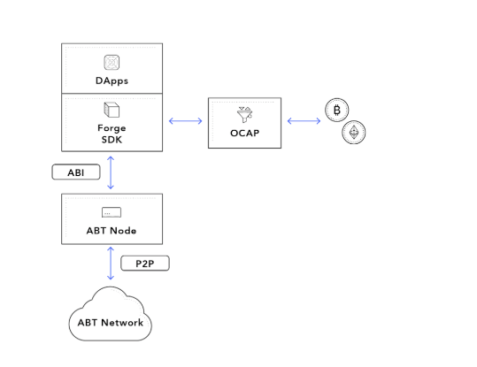

This chapter gives a high level overview of the SDK. If you want to understand the big picture of what Forge SDKs can do, please read on before you jump to your favourite language.

Quick Access to all languages of SDK supported:

- [JavaScript SDK](./javascript)
- [Java SDK](./java)
- [Python SDK](./python)
- [Elixir SDK](./elixir)

## Overview of Forge SDK

Forge SDK serves as a layer between Forge powered chain and DApps, providing APIs for interaction with the chain.

SDK APIs consists of following categories:

- [**Chain**](../../reference/rpc/chain): interactions with chain
- [**Stastics**](../../reference/rpc/stats): query statistics of chain
- [**Wallet**](../../reference/rpc/wallet): interactions with wallet
- [**State**](../../reference/rpc/state): query states of different objects
- [**Subscription**](../../reference/rpc/event): receive stream of information
- [**Transaction**](../../reference/rpc/transaction): helpers functions to simplify building and sending a tx
- [**Misc**](../../reference/rpc/misc): other functions
