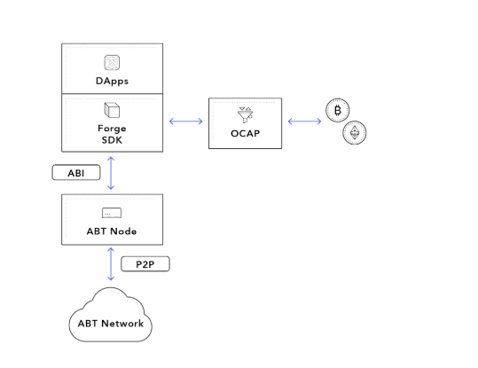

目前我们提供支持多种语言，包括 javascript/nodejs、python、java、elixir/erlang 等的 SDK。我们会继续发展 SDK，以支持更多语言。如果您对为您最喜欢的语言构建 SDK，请告诉我们，以便我们的团队迅速为您提供帮助。

- [JavaScript SDK](./javascript)
- [Java SDK](./java)
- [Python SDK](./python)
- [Elixir SDK](./elixir)

## SDK 一般概览

Forge SDK 的目的是，使与 Forge 构建的链的互动尽可能简单。所有 SDK API 都分为以下类别：

- [**链API**](../../reference/rpc/chain): 提供链相关的API接口
- [**统计API**](../../reference/rpc/stats): 链上数据统计相关的API接口
- [**钱包API**](../../reference/rpc/wallet): 链上创建账户相关的API接口
- [**状态API**](../../reference/rpc/state): 查询链上状态信息的API接口
- [**订阅API**](../../reference/rpc/event): 订阅某种交易的API结构
- [**交易API**](../../reference/rpc/transaction): 简化发送交易的API接口
- [**杂项API**](../../reference/rpc/misc): 解析配置等
