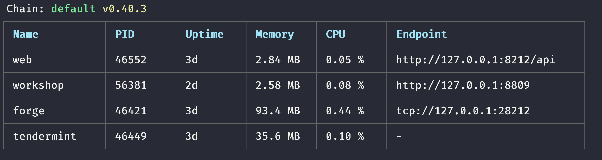

## Forge-java-sdk

forge sdk for java development.
For Forge-related setup, please checkout [Forge](https://github.com/ArcBlock/forge)

A detailed reference manual for forge-java-sdk can be found [here](../../../instruction/sdk/java).

## Installation

if you are using gradle ,you have to add url to your repositories

```gradle
 repositories {
      maven { url "http://android-docs.arcblock.io/release" }
 }

 dependencies {
     implementation("io.arcblock.forge:core:${forge_version}")
     implementation 'io.grpc:grpc-netty:1.20.0'
 }
```

and java version must >= 8.

## Usage

### Step 0

First get your Forge running on local with [Forge CLI](/handbook).
Or you know another's node config info.

### Step 1

Find the config your forge is using by `forge ps`, find forge section, and get endpoint.



## Tutorials

### Step 0: create a project.

Create a SpringBoot gradle project. and ZX forge-java-sdk to it's dependencies.

```bash
brew install springboot
spring init --build=gradle --language=kotlin {project_name}
```

### Step 1: connect to Forge Node.

```kotlin
val forge = ForgeSDK.connect("localhost",28210)
```

when you want to connect with forge node.

### Step 2: create a wallet.

```kotlin
val chainInfo = forge.getChainInfo().info //get chain info
val alice = forge.createWallet()
forge.declare("Alice",alice)
```

you have to declare your account like sign up your account on chain.

### Step 3: Query your account information.

```kotlin
// create a stream to listen account state
val accountRequest = forge.getAccountState(object : StreamObserver<ResponseGetAccountState> {
	override fun onNext(value: ResponseGetAccountState?) {
		logger.info("\nAccountState balance:\n${BigInteger(value?.state?.balance?.unSign?.value?.toByteArray())}")
	}
	override fun onError(t: Throwable?) {}
	override fun onCompleted() {}
	})
	accountRequest.onNext(RequestGetAccountState.newBuilder().setAddress(alice.address).build())
```

this interface is a gRPC stream

### Step 4: CheckIn/Poke your wallet to get some token.

```kotlin
forge.poke(alice)
Thread.sleep(5000) //wait for block to commit
accountRequest.onNext(RequestGetAccountState.newBuilder().setAddress(alice.address).build())
```

wait some seconds, check your account balance .

### Step 5: Transfer your token to other.

create another wallet (suppose: Bob) as step 2.

```kotlin
//create a transfer tx and send
forge.transfer(alice, bob.address, BigDecimal("2E18").toBigInteger())
```

if it works, response will return a hash string. you can query this hash use forgeSDK,or query it in forgeWeb. After this tx confirmed, check Alice and Bob 's accounts to confirm if this transaction successfully.

::: tip
**TBA** is the default currency on Forge Chain. 1 TBA has 18 digits, so it shows as `1000000000000000000`.
and decimal is 18.
:::

## For java user

Java user can use kotlin object like below:

```java
ForgeSDK.Companion.connect("localhost",28210)
```

and use kotlin extention like below:

```
TransactionExtKt.multiSig(tx, alice)
```

🎉 Congratulations! You have finished the tutorial! Now you should have a general sense about how Forge works. Now continue to explore !
[simple demo project](https://github.com/ArcBlock/forge-java-sdk/blob/master/examples/src/main/java/com/example/demo/DemoApplication.kt)
