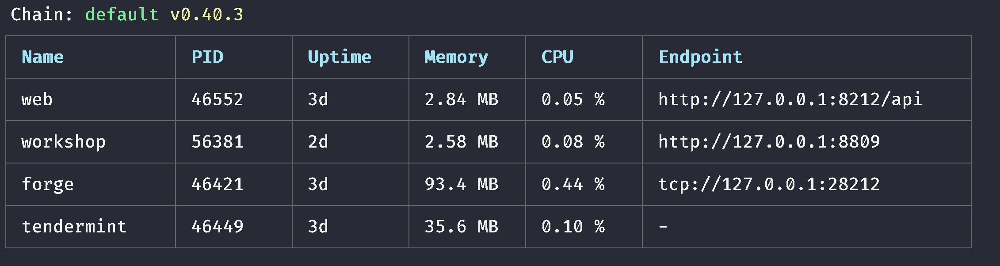

## Forge-java-sdk

forge sdk 供 java 开发。
如需了解 Forge-相关的设置，请查看[Forge](https://github.com/ArcBlock/forge)

Forge-java-sdk 的详细参考手册[在此](https://forge-java-sdk.netlify.com/)。

## 安装

如果您使用 gradle，必须在资源库中添加 url

```gradle
repositories {
  maven { url "http://android-docs.arcblock.io/release" }
}

dependencies {
  implementation("io.arcblock.forge:core:${forge_version}")
  implementation 'io.grpc:grpc-netty:1.20.0'
}
```

且 java 版本必须>= 8.

## 使用

### 第 0 步

首先，在本地搭配[Forge CLI](/handbook/)运行 Forge。

### 第 1 步

通过`forge ps`查看您的 forge 当前信息，找到 forge 的 endpoint。



## 教程

### 第 0 步：创建一个项目

创建一个 SpringBoot gradle 项目。然后将 forge-java-sdk 添加至其依赖。

```bash
brew install springboot
spring init --build=gradle --language=kotlin {project_name}
```

### 第 1 步：连接至 Forge Node

```kotlin
val forge = ForgeSDK.connect("localhost",28210)
```

### 第 2 步：创建一个钱包。

```kotlin
val chainInfo = forge.getChainInfo().info //get chain info
val alice = forge.createWallet()
forge.declare("Alice",alice)
```

::: tip
你必须在链上声明您的钱包，像是普通网站的注册一样。
:::

### 第 3 步：询问您的账户信息。

```kotlin
// create a stream to listen account state
val accountRequest = forge.getAccountState(object : StreamObserver<ResponseGetAccountState> {
  override fun onNext(value: ResponseGetAccountState?) {
		logger.info("\nAccountState balance:\n${BigInteger(value?.state?.balance?.unSign?.value?.toByteArray())}")
	}
	override fun onError(t: Throwable?) {}
	override fun onCompleted() {}
	})
accountRequest.onNext(RequestGetAccountState.newBuilder().setAddress(alice.address).build())
```

这是一个 gRPC stream 流，可以通过 onNext 查询某个或者很多账户的信息。

### 第 4 步：钱包签到以获得一些代币。

```kotlin
forge.poke(alice)
Thread.sleep(5000) //wait for block to commit
accountRequest.onNext(RequestGetAccountState.newBuilder().setAddress(alice.address).build())
```

等几秒，然后查看账户余额。

### 第 5 步：将您的余额转移给他人。

根据第 2 步操作创建另一个钱包（如：Bob）。

```kotlin
forge.poke(alice)
Thread.sleep(5000) //wait for block to commit
accountRequest.onNext(RequestGetAccountState.newBuilder().setAddress(alice.address).build())
```

如果有用，响应将返回一个哈希字符串。您可以使用 forgeSDK，或在 forgeWeb 内询问这个哈希。tx 确认后，检查 Alice 和 Bob 的账户以确认交易成功。

::: tip
**TBA**是 Forge 链上的默认货币。1 TBA 有 18 个数位，所以，显示为`1000000000000000000`。
小数是 18。
:::

## Java 使用者

Java 使用者可以按以下方式调用某些 kotlin 的 object 方法。

```java
ForgeSDK.Companion.connect("localhost",28210)
```

还可以像如下方式使用 kotlin 的扩展方法。

```java
TransactionExtKt.multiSig(tx, alice)
```

🎉 祝贺您！您已成功完成教程！现在您应该对 Forge 的工作原理有了基本的了解。继续探索吧！

<!--stackedit_data:
eyJoaXN0b3J5IjpbLTY3MzIyMjU0MywxNTQ4MzEzMTMyLC0xNT
kzOTU5NDIsMTc2MDczNzEwM119
-->
