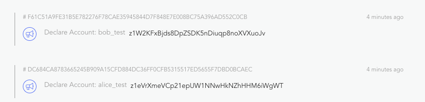

If you are a developer from traditional web development and not familiar with blockchain, please checkout [general concepts](../../../intro/concepts) first.

Forge Javascript SDK makes it very easy for developers to building applications on forge, it provides concise and simple api to helper developers accomplish following tasks:

- Create and manipulate wallets using just javascript: [@arcblock/mcrypto](https://www.npmjs.com/package/@arcblock/mcrypto), [@arcblock/forge-wallet](https://www.npmjs.com/package/@arcblock/forge-wallet)
- Read/Write on-chain data through [GraphQLClient](https://www.npmjs.com/package/@arcblock/graphql-client) or [GRpcClient](https://www.npmjs.com/package/@arcblock/GRpcClient)
- Derive/validate DID that are used widely in different forge components: [@arcblock/did](https://www.npmjs.com/package/@arcblock/did), [@arcblock/did-util](https://www.npmjs.com/package/@arcblock/did-util)
- Assemble/encode/sign a transaction that can be sent to any forge powered blockchain

Now, let's walk through the step-by-step guide to write a simple javascript program that may take a developer days or weeks to accomplish on other blockchain platforms:

1. Create 2 user accounts (`Alice` and `Bob`) on forge powered blockchain, which you can get up and running easily with [Forge CLI](/handbook/);
2. Get 25 free tokens for the newly created account
3. Transfer 5 token from `Alice` to `Bob`, inspect the balance

The whole process covers most of the tasks that a typical web application will do, such as:

- Setup a database, every blockchain is a public verifiable database
- Create user accounts (register/login)
- Update state for users (token/asset)
- Trade between users (transfer/exchange)

## Getting Started

### 1. Setup a running node

This step is not required to proceed to next steps, because forge javascript sdk is designed to work with any forge powered blockchain.

If you are interested in running a chain node on your local machine, take 10 minutes to checkout our awesome command line tool: [Forge CLI](/handbook/) and start a node.

Once your chain node has started, run `forge web open` to verify that the web dashboard/explorer of your chain is up and running. If the web dashboard of your chain node loads without any errors, means our database is set, we can use `http://127.0.0.1:8210/api` as graphql endpoint.

If you prefer to use existing chain(public sandbox database), please remember to replace endpoint in following code to our public testing chain endpoint: `https://test.abtnetwork.io/api`.

### 2. Init the javascript object

```bash
mkdir -p /tmp/hello-forge
cd /tmp/hello-forge
npm init -y
```

### 3. Create user accounts(wallets)

Cryptography is hard! So we created a multi-language package called `mcrypto` and utility library `forge-wallet` to help developers manipulate wallets that are compatible with forge.

To create user accounts we need first configure some properties of the accounts.

Add the following dependency:

```bash
yarn add @arcblock/forge-wallet @arcblock/mcrypto -S
touch index.js
```

Then, create 2 wallets named `Alice` and `Bob` with random secret key(`edit index.js`):

```javascript
const { types } = require('@arcblock/mcrypto');
const { fromRandom, WalletType } = require('@arcblock/forge-wallet');

const type = WalletType({
  role: types.RoleType.ROLE_ACCOUNT,
  pk: types.KeyType.ED25519,
  hash: types.HashType.SHA3,
});

const alice = fromRandom(type);
const bob = fromRandom(type);

console.log({ alice: alice.toJSON(), bob: bob.toJSON() });
```

Run `node index.js`, we will get:

```text
{ alice:
   { type:
      { role: 'ROLE_ACCOUNT',
        pk: 'ED25519',
        hash: 'SHA3',
        address: 'BASE58' },
     sk:
      '0xc5ef518f75347742858640e5685025dd7259e4417e037d65b68884ca8ea0068f03181ad64f61302de1f12903c99f6fd48da48b941391e0e0c85c6205b43cbd13',
     pk:
      '0x03181ad64f61302de1f12903c99f6fd48da48b941391e0e0c85c6205b43cbd13',
     address: 'z1icz5RNZuPRhDdKWg1GGjN1fcJ5NwccWpd' },
  bob:
   { type:
      { role: 'ROLE_ACCOUNT',
        pk: 'ED25519',
        hash: 'SHA3',
        address: 'BASE58' },
     sk:
      '0x3bd3d37e9bcc1ab61c52cbeb63118962ed43d2877344d2288225caf2cbcab7acfdfcc9a0146cf7f30af327090bbb1def2ddb9c08465623f901977e107df4686b',
     pk:
      '0xfdfcc9a0146cf7f30af327090bbb1def2ddb9c08465623f901977e107df4686b',
     address: 'z1m8hfeWSD4fZcycrHDgpJCRTHi2sowPXBt' } }
```

> Please note that, forge supports many wallet types, and developers can whatever types they want to use, the above wallet type is a typical combination, and it's ok to stick with this even in production. For all supported wallet types please refer to [enums](../../../reference/types/enum)

### 4. Register user on the chain

Similar to user registration in traditional web applications, forge requires an wallet(user account) to declare itself on the chain before accepting any further activities such as staking, voting and sending transaction from that wallet.

To register `Alice` and `Bob` on the chain, we will use `GraphQLClient`:

Add `@arcblock/graphql-client` as dependency:

```bash
yarn add @arcblock/graphql-client
```

Then, create an instance of `GraphQLClient`, then call `declare` on that instance:

```javascript
const { types } = require('@arcblock/mcrypto');
const { fromRandom, WalletType } = require('@arcblock/forge-wallet');
const GraphQLClient = require('@arcblock/graphql-client');

const type = WalletType({
  role: types.RoleType.ROLE_ACCOUNT,
  pk: types.KeyType.ED25519,
  hash: types.HashType.SHA3,
});

const alice = fromRandom(type);
const bob = fromRandom(type);

const host = 'http://127.0.0.1:8210';
const client = new GraphQLClient({ endpoint: `${host}/api` });

function registerUser(userName, userWallet) {
  return client.declare({
    moniker: userName,
    wallet: userWallet,
  });
}

(async () => {
  try {
    let hash = await registerUser('alice_test', alice);
    console.log('register alice tx:', hash);

    hash = await registerUser('bob_test', bob);
    console.log('register bob tx:', hash);
  } catch (err) {
    if (Array.isArray(err.errors)) {
      console.log(err.errors);
    }
    console.error(err);
  }
})();
```

Run `node index.js` again, we will get:

```bash
register alice tx: DC684CA8783665245B909A15CFD884DC36FF0CFB5315517ED5655F7DBD0BCAEC
register bob tx: F61C51A9FE31B5E782276F78CAE35945844D7F848E7E008BC75A396AD552C0CB
```

Open explorer: `http://localhost:8210/node/explorer/txs`, we can see that, the 2 accounts have already been registered on the chain:



> The screenshot above is from [Forge WEB](../../../tools/forge_web), which contains a build in web dashboard and block explorer for your chain.

> Here are are using `declare` to write data to the blockchain, many other [transaction types](../../../reference/txs) are supported. Full list of transaction send method list can be found at [GraphQLClient](https://www.npmjs.com/package/@arcblock/graphql-client).

### 5. Get 25 token for `Alice` and `Bob`

The most important usage of blockchain is recording state and transfers of value, value are presented with token, forge also support that.

#### 5.1 Default account balance

If we inspect the account we just created, we can see there balance is `0`:

```diff
diff --git a/index.js b/index.js
@@ -13,6 +13,7 @@ const bob = fromRandom(type);

 const host = 'http://127.0.0.1:8210';
 const client = new GraphQLClient({ endpoint: `${host}/api` });
+const sleep = timeout => new Promise(resolve => setTimeout(resolve, timeout));

 (async () => {
   try {
@@ -35,6 +36,10 @@ const client = new GraphQLClient({ endpoint: `${host}/api` });
       wallet: bob,
     });
+
+    await sleep(5000);
+    const { state: aliceState } = await client.getAccountState({ address: alice.toAddress() });
+    console.log('alice.balance', aliceState.balance);
   } catch (err) {
```

> Here we are using `getAccountState` to read data from the blockchain, we can also use GraphQLClient to read transaction/block/asset/chain info, please refer to [GraphQLClient](https://www.npmjs.com/package/@arcblock/graphql-client) for full list of API.

> You may also noticed that, we waited for 5 seconds before inspecting Alice's account balance, that's because 5 seconds is the block produce timeout for forge, which means that it takes at most 5 seconds before the transaction was executed by the chain and included in a block, this timeout can be configured in your [forge config](../../configuration).

#### 5.2 Get free token

Forge provides a special transaction type for developers to get test tokens for free:

```diff
diff --git a/index.js b/index.js
@@ -1,6 +1,7 @@
 const { types } = require('@arcblock/mcrypto');
 const { fromRandom, WalletType } = require('@arcblock/forge-wallet');
 const GraphQLClient = require('@arcblock/graphql-client');

 const type = WalletType({
   role: types.RoleType.ROLE_ACCOUNT,
@@ -26,7 +27,24 @@ function registerUser(userName, userWallet) {
   });
 }

+function getFreeToken(userWallet) {
+  return client.checkin({
+    wallet: userWallet,
+  });
+}
+
 (async () => {
+  console.log('alice.address(userId)', alice.toAddress());
+  console.log('bob.address(userId)', bob.toAddress());
   try {
     let hash = await registerUser('alice_test', alice);
@@ -34,9 +52,18 @@ function registerUser(userName, userWallet) {

     const { state: aliceState } = await client.getAccountState({ address: alice.toAddress() });
     console.log('alice.balance', aliceState.balance);
+
+    hash = await getFreeToken(alice);
+    console.log('get token for alice: ', hash);
+    hash = await getFreeToken(bob);
+    console.log('get token for bob: ', hash);
+
+    await sleep(5000);
+    const { state: aliceStateNew } = await client.getAccountState({ address: alice.toAddress() });
+    console.log('alice.balanceNew', aliceStateNew.balance);
   } catch (err) {
     if (Array.isArray(err.errors)) {
       console.log(err.errors);
```

Then, run `node index.js` again, we will get:

```bash
alice.address(userId) z1WrEtEV8QfVqfdVpMgP84zjqsAyvu9JQJx
bob.address(userId) z1gnRfzPLsvMzbnETWToC2KkZPS8DAUbu64
create account for alice on chain F229BAD518FBFF992DBA427EB41BB2FA4C47B737887A69148B2158EA6B270EDF
create account for bob on chain 983A330A062DE5D6939B77BC5C95443C1B879850FAF2B07C48381E7D1D0B9584
alice.balance 0
get token for alice:  9236928CBFD03E3B5C2DBD0963E0C0F1D9CECF48CB76612AE8B97136CCC3A33F
get token for bob:  C9C3A24FB12746F4E8049AD7088B9FADE92D5991152BA14B7C86B0DBDE92E01E
alice.balanceNew 250000000000000000
```

#### 5.3 Format account balance

You may notice that the token balance for `Alice` is a very large number, the reason big number is used is the deterministic requirement of blockchain, we can format the big number to human readable string with functions provided by `@arcblock/forge-util`.

> For all utility methods of `@arcblock/forge-util`, please refer to the [documentation](https://www.npmjs.com/package/@arcblock/forge-util)

```bash
yarn add @arcblock/forge-util
```

Then change `index.js` to format account balance:

```diff
diff --git a/index.js b/index.js
@@ -1,5 +1,6 @@
 const { types } = require('@arcblock/mcrypto');
 const { fromRandom, WalletType } = require('@arcblock/forge-wallet');
+const { fromUnitToToken } = require('@arcblock/forge-util');
 const GraphQLClient = require('@arcblock/graphql-client');

@@ -64,6 +65,7 @@ function getFreeToken(userWallet) {
     await sleep(5000);
     const { state: aliceStateNew } = await client.getAccountState({ address: alice.toAddress() });
     console.log('alice.balanceNew', aliceStateNew.balance);
+    console.log('alice.balanceNew.readable', fromUnitToToken(aliceStateNew.balance));
   } catch (err) {
```

Run `node index.js` again, we can see that `Alice` got 25 token:

```bash
alice.balanceNew 250000000000000000
alice.balanceNew.readable 25
```

> Forge allows developers to customize the token name/symbol/decimal on each chain, refer to [configuration](../../configuration) for details.

### 6. Transfer 5 token from `Alice` to `Bob`

Now both `Alice` and `Bob` can spend money on the chain, let's ask `Alice` to transfer 5 token to `Bob`.

Before we do actual transfer, let's do a little refactor: extract account balance inspecting to a helper function that will be reused:

```diff
diff --git a/index.js b/index.js
@@ -43,6 +43,11 @@ function getFreeToken(userWallet) {
   });
 }

+async function checkBalance(userName, userWallet) {
+  const { state } = await client.getAccountState({ address: userWallet.toAddress() });
+  console.log(`${userName}.balance`, fromUnitToToken(state.balance));
+}
+
 (async () => {
   console.log('alice.address(userId)', alice.toAddress());
   console.log('bob.address(userId)', bob.toAddress());
@@ -54,8 +59,8 @@ function getFreeToken(userWallet) {
     console.log('create account for bob on chain', hash);

     await sleep(5000);
-    const { state: aliceState } = await client.getAccountState({ address: alice.toAddress() });
-    console.log('alice.balance', aliceState.balance);
+    await checkBalance('alice.initial', alice);
+    await checkBalance('bob.initial', bob);

     hash = await getFreeToken(alice);
     console.log('get token for alice: ', hash);
@@ -64,8 +69,8 @@ function getFreeToken(userWallet) {

     await sleep(5000);
     const { state: aliceStateNew } = await client.getAccountState({ address: alice.toAddress() });
-    console.log('alice.balanceNew', aliceStateNew.balance);
-    console.log('alice.balanceNew.readable', fromUnitToToken(aliceStateNew.balance));
+    await checkBalance('alice.getToken', alice);
+    await checkBalance('bob.getToken', bob);
   } catch (err) {
     if (Array.isArray(err.errors)) {
       console.log(err.errors);
```

Token transfer is just a function call:

```diff
diff --git a/index.js b/index.js
@@ -1,6 +1,6 @@
 const { types } = require('@arcblock/mcrypto');
 const { fromRandom, WalletType } = require('@arcblock/forge-wallet');
-const { fromUnitToToken } = require('@arcblock/forge-util');
+const { fromUnitToToken } = require('@arcblock/forge-util');
 const GraphQLClient = require('@arcblock/graphql-client');

@@ -52,16 +52,17 @@ async function checkBalance(userName, userWallet) {
     await checkBalance('alice.getToken', alice);
     await checkBalance('bob.getToken', bob);
+
+    // Transfer
+    hash = await client.transfer({
+      to: bob.toAddress(),
+      token: 5,
+      wallet: alice,
+    });
+    console.log('transfer hash', hash);
+
+    await sleep(5000);
+    await checkBalance('alice.transfer', alice);
+    await checkBalance('bob.transfer', bob);
   } catch (err) {
     if (Array.isArray(err.errors)) {
```

Run `node index.js`, we can get:

```bash
alice.address(userId) z1WE7HCTNgshF7i5EbnDawA2MthfJghxC5j
bob.address(userId) z1hWaUK6LHbyWe72p2x1b17iD1xNJuFzVkU
register alice 309A3098B90519A98B248E05D6D50926F89AD346693CBC5A2322CC24DBBA4211
register bob B694FE8E64E70019D624454D29A037589D106775E47C1A899A1EDF2309F4643B
alice.initial.balance 0
bob.initial.balance 0
get token for alice:  3D1D6ED02F3F80CEE5AA3630EEB2ED68917252E00FE4533D12B3EA9D4D9B1F0A
get token for bob:  89090F0EF413545618FBD45C8306175311E18C7C2F2D2C34D69E743C80200CEB
alice.getToken.balance 25
bob.getToken.balance 25
transfer hash 629A6F151085951EB1C8567469E02C9C3276FA3A05B4FB49330C9AAC4B7D16D3
alice.transfer.balance 20
bob.transfer.balance 30
```

Now we have completed our first program with Forge Javascript SDK, you are quite familiar with the basic steps to write programs on forge powered blockchain.

The complete source code so far is:

```javascript
const { types } = require('@arcblock/mcrypto');
const { fromRandom, WalletType } = require('@arcblock/forge-wallet');
const { fromUnitToToken } = require('@arcblock/forge-util');
const GraphQLClient = require('@arcblock/graphql-client');

const type = WalletType({
  role: types.RoleType.ROLE_ACCOUNT,
  pk: types.KeyType.ED25519,
  hash: types.HashType.SHA3,
});

const alice = fromRandom(type);
const bob = fromRandom(type);

const host = 'http://127.0.0.1:8210';
const client = new GraphQLClient({ endpoint: `${host}/api` });
const sleep = timeout => new Promise(resolve => setTimeout(resolve, timeout));

function registerUser(userName, userWallet) {
  return client.declare({
    moniker: userName,
    wallet: userWallet,
  });
}

function getFreeToken(userWallet) {
  return client.checkin({
    wallet: userWallet,
  });
}

async function checkBalance(userName, userWallet) {
  const { state } = await client.getAccountState({ address: userWallet.toAddress() });
  console.log(`${userName}.balance`, fromUnitToToken(state.balance));
}

(async () => {
  console.log('alice.address(userId)', alice.toAddress());
  console.log('bob.address(userId)', bob.toAddress());
  try {
    // Register
    let hash = await registerUser('alice_test', alice);
    console.log('register alice', hash);
    hash = await registerUser('bob_test', bob);
    console.log('register bob', hash);

    await sleep(5000);
    await checkBalance('alice.initial', alice);
    await checkBalance('bob.initial', bob);

    // Get token
    hash = await getFreeToken(alice);
    console.log('get token for alice: ', hash);
    hash = await getFreeToken(bob);
    console.log('get token for bob: ', hash);

    await sleep(5000);
    const { state: aliceStateNew } = await client.getAccountState({ address: alice.toAddress() });
    await checkBalance('alice.getToken', alice);
    await checkBalance('bob.getToken', bob);

    // Transfer
    hash = await client.transfer({
      to: bob.toAddress(),
      token: 5,
      wallet: alice,
    });
    console.log('transfer hash', hash);

    await sleep(5000);
    await checkBalance('alice.transfer', alice);
    await checkBalance('bob.transfer', bob);
  } catch (err) {
    if (Array.isArray(err.errors)) {
      console.log(err.errors);
    }
    console.error(err);
  }
})();
```

## Want More ?

Here are some resources for you to learn more:

- [Forge Javascript SDK API Reference](https://forge-js.netlify.com)
- [Advanced Examples with GraphQLClient](https://github.com/ArcBlock/forge-js/tree/master/packages/graphql-client/examples)
- [Advanced Examples with GRpcClient](https://github.com/ArcBlock/forge-js/tree/master/packages/grpc-client/examples)

Besides, more documentation to make you up to speed on building applications on forge are on the way, stay tuned!

## Report Issues ?

If you got stuck on any step with the above work through, feel free to open issues on our [GitHub Repo](https://github.com/ArcBlock/forge-js/issues)
