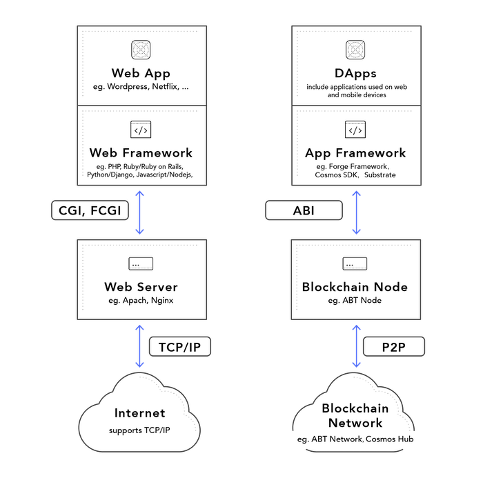

# General Concepts
Essential concepts to use Forge SDK for your first application

## Introduction

-----

[**Forge**](https://docs.arcblock.io/forge/intro/) is a framework for users to launch their own decentrailized applications on their own chains.

**Forge** helps users to build their own chain with three ready-to-use layers: **Consensus**, **Storage**, **Network Connections**. To build a decentralized application, users only need to focus on the top layer: appliciton logic, without worrying infrastructures underneath.

### DApps
**DApps** stands for decentralized application, which run on a distributed computing system.

### Forge Framework
To better understand Forge's role and function, we can look at what role Forge plays in a bigger picture in terms of traditional web development concepts.



## Accounts and Wallets

-----

### Accounts
 initiate a **transaction** on a Forge chain, users need to have accounts. Each account is has a unique address used by Forge to identify different users. Each user can have unlimited number of accounts with different addresses.

### Wallets

A wallets is a container of accounts's credentials,including the unique address, a secret Key (sk) and a public Key(pk). Users use their wallets to send and receive **transactions**.

```protobuf
message WalletInfo {
  WalletType type = 1;
  bytes sk = 2;
  bytes pk = 3;
  string address = 4;
}
```

* `type`: the cryptographic algorithms used to generate this wallet
* `sk`: secrety key
* `pk`: public key
* `address`: wallet address, which also the account address

### Keys

Depending on the **type** users choose for wallet, public keys are calculated out of secret keys, and addresses are calculated out of public keys. Therefore, secrety keys are very important, because anyone can fake other people's signatures to send malicious **transactions** with their secrety keys.

### Signatures

Each **transaction** carries a signature generated by send's **sk**. By verifying the signature with the sender's pk, which is published on the chain, anyone can verify that the transaction content is the same as the sender intended.

## Transactions

-----
 A transaction is the smallest unit of activites that can happen on chains built by **Forge**. Everything on a Forge chain are combinations of different **transactions**.

```protobuf
message Transaction {
  string from = 1;
  uint64 nonce = 2;
  string chain_id = 3;
  bytes pk = 4;
  bytes signature = 13;
  repeated Multisig signatures = 14;
  google.protobuf.Any itx = 15;
}
```

Above is the comlete definition of a **transaction**.

* `from`: the sender address that initiates the transaction
* `nonce`: an integer that track how many transactions this address has sent
* `chain_id`: a string that tracks on which chain this transaction happens
* `pk`: bytes of public key of sender
* `signature`: bytes of sender's signature over this transaction. Used by   receiver to verify that the content of this transaction has not been changed by other parties.
* `signatures`: signatures and address of third parties if this transaction requires approval of more than two parties
* `itx`: type and content of this transaction.

Detailed explanation of each field will be covered later.


## Inner Transactions(ITX)

Above we have seen the definition of each **transaction**, where the field `itx`, which stands for inner transaction decides the type of the **transaction** and essentially what activity it represents.

For example, `TransferTx` means this transaction represents the activity where one **account** is trying to transfer some ammount of money or asset to another **account**.

Each `itx` is encoded in `google.protobuf.Any` format, consisting of `type_url` and `value`.
* _type_url_: string that represents the identify of this inner transaction, which helps Forge to decide how to decode the `value` field
* _value_: serialized version of the inner transaction.

#### Type_Urls

Type_urls are strings that helps Forge to correctly decode the serialized itx. Each `type_url` should be registered on forge with corresponding itx definition. So when Forge sees a `type_url`, it can grab the correct `itx` type to decode the `value` field to get the complete inner transaction.

Since `type_urls` are used by Forge to interprate the type of `itx`, it's important that all `type_urls` follow the same nameing conventions. For example, the `type_url` of a `TransferTx` is
    ```fg:t:transfer```
In this case: `fg` stands for Forge, `t` for `transaction`, which means the type of this encoded `value` is a inner transaction, and `transfer` stands for the type of this inner transaction.

Every `protobuf.Any` should contain a `type_url` that specifies a registered format to decode the encoded `value` field. Later we will see more use cases of type_urls other than inner transaction.

#### Values

In `protobuf.Any`, `value` contains a serialized version of the inner transaction, which is not human readable.

For example, if we want to transfer 1 unit of currency to some address `zysnfkW9LH5jVUubpwcrGaopnN2oDBPTLmuP`. The `TransferTx` looks like:
```protobuf
TransferTx{
    to='zysnfkW9LH5jVUubpwcrGaopnN2oDBPTLmuP',
    value=BigUint(value=b'\x01')
}
```
After serialization, the itx looks like:
```'\n\x08address1\x12\x03\n\x010'```
And the entire `itx` should look like:
```protobuf
Any{
    type_url='fg:t:transfer',
    value='\n\x08address1\x12\x03\n\x010'
}
```

And when Forge sees `fg:t:transfer`, it will know how to decode the `value`.

### Types of Inner Transactions

Above we have seen `TransferTx`, which represents the transfer activity on Forge chain. Each activity has its own inner transactions, defined as different types.

For the complete list of itx types and explanations, please see [Forge ITX](https://docs.arcblock.io/forge/txs/declare.html).

## Commucation

Users communicate with Forge through [GRPC](https://grpc.io/docs/) calls or [GraphQL](https://graphql.org/learn/).

SDK has implemented many read-to-use GRPC APIs for users to use. Detailed guide for SDK can be found [here](https://docs.arcblock.io/forge/sdk/).

### Protobuf

To communicate in GRPC, all messages should be in the format of [protobuf](https://developers.google.com/protocol-buffers/), which is a format designed to seralize data transferred in **gRPC** calls.
