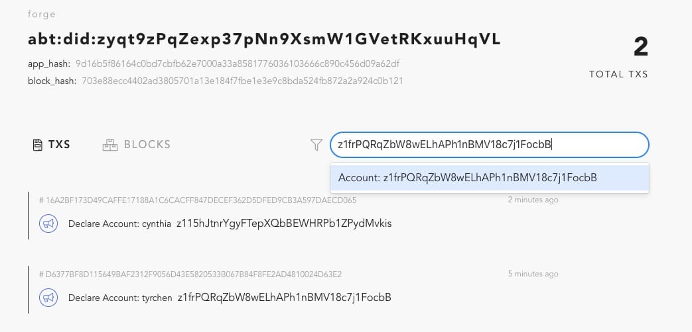
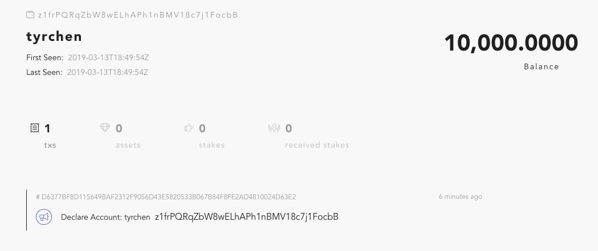
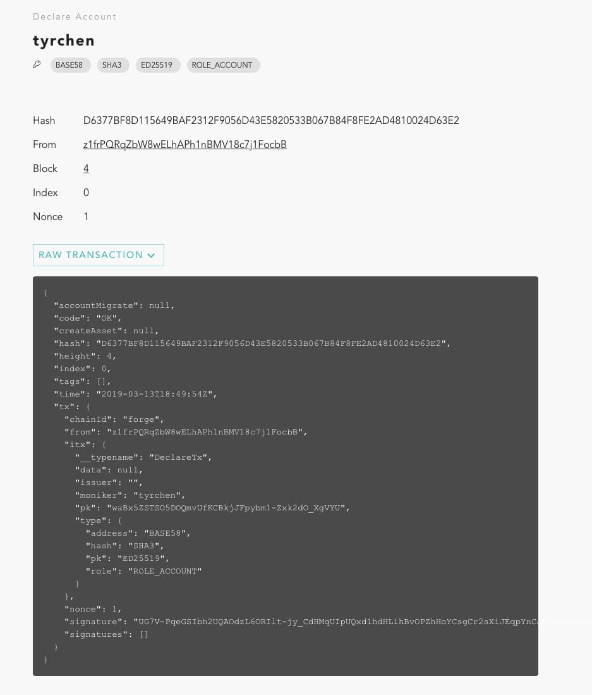

# Transactions in Forge

This article will show you how to create an account and send your first transaction using Forge.

**Note:** If you're new to Forge, please review the [Quick Start](../../intro) before proceeding.

## Create a wallet

To send transactions in Forge, you must first create an account. You can do so using the Forge CLI:

```bash
$ forge account:create
```

You'll see the following series of prompts for additional information related to your new account:

```bash
? Please input passphrase:
? Please input moniker:
? Please select a account role type?
? Please select a key pair algorithm?
? Please select a hash algorithm?
```

Once you've provided the requested information, Forge will create your wallet. If successful, you will see the following"

```bash
──────────────
✔ account create success!
──────────────
{
  type: {
    pk: 'ED25519',
    hash: 'SHA3',
    address: 'BASE58',
    role: 'ROLE_ACCOUNT'
  },
  sk: '',
  pk: 'waBx5ZSTSO5DOQmvUfKCBkjJFpybm1+Zxk2dO/XgVYU=',
  address: 'z1frPQRqZbW8wELhAPh1nBMV18c7j1FocbB'
}
──────────────
✔ account unlocked!
ℹ run forge account z1f...bB to inspect account state
```

The CLI will also save your account as a keystore, which is located in `$FORGE_HOME/core/keystore/z1f/rPQRqZbW8wELhAPh1nBMV18c7j1FocbB.key`). Your wallet is AES256- encrypted using the passphrase you provided when creating your wallet. Once you've created a wallet using the Forge CLI, it is unlocked and can be used to send transactions.

Note that the account's address changes after you run the Forge CLI, so the keystore file changes, too.

### Create a wallet with forge console

Still remember when you run `forge start`, it gave you a command to connect to the remote console for forge?

```bash
ℹ If you want to access interactive console, please run /Users/tchen/.forge_cli/release/forge/0.18.2/bin/forge remote_console
```

If you want to get your hands dirty, you can connect to the console and create your wallet with the command prompted on `forge start`:

```bash
$ ~/.forge_cli/release/forge/0.18.2/bin/forge remote_console
Erlang/OTP 21 [erts-10.2.3] [source] [64-bit] [smp:8:8] [ds:8:8:10] [async-threads:1] [hipe]

Interactive Elixir (1.8.1) - press Ctrl+C to exit (type h() ENTER for help)
iex(forge@127.0.0.1)1> ForgeSdk.create_wallet(moniker: "cynthia", passphrase: "helloworld")
{%ForgeAbi.WalletInfo{
   address: "z115hJtnrYgyFTepXQbBEWHRPb1ZPydMvkis",
   pk: <<250, 96, 58, 155, 134, 18, 94, 46, 31, 170, 134, 4, 54, 129, 30, 147,
     120, 139, 208, 168, 87, 140, 12, 83, 110, 179, 248, 141, 69, 90, 9, 193>>,
   sk: "",
   type: %ForgeAbi.WalletType{address: 0, hash: 0, pk: 0, role: 0}
 }, "9981b5debd415bf85e94f8136a026d89"}
```

Since Forge is built with erlang/elixir, this is the default console in erlang, which means you can run all kinds of erlang/elixir code in it. `ForgeSdk.create_wallet(moniker: "cynthia", passphrase: "helloworld")` is the function we execute to create a wallet. And once a wallet is created, it returned a wallet without secret key (sk), but with a token, so that later on you could use this token to unlock the wallet and sign the transaction.

To quit forge console, please press "CTRL+c" twice.

Now if you do look at the keystore folder, you'll find two keystores:

```bash
$ tree ~/.forge_release/core/keystore/
/Users/tchen/.forge_release/core/keystore/
├── z11
│   └── 5hJtnrYgyFTepXQbBEWHRPb1ZPydMvkis.key
└── z1f
    └── rPQRqZbW8wELhAPh1nBMV18c7j1FocbB.key
```

Although we use same moniker and passphrase, each time we create a wallet a new keypair is generated and as a result, a new wallet (address) is generated.

<!-- ### Create a wallet with Forge SDK

You can also create wallet with forge SDK easily, please refer [Forge SDK](../../instruction/sdk). -->

### Create a wallet with Wallet App

The most secure way to create a wallet for general public is using a wallet app - a forge compatible wallet app. Currently you can use ArcBlock Wallet App for that purpose.

### More information about wallet

Let's use the first wallet address `z1frPQRqZbW8wELhAPh1nBMV18c7j1FocbB` to see what can we find in forge block explorer. Paste the address (here please paste the address you created with Forge CLI) into the search box in the explorer, and press enter:



Then you would see:



Here we just created a wallet with Forge CLI, why there's transaction sent already?

The transaction you saw is the **Declare Account** transaction, if you click the transaction hash, you would see:



In forge, a wallet cannot be used without declare tx. This TX serves several purposes:

- create the default state for the address
- register the address / wallet type / public key in the chain

In Bitcoin / Ethereum, others can send coins / tokens to your wallet without any preconditions. You can have a wallet that just receive tokens, even if the state for that wallet doesn't exist[^2]. In Forge, since the main purpose of it is to allow users to build rich applications, putting the state of the wallet in the chain in advance would unlock and simplify lots of use cases.

[^2]:

  actually Bitcoin is an UTXO system, it doesn't have per wallet state; Ethereum has per wallet state if the wallet has ever sent transactions out.

## Send a transaction

Now that you have a wallet, sending a transaction is simple. We will still use the wallet `z1frPQRqZbW8wELhAPh1nBMV18c7j1FocbB` to send a transfer tx. The receiver will be the one we created in forge console: `z115hJtnrYgyFTepXQbBEWHRPb1ZPydMvkis`. Before sending a transaction, you may want to have a look at the account state for the wallet that was created by declare tx. You can use forge cli to do so:

```bash
$ forge account z1frPQRqZbW8wELhAPh1nBMV18c7j1FocbB
{
  balance: '10000 TOKEN',
  nonce: 2,
  numTxs: 1,
  address: 'z1frPQRqZbW8wELhAPh1nBMV18c7j1FocbB',
  pk: 'waBx5ZSTSO5DOQmvUfKCBkjJFpybm1+Zxk2dO/XgVYU=',
  type: {
    pk: 'ED25519',
    hash: 'SHA3',
    address: 'BASE58',
    role: 'ROLE_ACCOUNT'
  },
  moniker: 'tyrchen',
  context: {
    genesisTx: 'D6377BF8D115649BAF2312F9056D43E5820533B067B84F8FE2AD4810024D63E2',
    renaissanceTx: 'D6377BF8D115649BAF2312F9056D43E5820533B067B84F8FE2AD4810024D63E2',
    genesisTime: '2019-03-13T18:49:54.707Z',
    renaissanceTime: '2019-03-13T18:49:54.707Z'
  },
  issuer: '',
  migratedTo: [],
  migratedFrom: [],
  numAssets: 0,
  stake: {
    totalStakes: '0',
    totalUnstakes: '0',
    totalReceivedStakes: '0',
    recentStakes: {
      items: [],
      typeUrl: 'fg:x:address',
      maxItems: 128,
      circular: true,
      fifo: false
    },
    recentReceivedStakes: {
      items: [],
      typeUrl: 'fg:x:address',
      maxItems: 128,
      circular: true,
      fifo: false
    }
  }
}
```

An account state created for a wallet is pretty big. So far please don't worry about the data you don't understand. To make development easy, all newly declared wallets will have 10000 tokens in its state. We can use this to transfer tokens to others.

### Transfer with forge CLI

We can use `forge tx:send` CLI to send a transaction. If the wallet you choose to send tx is not unlocked, Forge CLI will prompt you to enter the passphrase so that it can unlock the wallet and use the secret key to sign the transaction:

```bash
$ forge tx:send
? Use cached wallet <z1frPQRqZbW8wELhAPh1nBMV18c7j1FocbB>? Yes
? Please enter passphrase of the wallet: helloworld
? Select transaction type you want to send: TransferTx
? Please enter the itx data object (js supported): Received
──────────────
{
  to: 'z115hJtnrYgyFTepXQbBEWHRPb1ZPydMvkis',
  value: '1000',
  assets: [],
  data: null
}
──────────────
✔ tx send success! EAF6A091136A7D95AFA704993F43CA175844EFFAA8908A7A2F8F5BF1EE08F4A4
```

Note that when you pressed enter for `Please enter the itx data object`, an editor will pop up with default values, you can copy & paste the json data showed above:

```json
{
  "to": "z115hJtnrYgyFTepXQbBEWHRPb1ZPydMvkis",
  "value": "1000",
  "assets": [],
  "data": null
}
```

This `TransferTx` send 1000 unit to `z115hJtnrYgyFTepXQbBEWHRPb1ZPydMvkis`. Note that by default $1 token = 10^16 unit$, and when we do transfer the minimum allowed value is 1 unit.

Let's see the whole tx sent to the chain:

```bash
$ forge tx EAF6A091136A7D95AFA704993F43CA175844EFFAA8908A7A2F8F5BF1EE08F4A4
{
  from: 'z1frPQRqZbW8wELhAPh1nBMV18c7j1FocbB',
  nonce: 3,
  signature: 'OjxrrpPr+6Xx76TTzX+u7m73Dvci8gWyhCqG58v8utjNceqSnEhN6hywrnOs6uk0XBwPUfqWdfzhPxK1D9uSCQ==',
  chainId: 'forge',
  signatures: [],
  itx: {
    type: 'TransferTx',
    value: {
      to: 'z115hJtnrYgyFTepXQbBEWHRPb1ZPydMvkis',
      value: '1000',
      assets: []
    }
  }
}
```

Forge CLI will fill several values for you for the transaction:

- **from**: the sender address.
- **nonce**: nonce value for this tx.
- **signature**: the sender's signature of this tx.
- **chain_id**: which chain this tx belongs to. If you didn't change `forge_release.toml` the default chain id is **forge**.

Once the tx is executed in the chain (you may need to wait 5s), you can get the updated account state for both addresses `z1frPQRqZbW8wELhAPh1nBMV18c7j1FocbB` and `z115hJtnrYgyFTepXQbBEWHRPb1ZPydMvkis`:

```bash
$ forge account z1frPQRqZbW8wELhAPh1nBMV18c7j1FocbB
{
  balance: '9999.9999999999999 TOKEN',
  nonce: 3,
  numTxs: 2,
  ...
}
```

The balance of sender decreased 100 units and receiver increased 100 units.

```bash
$ forge account z115hJtnrYgyFTepXQbBEWHRPb1ZPydMvkis
{
  balance: '10000.0000000000001 TOKEN',
  nonce: 2,
  numTxs: 2,
  ...
}
```

Congratulations! Now you have sent your first transfer transaction! If you wonder how magic happened underlying, read the [transaction chapter of Forge Core](../tx_protocol).

### Transfer with Forge Console (optional)

This section only for the braves or elixir/erlang users. If you know elixir/erlang or you're not afraid on something weird to you, read on.

Now enter the forge console again (`~/.forge_cli/release/forge/0.18.2/bin/forge remote_console`).

First of all, let's create a `TransferTx`, we want to give `z115hJtnrYgyFTepXQbBEWHRPb1ZPydMvkis` 100 tokens, so we put that address in `to` and value to `ForgeAbi.token_to_arc(100)`:

```elixir
iex(forge@127.0.0.1)1> itx = ForgeAbi.TransferTx.new(to: "z115hJtnrYgyFTepXQbBEWHRPb1ZPydMvkis", value: ForgeAbi.token_to_arc(100))
%ForgeAbi.TransferTx{
  assets: [],
  data: nil,
  to: "z115hJtnrYgyFTepXQbBEWHRPb1ZPydMvkis",
  value: %ForgeAbi.BigUint{value: <<13, 224, 182, 179, 167, 100, 0, 0>>}
}
```

You may see `BigUint` here and the value is pretty weird. We mentioned in previous section that by default $1 token = 10^{16} unit$, and when we do transfer the minimum allowed value is 1 unit. Thus if we want to transfer 100 tokens, it means $100x10^{16}$. This is a pretty big number. Thus we need a way to encode big integer across all languages (although languages like elixir, python support big number with any digits, many languages only support a fix-size integer). To encode a big number efficiently (the string format is least efficient approach), we use its smallest binary format. For more about `BigUint`, please refer to: [Big integer processing in Forge](../bigint).

Before we can send the transaction out, we need to unlock the wallet, same as what we have done in Forge CLI:

```
iex(forge@127.0.0.1)2> {w, t} = ForgeSdk.load_wallet(address: "z1frPQRqZbW8wELhAPh1nBMV18c7j1FocbB", passphrase: "helloworld")
{%ForgeAbi.WalletInfo{
   address: "z1frPQRqZbW8wELhAPh1nBMV18c7j1FocbB",
   pk: <<193, 160, 113, 229, 148, 147, 72, 238, 67, 57, 9, 175, 81, 242, 130, 6,
     72, 201, 22, 156, 155, 155, 95, 153, 198, 77, 157, 59, 245, 224, 85, 133>>,
   sk: "",
   type: %ForgeAbi.WalletType{address: 1, hash: 1, pk: 0, role: 0}
 }, "bedd6df719d6e142eef856f88fd7c847"}
```

Here we got the wallet data and a token that we could use to tell Forge to load the secret key to sign the tx and send it out. `ForgeSdk.transfer` is a helper function that does all these for you:

- Wrap the `TransferTx` into `Transaction`.
- Sign the transaction with the wallet and token.
- Send the transaction out to the chain.

```elixir
iex(forge@127.0.0.1)3> ForgeSdk.transfer(itx, wallet: w, token: t)
"9C2CD01B5EA739AEB430F300757DA74AB5D17F2F660DD090BD0BB80CA4D6F95C"
```

You can retrieve the transaction receipt by using `ForgeSdk.get_tx`:

```elixir
iex(forge@127.0.0.1)4> ForgeSdk.get_tx(hash: "9C2CD01B5EA739AEB430F300757DA74AB5D17F2F660DD090BD0BB80CA4D6F95C")
%ForgeAbi.TransactionInfo{
  code: 0,
  extra_meta: nil,
  hash: "9C2CD01B5EA739AEB430F300757DA74AB5D17F2F660DD090BD0BB80CA4D6F95C",
  height: 118,
  index: 0,
  tags: [],
  time: %Google.Protobuf.Timestamp{nanos: 348370000, seconds: 1552503566},
  tx: %ForgeAbi.Transaction{
    chain_id: "forge",
    from: "z1frPQRqZbW8wELhAPh1nBMV18c7j1FocbB",
    itx: %Google.Protobuf.Any{
      type_url: "fg:t:transfer",
      value: <<10, 36, 122, 49, 49, 53, 104, 74, 116, 110, 114, 89, 103, 121,
        70, 84, 101, 112, 88, 81, 98, 66, 69, 87, 72, 82, 80, 98, 49, 90, 80,
        121, 100, 77, 118, 107, 105, ...>>
    },
    nonce: 2,
    signature: <<153, 85, 120, 117, 178, 235, 91, 29, 57, 81, 114, 67, 14, 163,
      250, 131, 82, 250, 161, 75, 244, 20, 240, 169, 66, 228, 135, 242, 3, 179,
      149, 14, 240, 25, 89, 185, 209, ...>>,
    signatures: []
  }
}
```

Note the `code` is 0 here, meaning the executing of the tx is succeeded. Code that is not 0 means tx failed to execute. For more information about the status code, see: [Forge Status Code](../../reference/code).

Now let's see what the balance looks like:

```elixir
iex(forge@127.0.0.1)5> ForgeSdk.get_account_state(address: "z1frPQRqZbW8wELhAPh1nBMV18c7j1FocbB")
%ForgeAbi.AccountState{
  address: "z1frPQRqZbW8wELhAPh1nBMV18c7j1FocbB",
  balance: %ForgeAbi.BigUint{value: <<5, 93, 230, 167, 121, 187, 171, 252, 24>>},
  ...
}
```

This is pretty hard to read, thus we provided a `ForgeSdk.display` to show more human readable result:

```elixir
iex(forge@127.0.0.1)6> ForgeSdk.get_account_state(address: "z1frPQRqZbW8wELhAPh1nBMV18c7j1FocbB") |> ForgeSdk.display()
%{
  address: "z1frPQRqZbW8wELhAPh1nBMV18c7j1FocbB",
  balance: 98999999999999999000,
  ...
}
```

We can see this balance further decreased 100 tokens ($100x10^{16}$). And not surprisingly, the receiver increased 100 tokens:

```elixir
iex(forge@127.0.0.1)7> ForgeSdk.get_account_state(address: "z115hJtnrYgyFTepXQbBEWHRPb1ZPydMvkis") |> ForgeSdk.display()
%{
  address: "z115hJtnrYgyFTepXQbBEWHRPb1ZPydMvkis",
  balance: 101000000000000001000,
  ...
}
```

Hope you still follow what I'm talking about. Don't worry if you can't fully understand how things working. Again, feel free to jump to [transaction chapter of Forge Core](../tx_protocol) for all the details.
