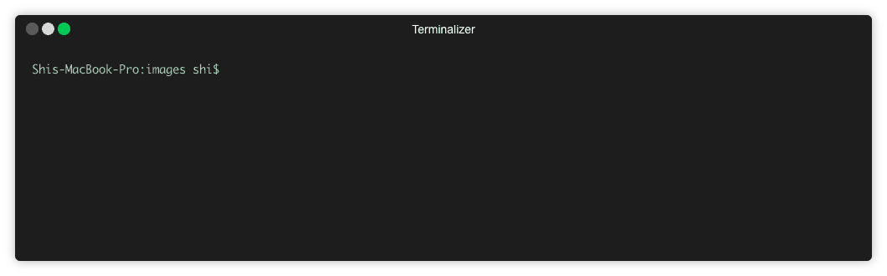

Forge is a framework that allows you to launch your decentralized applications (DApps) on your own blockchains.

## Install Forge CLI

Currently, Forge is supported on machines running one of the following operating systems:

* [CentOS](../../instruction/install/centos)
* [Ubuntu](../../instruction/install/ubuntu)
* [MacOS](../../instruction/install/macos)
* [Docker](../../instruction/install/docker)

If you are using other operating systems, you can run Forge using Docker.

## Install Forge

Now we need to install Forge, the ArcBlock framework with `forge install`.

`forge install` installs the lastest version by default, if you want to install a specific version, say `1.0.0`, run `forge install 1.0.0`.

## Create A Chain

Now everything is ready. Let's create a chain with `forge chain:create`.

After the chain is created, terminal would output the path for your configuration information. You can directly change this file to config your chain, such as block intervals, and token supplies, etc. Check out details in [Configuration Guide](../../instruction/configuration)。

## Start the Chain

Before starting the chain, make sure you have finalized your configurations. Once the chain starts, some configuration can't be modified anymore.Check out details in [Configuration Guide](../../instruction/configuration)。

After checking all configurations, run `forge start [your-chain]` to start.

## Getting Started with Forge Web

Now your chain is running! To see what's happening on your chain, run `forge web open`.

Forge Web is a web interface that provides you with visual tools for working with Forge and its blockchain, including:

* **Dashboard**: Provides an overview of what is occurring on the chain
* **Block Explorer**: Allows you to view and query the data and states on the chain
* **RPC Playground**: Provides you a playground/sandbox area to interact with the RPCs provided by Forge

When you first get started with Forge Web, you will not have any data. You can get started with test data by running Forge Simulator (see the following section for additional details).

For additional information about Forge Web, please review its [documentation](../../tools/forge_web).
