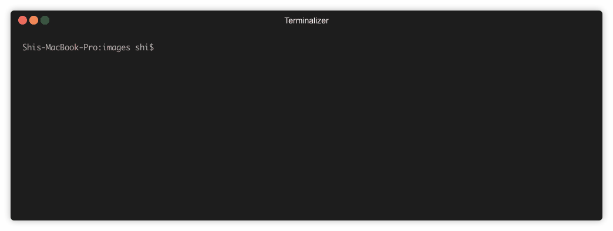
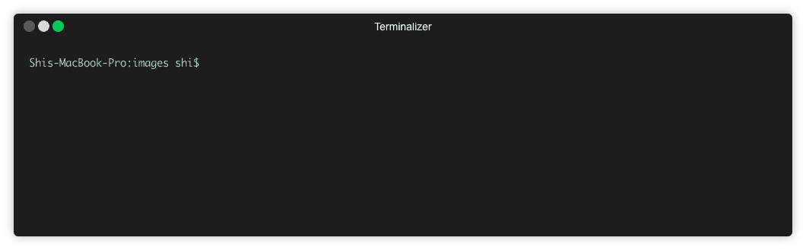
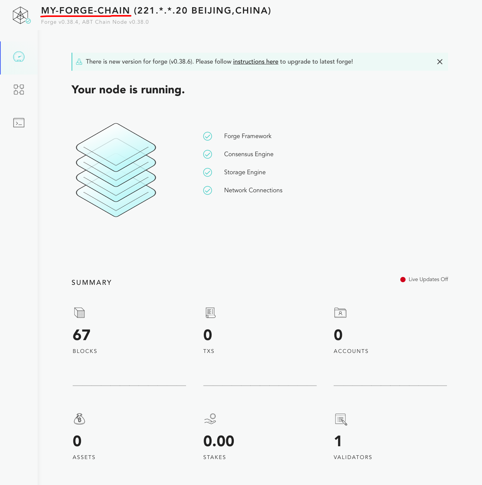
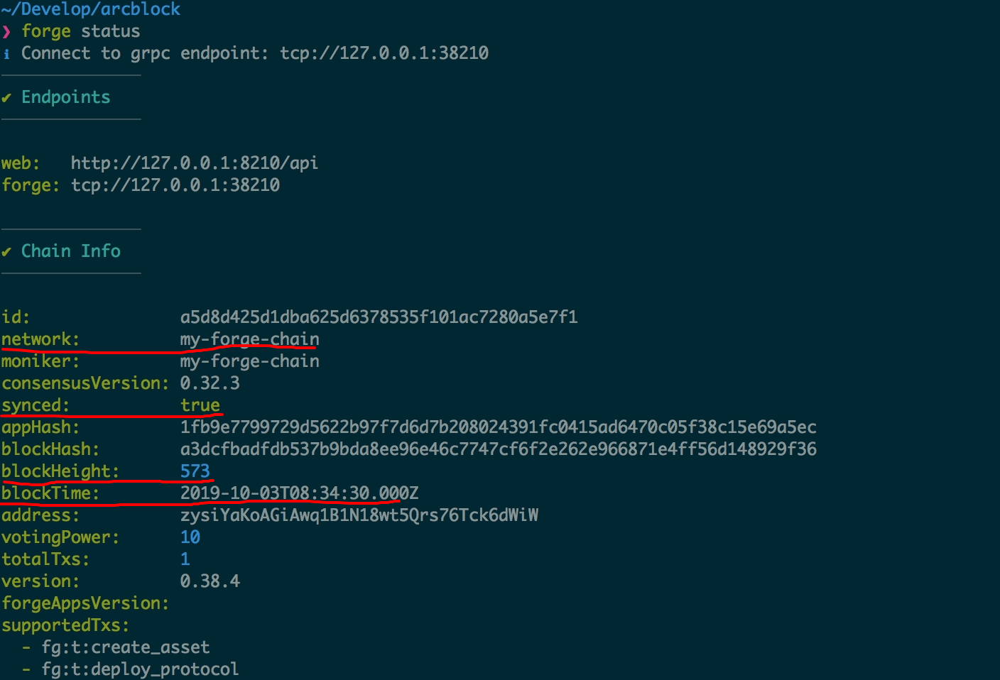
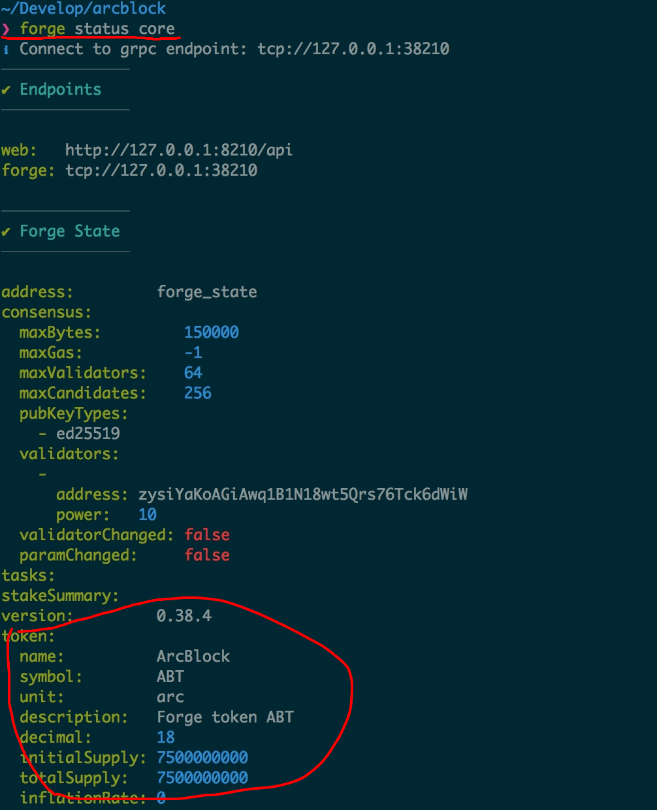

## 安装 Forge CLI

为了最大程度简化安装流程，我们首先需要安装 `Forge CLI` 这个命令行工具，这个工具会帮助我们完成接下来的所有步骤。选择一个合适的系统安装 `Forge CLI`。

* [MacOS](../../instruction/install/macos)
* [CentOS](../../instruction/install/centos)
* [Ubuntu](../../instruction/install/ubuntu)
* [Docker](../../instruction/install/docker)

## 安装 Forge

现在`Forge CLI` 已经安装好了。下面我们要通过 `forge install` 安装 Forge。

::: tip
对于中国大陆的用户，可以使用阿里云的镜像来加速安装：`forge install --mirror https://releases.arcblockio.cn`
:::

`forge install` 会默认安装最新版本，如果想要安装特定版本的forge 如 `1.0.0`, 运行 `forge install 1.0.0`

## 创建一条链

现在你的电脑上已经安装好了所有环境，接下来我们就使用 `forge chain:create` 创建一条链。

链创建好之后，terminal会提示该条链配置信息的保存路径，你可以通过直接修改这个配置文件来进一步配置链的具体信息，比如区块生成的间隔、具体交易设置、具体币的数量的设置等。具体内容可以参考 [配置指南](../../instruction/configuration)。

## 运行创建好的链

在运行你创建好的链之前，要确保 `链的配置` 已经全部配置好，因为一旦链开始运行，这部分配置信息将不可改动。具体内容可以参考 [配置指南](../../instruction/configuration)。

确保一切配置信息都符合你的要求后，运行 `forge start [your-chain]` 来运行你的链。

## 查看正在运行的链

执行 `forge web open`，本地的浏览器会打开刚刚启动的这条链的区块浏览器，区块浏览器里面能看到链的基本信息：

- 链的名称显示在左上角
- 链的块高、交易数量、账户数量、验证人节点数量显示在仪表盘上
- 如果你刷新这个页面，会看到块高在不停的变大，是因为即使没有交易的时候 forge 也在出空块

::: warning
如果你是在云平台上的远端机器，`forge web open` 大概率无法工作，如果你想通过网络访问刚刚启动链的区块浏览器，需要这个机器有公网的 IP，并且打开 8210 端口。关于 Forge WEB 的更多介绍参见 [这里](../../8-explorer-other-tooling/forge-web)
:::

## 检查链的状态

到这里，我们的单节点的链已经启动了，怎么确定这个链的状态是正常的呢？执行 `forge status` 即可看到当前的链块高是多少：

## 检查币的状态

如果想查看链上币的配置，可以执行 `forge status core`，在输出结果中查找 `token` 信息，如下图：

