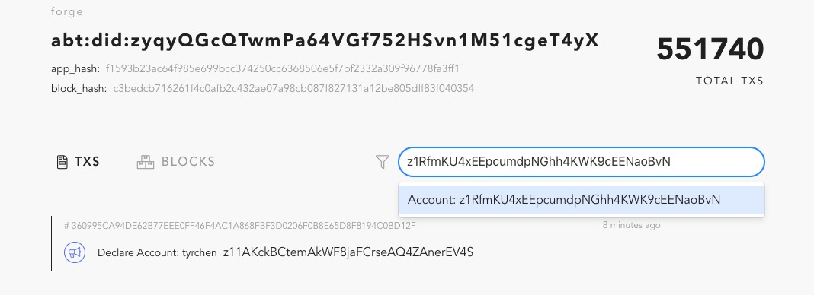
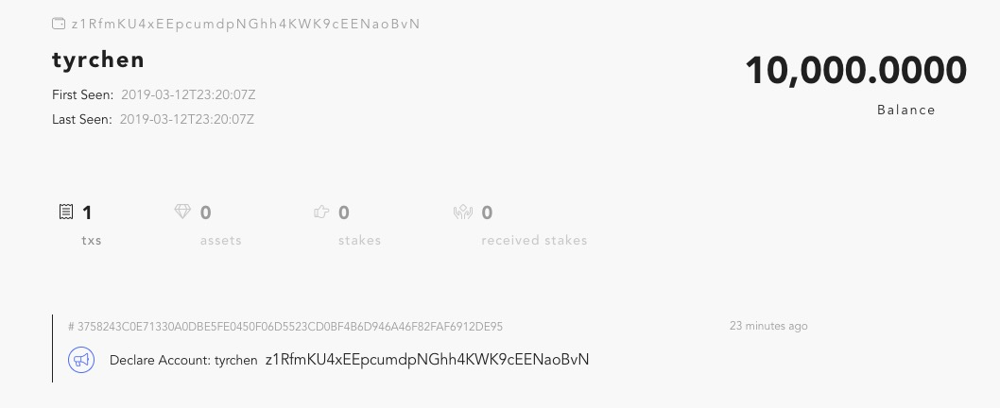
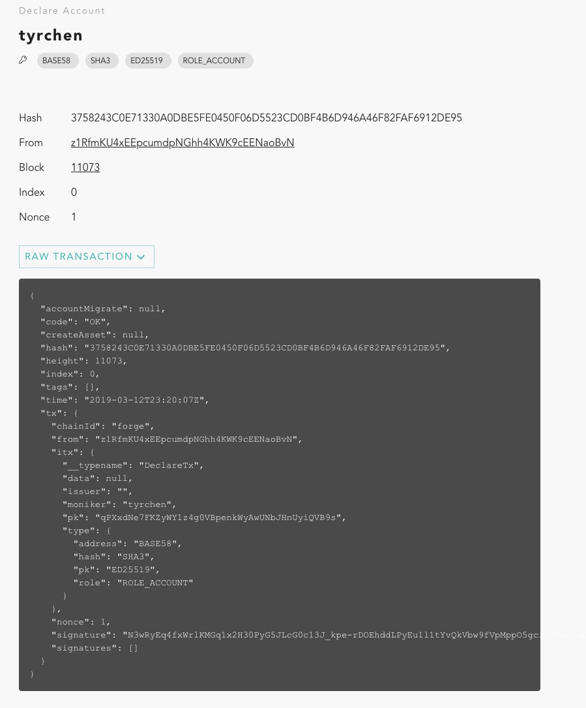

# Send your first transaction

One important design aspect for forge is to make it as easy as possible for newbies to get familiar with Forge. If you followed the "Quick Start" section of the [Overview](./README.md), you have already used many of them: forge cli, forge web and forge simulator. Now it's time to send your first transaction - but before that, you need a wallet.

## Prerequisite knowledge for wallet

If you familiar with blockchain technology, feel free to skip to next section.

In blockchain world, a wallet is actually an address that backed by a keypair that generated with public key encryption algorithms. If you have used Bitcoin or Ethereum, you might already know the [ECDSA (Elliptic Curve Digital Signature Algorithm)](https://en.wikipedia.org/wiki/Elliptic_Curve_Digital_Signature_Algorithm) - ECDSA is a variant of the DSA (Digital Signature Algorithm) that uses elliptic curve cryptography. Basically if you own a wallet, you have the private key, the private key could generate its public key, and the public key could be used to generate the wallet address. If you want to send transaction from your wallet, you need to generate the transaction data and sign the transaction with your private key. Since your public key is included in the transaction, anyone else can use it to verify the transaction is really signed by you. This is the foundation of the "trust" of the blockchain technology. And since everyone can verify the authenticity of the transaction, it is also called "public verifiable".

Bitcoin and Ethereum use secp256k1 for the public key encryption of their wallets, to generate the wallet address, they used fixed hash algorithms. In forge, we make it flexible and extensible - developer or user can choose their favorite algorithms combination. For example, by default, forge uses ED25519 for public key encryption, Sha3 for public key hash, and base58 (actually, base58 with [multibase](https://github.com/multiformats/multibase) prefix) for address.

## Create a wallet

### Create a wallet with Forge CLI

You can easily create a wallet by using forge CLI. Note normally you shall not use this to create a wallet that you would store your valuable assets, unless you own the node and the node is in a secure environment. For this example, since we're running it locally, it's good to go:

```bash
$ forge account:create
? Please input passphrase: helloworld
? Please input moniker: tyrchen
? Please select a account role type? ROLE_ACCOUNT
? Please select a key pair algorithm? ED25519
? Please select a hash algorithm? SHA3
──────────────
✔ account create success!
──────────────
{
  type: {
    pk: 'ED25519',
    hash: 'SHA3',
    address: 'BASE58',
    role: 'ROLE_ACCOUNT'
  },
  sk: '',
  pk: 'qPXxdNe7FKZyWY1z4g0VBpenkWyAwUNbJHnUyiQVB9s=',
  address: 'z1RfmKU4xEEpcumdpNGhh4KWK9cEENaoBvN'
}
──────────────
✔ account unlocked!
ℹ run forge account z1RfmKU4xEEpcumdpNGhh4KWK9cEENaoBvN to inspect account state
```

This CLI will create a wallet and save it as a keystore (you can find the wallet in `$FORGE_HOME//core/keystore/z1R/fmKU4xEEpcumdpNGhh4KWK9cEENaoBvN.key`), encrypted (AES256) with your passphrase. Once you created a wallet in forge CLI, it is unlocked, meaning you can use it to send transactions within a period.

### Create a wallet with forge console

Still remember when you run `forge start`, it gave you a command to connect to the remote console for forge?

```bash
ℹ If you want to access interactive console, please run /Users/tchen/.forge_cli/release/forge/0.18.2/bin/forge remote_console
```

If you want to get your hands dirty, you can connect to the console and create your wallet:

```bash
$ /Users/tchen/.forge_cli/release/forge/0.18.2/bin/forge remote_console
Erlang/OTP 21 [erts-10.2.3] [source] [64-bit] [smp:8:8] [ds:8:8:10] [async-threads:1] [hipe]

Interactive Elixir (1.8.1) - press Ctrl+C to exit (type h() ENTER for help)
iex(forge@127.0.0.1)1> ForgeSdk.create_wallet(moniker: "tyrchen", passphrase: "helloworld")
{%ForgeAbi.WalletInfo{
   address: "z11AKckBCtemAkWF8jaFCrseAQ4ZAnerEV4S",
   pk: <<216, 81, 103, 181, 91, 220, 232, 21, 160, 218, 166, 53, 141, 75, 80,
     247, 90, 126, 67, 250, 229, 112, 251, 254, 141, 162, 102, 219, 119, 185,
     160, 140>>,
   sk: "",
   type: %ForgeAbi.WalletType{address: 0, hash: 0, pk: 0, role: 0}
 }, "1fc524cfd168c9508d6a3f63386e7f05"}
iex(forge@127.0.0.1)2>
```

Since Forge is built with erlang/elixir, this is the default console in erlang, which means you can run all kinds of erlang/elixir code in it. `ForgeSdk.create_wallet(moniker: "tyrchen", passphrase: "helloworld")` is the function we execute to create a wallet. And once a wallet is created, it returned a wallet without secret key (sk), but with a token, so that later on you could use this token to unlock the wallet and sign the transaction.

Now if you do look at the keystore folder, you'll find two keystores:

```bash
$ tree ~/.forge_release/core/keystore/
/Users/tchen/.forge_release/core/keystore/
├── z11
│   └── AKckBCtemAkWF8jaFCrseAQ4ZAnerEV4S.key
└── z1R
    └── fmKU4xEEpcumdpNGhh4KWK9cEENaoBvN.key
```

Although we use same moniker and passphrase, each time we create a wallet a new keypair is generated and as a result, a new wallet (address) is generated.

### Create a wallet with Forge SDK

You can also create wallet with forge SDK easily, please refer [Forge SDK](../sdk).

### Create a wallet with Wallet App

The most secure way to create a wallet for general public is using a wallet app - a forge compatible wallet app. Currently you can use ArcBlock Wallet App for that purpose.

### More information about wallet

Let's use the first wallet address `z1RfmKU4xEEpcumdpNGhh4KWK9cEENaoBvN` to see what can we find in forge block explorer. Paste the address (here please paste the address you created with Forge CLI) into the search box in the explorer, and press enter:



Then you would see:



Here we just created a wallet with Forge CLI, why there's transaction sent already?

The transaction you saw is the __Declare Account__ transaction, if you click the transaction hash, you would see:



In forge, a wallet cannot be used without declare tx. This TX serves several purposes:

* register the address / wallet type / public key in the chain
* create the state for the address

## Send a transaction
