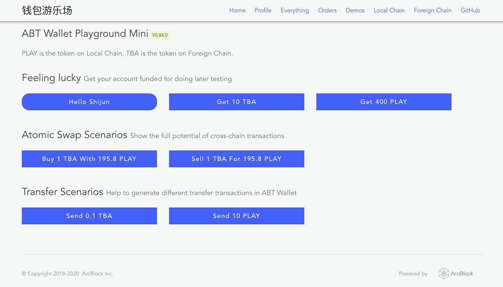
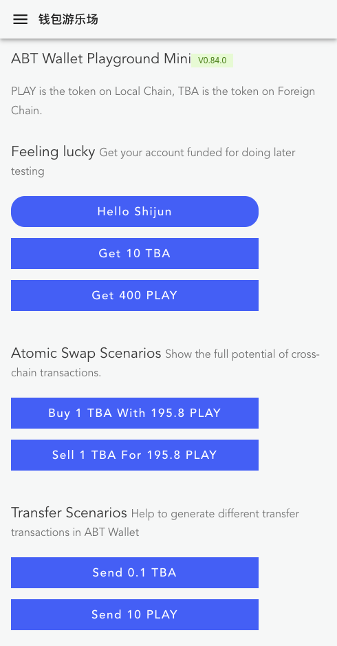
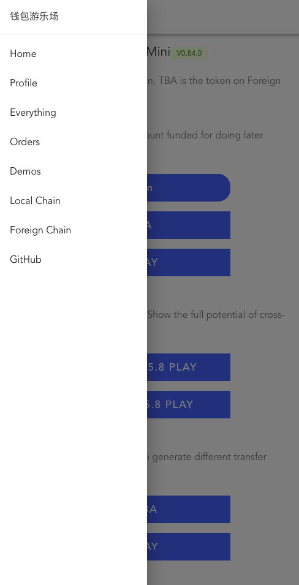

<style>table {display:table}</style>

## 为什么要支持 Webview？

在最初的 [ABT 钱包](https://abtwallet.io)产品设计中，为了钱包内数据的安全，我们直接砍掉了在钱包里面支持 Webview 的想法，让钱包只是个纯粹的 DID 管理工具，毕竟 ABT 钱包的用户会在里面存储数字资产，不管是通证还是 NFT。

钱包支持 [DID Auth 协议](https://github.com/ArcBlock/abt-did-spec)之后，所有基于 ArcBlock 技术开发的应用都会以二维码作为入口发起多种类型的交互，完成应用和用户之间的点对点通信，比如请求用户提供 Profile、请求用户签名转账交易、签名互换交易等。

随着钱包的迭代，我们在开发各种小应用的过程中愈发觉得手机操作系统的安全限制：比如从手机浏览器调起 ABT 钱包并完成授权操作之后可能会回调到另外 1 个浏览器（见[这里](https://community.arcblockio.cn/t/topic/54)和[这里](https://github.com/ArcBlock/forge-js/issues/436)），这些安全限制所带来的的钱包用户体验问题如鲠在喉，不除不快。

从长期角度，用户体验决定了生态的发展，这个问题必须解决掉。做了仔细的讨论和调研之后，我们发现在现在的环境下支持钱包内的 WebView 是利远大于弊的：

- Webview 已经是比较成熟的技术，经历过几次注明的安全事件之后，手机操作系统已经做了很多改进，我们可以站在巨人的肩上
- Webview 最大的安全隐患可能存在 JS 注入到原生应用里面的代码，这个在 ABT 钱包里面是不允许和不支持的，原因见下条
- Webview 里面用户触发的和原生钱包的交互（称为 DID-Auth 会话）实际上是应用和钱包之间的点对点通信，有非对称加密技术来保障安全，会话结果直接提到应用后端，也保障了应用的安全

## Webview 会带来哪些改变？

ABT 钱包支持 Webview 之后有哪些改变呢？

- 首先，ABT 钱包的扫码功能可以直接打开网址，如果网址恰巧是 dApp，交互过一次之后就会被钱包记录下来
- 其次，ABT 钱包交互过的应用都被会记录下来，下次可以直接在钱包的 Webview 里面打开，让用户的搜索路径更短
- 最后，任何使用 ArcBlock 技术开发的 dApp 如果想在钱包里面打开，可以通过钱包支持的 Deep Link 以直接在钱包内打开该应用，以提供最流畅的体验

如果你想体验这几种场景，可以扫描下面两个二维码，扫码前需要把 ABT 钱包升级到 v2.5（需要升级的可以猛击[钱包全球站](https://abtwallet.io)或[钱包中国站](https://demo.wallet.arcblockio.cn)）：

| 打开普通网址             | 直接打开应用                 |
| ------------------------ | ---------------------------- |
|  |  |

可能有同学会问：**ABT 钱包的 Webview 有什么特别之处？**其实除了上面说的安全限制外，它就是个标准的内嵌了现代浏览器内核的 Webview，对 HTML5 和 CSS3 都有很不错的支持。

## 如何让 dApp 支持 Webview？

如果你不是开发者，到这里可以关闭这篇文章了。

接下来我们介绍下怎么做才能让你的应用在钱包 Webview 里面的体验更好。

### 使用 Blocklet

这种方式适合于创建全新的项目，我们已经更新了所有的 Starter Blocklet，使用这些 Blocklet 创建的应用已经对 ABT 钱包做了很好的适配，比如自动登录、基本的响应式布局等等，并且内置了基本的会话管理、用户管理、支付案例，使用 Blocklet 的步骤也非常简单：

```shell
npm install -g @arcblock/forge-cli
forge blocklet:use forge-react-starter
```

::: warning
如果你还没有使用过 Forge CLI（ArcBlock 打造的 dApp 开发的瑞士军刀），请猛击[这里](/handbook/1-introduction/install-forge-cli)。
:::

目前发布的 Javascript Blocklet 前端都是用 [React.js](https://reactjs.org/) 编写，后端使用了 [Express.js](http://expressjs.com/)，你可以根据自己的偏好和实际需求选择如下几个 Blocklet：

- [forge-react-starter](https://blocklet.arcblockio.cn/starter/forge-react-starter)，把我们的 Forge SDK 集成到了 [create-react-app](https://github.com/facebook/create-react-app) 而成，非常适合入门
- [forge-next-starter](https://blocklet.arcblockio.cn/starter/forge-next-starter)，把我们的 Forge SDK 集成到了 [next.js](https://nextjs.org/) 而成，适合需要服务端渲染的同学
- [forge-keystone-starter](https://blocklet.arcblockio.cn/starter/forge-keystone-starter)，把我们的 Forge SDK 集成到了 [next.js](https://nextjs.org/) 和 [keystone.js](https://www.keystonejs.com/) 而成，适合需要服务端渲染和管理后台的场景

### 集成响应式布局

如果你已经有在运行中的应用需要适配 ABT 钱包的 Webview，首先需要考虑的是响应式布局，响应式布局能让任何 WebApp 在不同大小的屏幕尺寸上伸缩自如，我们把内部的响应式布局做了封装，可以按如下步骤使用：

首先，安装依赖：

```shell
yarn add @arcblock/ux
# OR
# npm install @arcblock/ux -S
```

然后，在 WebApp 的布局组件里面使用 `Layout` 组件：

```javascript
import React from 'react';
import PropTypes from 'prop-types';
import BaseLayout from '@arcblock/ux/lib/Layout';

export default function Layout({ title, children }) {
  const links = [
    { url: '/', title: 'Home' },
    { url: '/profile', title: 'Profile' },
  ];

  if (env.chainHost) {
    links.push({ url: getExplorerUrl(env.chainHost, 'local'), title: 'Local Chain' });
  }

  return (
    <BaseLayout title={title} brand={env.appName} links={links} baseUrl={env.baseUrl}>
      {children}
    </BaseLayout>
  );
}

Layout.propTypes = {
  title: PropTypes.string.isRequired,
  children: PropTypes.any.isRequired,
};
```

这个响应式布局在 PC 端渲染出来的样子如下图：



在移动端的样子如下图：

| 菜单折叠样式                  | 菜单打开样式                  |
| ----------------------------- | ----------------------------- |
|  |  |

### 组件的条件渲染

某些场景下，可能某些页面元素只需要在钱包 Webview 里面才显示或者隐藏，这个时候需要检查 User Agent，但是我们也做了拆箱即用的封装

首先，安装依赖：

```shell
yarn add @arcblock/react-hooks
# OR
# npm install @arcblock/react-hooks -S
```

然后，在 WebApp 的页面里面使用 `useBrowser` Hook：

```javascript
import React from 'react';
import useBrowser from '@arcblock/react-hooks/lib/useBrowser';

export default function MyComponent() {
  const browser = useBrowser();

  return (
    <div>
      {browser.wallet && <p>I am only visible when in ABT Wallet webview</p>}
      {!browser.wallet && <p>I am not visible when in ABT Wallet webview</p>}
    </div>
  );
}
```

### 自动调起登录

用户打开应用的时候，如果需要自动登录，可以这么做：

首先，安装依赖：

```shell
yarn add @arcblock/did-react @arcblock/react-hooks
# OR
# npm install @arcblock/did-react @arcblock/react-hooks -S
```

然后，在 WebApp 的登录页面里面使用 `useBrowser` Hook 和 `DidAuth` 组件，更完整的代码可以参见 [forge-react-starter](https://github.com/ArcBlock/forge-dapp-starters/tree/master/packages/forge-react-starter/templates)：

```javascript
import React, { useState, useEffect } from 'react';
import api from 'axios';
import useBrowser from '@arcblock/react-hooks/lib/useBrowser';
import DidAuth from '@arcblock/did-react/lib/Auth';

export function Login({ onLogin, loading }) {
  const browser = useBrowser();
  const [open, setOpen] = useState(false);

  // 检测到在钱包中就自动打开 DID 登录，DID 登录会自动唤起钱包原生界面
  useEffect(() => {
    if (browser.wallet) {
      setTimeout(() => {
        setOpen(true);
      }, 0);
    }
  }, [browser.wallet]);

  return (
    <div>
      {open && (
        <DidAuth
          responsive
          action="login"
          checkFn={api.get}
          onClose={() => setOpen(false)}
          onSuccess={() => console.log('login success')}
          checkTimeout={5 * 60 * 1000}
          messages={{
            title: 'Login Required',
            scan: 'Provide profile to login',
            confirm: 'Confirm on your ABT Wallet',
            success: 'Login Success',
          }}
        />
      )}
    </div>
  );
}
```

## FAQ

下面是如何让你的 dApp 在开发环境下的跑在 ABT Wallet 中的几个可能帮到你的建议：

### 用 Chrome 开发者工具模拟钱包？

参考[这里](https://developers.google.com/web/updates/2015/07/add-a-new-custom-device-as-a-preset)的教程为你的 Chrome 浏览器添加几个自定义设备，新设备的 User Agent 字符串可以设定如下：

- ABT Wallet 安卓版: `Mozilla/5.0 (Linux; Android 9; MIX 2 Build/PKQ1.190118.001; wv) AppleWebKit/537.36 (KHTML, like Gecko) Version/4.0 Chrome/80.0.3987.99 Mobile Safari/537.36 ABTWallet/2.5.0`
- ABT Wallet iOS 版: `Mozilla/5.0 (iPhone; CPU iPhone OS 5_1 like Mac OS X) AppleWebKit/534.46 (KHTML, like Gecko) Version/5.1 Mobile/9B176 Safari/7534.48.3 ABTWallet/2.3.24`

这样打开调试工具之后就能看到你的 dApp 在 ABT 钱包 Webview 时的表现。

### 用钱包直接打开开发环境的 dApp？

需要具备两个条件：

- 在 Chrome 上安装[这个插件](https://chrome.google.com/webstore/detail/quick-qr-code-generator/afpbjjgbdimpioenaedcjgkaigggcdpp)，一键把当前地址栏的网址转化为二维码
- 确保你的钱包和电脑在同一个网络里面，不然钱包是无法打开开发环境的 dApp

### 遇到问题？

如果遇到其他问题，请到[开发者社区](https://community.arcblockio.cn)求助，或者到 [GitHub 仓库](https://github.com/ArcBlock/forge-dapp-starters)给我们提 Issue。
