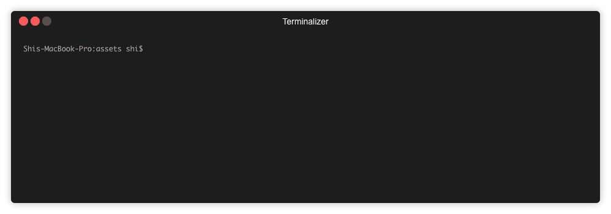

全新 ubuntu 机器缺少几个 Forge 所需的依赖。如果您在 Ubuntu 上运行 Forge 时遇到问题，请往下读。本指南通过了在每月 5 美元的 Digital Ocean 机器上对 ubuntu 16.04 和 18.04 的测试。

::: warning

我们不建议您在 Ubuntu 14.04 或更低版本上运行 Forge。本指南可能不适用于 Ubuntu 14.04（至少您无法在该版本上安装 nodejs >10）。

:::

## 设置用户

首先，我们创建一个 sudo 用户。有的云提供商（如 digital ocean）提供的是带 root 用户的 ubuntu，因此我们需要将其禁用。如果您已经是 sudo 用户，可以跳过此步骤。

创建一个名为`arcblock`的用户，您可选择其他用户名：

```bash
adduser arcblock
```

然后将用户添加至 sudo 用户组并删除密码：

```bash
usermod -aG sudo arcblock

sudo passwd -d arcblock
```

然后，您可以进行`visudo`，这样 sudo 用户便不需要密码：

```
%sudo ALL=(ALL:ALL) NOPASSWD:ALL
```

::: tip

如果您更熟悉 vim，`update-alternatives --config editor`可以修改默认编辑器。

:::

从现在起，我们可以将用户交换为此 sudo 用户。

::: tip

如果您之前通过 root 账户 ssh 至主机，又想在最新创建的`arcblock`账户进行 ssh，您可运行以下命令：

```bash
cat ~/.ssh/id_rsa.pub | ssh root@host "mkdir -p ~arcblock/.ssh && touch ~arcblock/.ssh/authorized_keys && chown -R arcblock ~arcblock/.ssh && chmod -R go= ~arcblock/.ssh && cat >> ~/.ssh/authorized_keys"
```

:::

## 安装 nodejs 10/11

Forge CLI 需要 nodejs 运行时间，所以我们应该安装最新的 10.x 或 11.x 节点。如果是 ubuntu，请参考以下指南：[NodeSource Node.js Binary Distributions](https://github.com/nodesource/distributions/blob/master/README.md).

基本来说，您需要：

```bash
sudo apt-get update

sudo apt-get install -y build-essential

curl -sL https://deb.nodesource.com/setup_11.x | sudo -E bash -

sudo apt-get install -y nodejs
```

如果您想安装 nodejs 10，仅需将`setup_11.x`替换为`setup_10.x`。

完成后，请检查 nodejs 版本是否为理想版本：

```bash
$ node -v

v11.12.0
```

尽管 nodejs 提供 npm，但我们强烈推荐您安装 yarn：

```bash
curl -sL https://dl.yarnpkg.com/debian/pubkey.gpg | sudo apt-key add -

echo "deb https://dl.yarnpkg.com/debian/ stable main" | sudo tee /etc/apt/sources.list.d/yarn.list

sudo apt-get update && sudo apt-get install -y yarn
```

## 安装最新的 openssl

ubuntu 16.04 搭配的 openssl 版本太老，我们应按照更新版本：

```bash
cd /tmp

wget https://www.openssl.org/source/openssl-1.1.1.tar.gz

tar xvf openssl-1.1.1.tar.gz

cd openssl-1.1.1

./config -Wl,--enable-new-dtags,-rpath,'$(LIBRPATH)'

make

sudo make install
```

然后，您需要将 openssl 路径放入您的`$PATH`：

```
sudo vim /etc/environment
```

在`/usr/local/bin`之后添加`/usr/local/ssl/bin`：

```
PATH="/usr/local/sbin:/usr/local/bin:/usr/local/ssl/bin:/usr/sbin:/usr/bin:/sbin:/bin:/usr/games:/usr/local/games"
```

现在，登出后再次登录，以激活`$PATH`修改。查看您的 openssl 版本：

```bash
$ openssl version

OpenSSL 1.1.1 11 Sep 2018
```

### 安装 erlang crypto（可选）

在 ubuntu 16.04，您需要安装 erlang crypto，确保 erlang 版本可和您安装的 openssl 一起使用：

```bash
sudo apt-get install -y erlang-crypto
```

::: warning

如果错过这一步，Forge 版本会崩溃，且会出现以下错误信息：

> libcrypto.so.1.1: cannot open shared object file: No such file or directory

:::

## 安装 Forge CLI

让我们使用 yarn 安装 forge cli。请注意，我们进行全球安装，以便不同用户使用。

```bash
sudo yarn global add @arcblock/forge-cli
```

## 添加非特权用户并安装 Forge

我们不推荐您在 sudo 用户上运行 forge。所以，让我们创建一个新用户：

```bash
sudo adduser forge
```

然后删除其密码：

```bash
sudo passwd -d forge
```

sudo 用户`arcblock`仅应被用于 ssh 以安装软件，而普通用户`forge`仅应被用于运行 forge。

让我们通过`sudo su forge`使用 `forge` 用户，然后运行`forge -h` 检查 Forge CLI 是否已成功安装：



🎉 Forge CLI 已经安装成功了，现在去 [快速入门](../../../intro/quickstart) 尝试发一条链吧！
