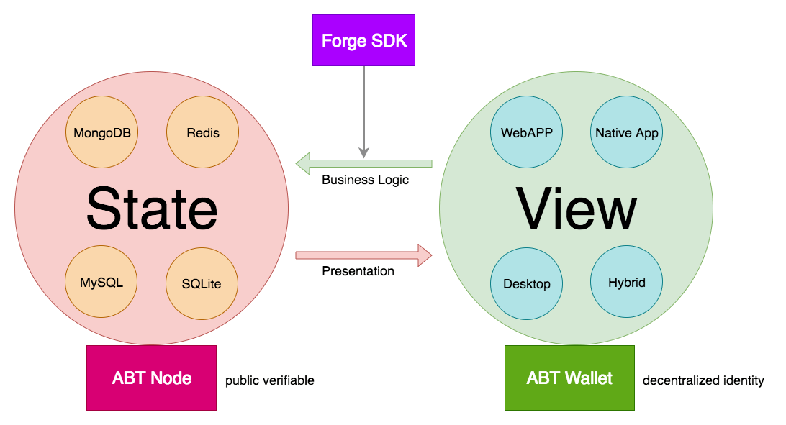
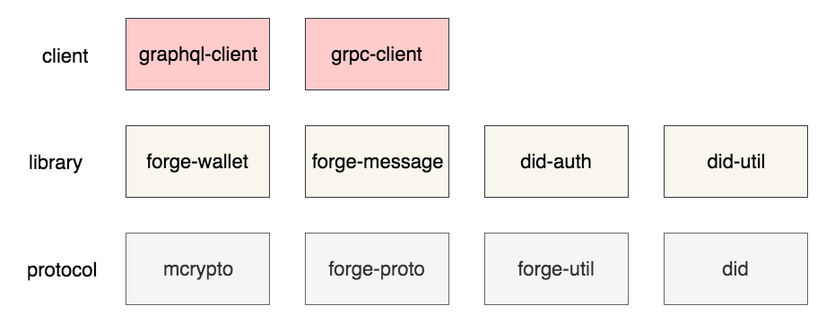

## SDK positioning

From a very high point of view, any application, whether it is a traditional Internet application or a blockchain application, is processing back and forth transformations between the data state and the application view. operating.



From this perspective, the Forge chain is an effective way to store application state, and the Forge SDK is a bridge between state and application.

Forge designed to ensure the scalability of all layers and sides as much as possible. Regardless of the language, the Forge SDK serves three goals:

- Support basic blockchain data operations, such as hashing, signing, encryption, decryption, etc.
- Support basic on-chain data read and write, link application code with Forge chain
- Simplify the various operations that developers need to do in the first goal

## Necessary components

> Modularity, as well as high cohesion and low coupling of modules, are important means to achieve software scalability and maintainability.

To achieve the above goals, the functional modules required by the Forge SDK are divided as follows:



- Protocol layer: defines various data structures (used in Forge [Protocol Buffers](https://developers.google.com/protocol-buffers) Definition), data changes (hash, signature, encryption and decryption, etc.), DID generation process
- Class library layer: defines how to assemble messages that Forge can recognize and how to decode the data returned from Forge, such as encapsulation of wallets and encapsulation of transaction messages that Forge can send and receive
- Client: Define how to connect Forge chain nodes (Forge support [gRPC](https://grpc.io/) with [GraphQL](https://graphql.org/) Two ways), how to perform common on-chain operations, etc.

The areas of application for different languages will be very different, and the corresponding SDK implementations also have emphasis, such as:

- If it is a back-end language SDK, focus on implementing gRPC.
- If support is not required [ABT Wallet](https://abtwallet.io) Interactive logic processing, no need to implement [DID authentication related logic](https://github.com/ArcBlock/abt-did-spec#abt-did-authentication-protocol)
- If you do not need to support rich data hashing, encryption, decryption, and signature algorithms, you can support the standard algorithm selected by Forge. The standard algorithm refers to: the hash algorithm uses [SHA3](https://en.wikipedia.org/wiki/SHA-3)Use of asymmetric encryption algorithms [ED25519](https://ed25519.cr.yp.to/)Use of address encoding [base58btc](https://github.com/multiformats/multibase)

## The basic steps

After completing the module division, implement the Forge SDK, just follow the steps.

### Data hashing and encryption

This part of the function is mainly included in `mcrypto` In the module, the implementation reference of different languages:

- [Elixir / Erlang](https://github.com/ArcBlock/mcrypto)
- [Javascript/Node.js](https://github.com/ArcBlock/forge-js/tree/master/forge/mcrypto)

The main functions to be implemented in this module include:

- `Hasher`: Hash the data and support hashing of different lengths. At least the supported lengths are 224, 256, 384, and 512. The required hash algorithms include: Sha2, Sha3
- `Signer`: Supports signature generation and verification based on asymmetric encryption, the core interface is `sign(data, privateKey) => signature`， `verify(data, publicKey, signature) => true|false`In addition, it should also support the random generation of public and private key pairs. At least the asymmetric encryption algorithms that need to be supported include `ED25519`
- `Crypter`: Encrypt and decrypt data. It can be symmetric or asymmetric, at least it supports `AES CBC 256`, Which is still relatively rare in the current SDK

### DID generation

Any entity in the Forge system has its own DID, including nodes, contracts, accounts, assets, etc. From a technical perspective, DID is a wallet address calculated from public and private key pairs that encodes the characteristics of the entity it refers to. In [ABT DID protocol](https://github.com/ArcBlock/ABT-DID-spec#create-did)This process is described in detail, and we have a article [Engineering Blog](https://www.arcblock.io/zh/post/2019/05/28/did-101)Describe the generation steps in detail.

DID generation process reference in different languages:

- [JavaScript/Node.js](https://github.com/ArcBlock/forge-js/tree/master/did/did)
- [Elixir / Erlang](https://github.com/ArcBlock/abt-did-elixir/blob/master/lib/abt_did.ex)

### Message codec

Required for SDK and Forge communication [Protocol Buffers](https://developers.google.com/protocol-buffers) Data encoding and decoding, so the SDK needs to know the data structure in Forge, and the data structure used in the SDK mainly includes the following two parts:

- [Forge ABI](https://github.com/ArcBlock/forge-abi/tree/master/lib/protobuf)
- [Forge Core Protocols](https://github.com/ArcBlock/forge-core-protocols)

After getting these two codes, you need to use `protoc` Tools, compile it into the language-specific implementation you need, so that you can implement the encoding and decoding of messages in a specific language.

### Wallet package

Encapsulating the wallet is mainly to simplify operations, such as support `fromRandom`、 `fromSecretKey`、 `fromPublicKey` And other methods return the same wallet structure, and these return values support such as `toAddress`、 `sign(data)`、 `verify(data, signature)` Operation. For example [Javascript SDK](https://github.com/ArcBlock/forge-js/tree/master/forge/forge-wallet) The operation of the wallet is specially encapsulated.

### gRpcClient

#### Data read operation

Finished with, next, with the help of `protoc` Generated code, we can complete the basic data read operation:

```javascript
const grpc = require("grpc");
const { RequestGetConfig } = require("/path/to/generated/code");
const { StateRpcClient } = require("/path/to/generated/code");

const endpoint = "tcp://127.0.0.1:28210";
const client = new StateRpcClient(endpoint, grpc.credentials.createInsecure());

const message = new RequestGetConfig();
message.setParsed(true);

const response = await client.getConfig(message);
console.log(response.toObject());
```

#### Data write operation

Because writing data to the blockchain is usually equivalent to sending a transaction, you need to sign the transaction before sending the transaction, and then put the signature in `Transaction` Instance, use [Protocol Buffers](https://developers.google.com/protocol-buffers) Send it after serialization, the general process is as follows:

```javascript
const grpc = require("grpc");
const Wallet = require("/path/to/your-wallet-implementation");
const {
  RequestSendTx,
  DeclareTx,
  Transaction
} = require("/path/to/generated/code");
const { ChainRpcClient } = require("/path/to/generated/code");

const endpoint = "tcp://127.0.0.1:28210";
const client = new ChainRpcClient(endpoint, grpc.credentials.createInsecure());
const wallet = Wallet.fromRandom(); // generates a random wallet with sha3256,role_account,ed25519

const itx = new DeclareTx();
itx.setMoniker("test-wallet");

const tx = new Transaction();
tx.setNonce(Date.now());
tx.setFrom(wallet.toAddress());
tx.setPk(wallet.publicKey);
tx.setChainId("forge"); // must be same from chain
tx.setItx(itx);

const signature = wallet.sign(tx.serializeBinary()); // sign the buffer presentation of the message
tx.setSignature(signature);

const message = new RequestSendTx();
message.setTx(tx);

const response = await client.getConfig(message);
console.log(response.toObject());
```

### Streaming data subscription

> EVERYTHING

### GraphQLClient

#### Data read operation

> EVERYTHING

#### Data write operation

> EVERYTHING

#### Streaming data subscription

> EVERYTHING

### Support for custom contracts

> EVERYTHING

## Basic interface

After the SDK is packaged, its basic usage method should be concise. For example, the following is the basic usage of the Javascript SDK:

```javascript
const ForgeSDK = require("@arcblock/forge-sdk");

// Connect to multi endpoints
ForgeSDK.connect("https://test.abtnetwork.io/api", { name: "test" });
ForgeSDK.connect("https://zinc.abtnetwork.io/api", { name: "zinc" });
ForgeSDK.connect("tcp://127.0.0.1:28210", { name: "local" });

// Declare on test chain
ForgeSDK.sendDeclareTx({
  tx: { itx: { moniker: "abcd" } },
  wallet: ForgeSDK.Wallet.fromRandom()
}).then(console.log);

// Get zinc chain info
ForgeSDK.getChainInfo({ conn: "zinc" }).then(console.log);

// Get local chain info
ForgeSDK.getChainInfo({ conn: "local" }).then(console.log);
```

## Precautions

### Compatibility test

The input and output test cases of basic modules such as mcrypto and did require and `Elixir/Erlang` Strict matching, see the test case details in the corresponding warehouse `tests` Directory, ArcBlock officially maintained SDK does the same.
