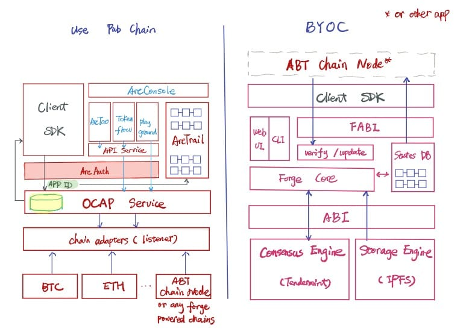

Now you should have a good sense about Forge. Let's dive into it.

In ArcBlock, we provide solutions that enable developers building dApps easily with both public chains (e.g. BTC, ETH) and application chains (BYOC - Bring Your Own Chain):

Forge is for the decentralized apps that wants to have their own, dedicated chains, rather than the squeeze everything into the already-heavy Ethereum.

In our big picture, chains built on Forge should be as easy as Web apps built on Rails. That's why we build a wholistic framework with lots of features:

- built-in replaceable consensus engine. Currently we're using [tendermint](https://tendermint.com/docs/). One can run a different consensus engine as long as it complies with ABCI protocol and implemented the consensus engine protocol.
- built-in replaceable storage engine (experiment). Currently we're using [ipfs](https://ipfs.io/). Same as consensus engine, it follows storage engine protocol.
- built-in MPT backed state db. For storing globally replicated data.
- A fat transaction layer that contains many useful transactions for building dApps. Again, the purpose of Forge is to help developers to build applications, not just serve as a asset chain (although it can be perfectly used as a pure asset chain).
- A powerful CLI that alleviate most day to day work
- A ready-to-use UI to explore the chain and manage accounts / states

## Transactions supported by Forge

There're a bunch of transactions supported by forge. We can divided them into 4 groups:

- Asset related: help with creating and manipulating non-fungible assets.
- Declare related: declare stuff in the chain.
- Transfer related: transfer token and assets between accounts.
- Governance related: create poll, vote, stake / unstake, poke, consensus upgrade, etc.

### Asset related tx

Asset is an important concept in Forge, which allows user to create unique digit asset that could be transferred, utilized and proved of ownership. The use case of asset could be tickets, certificates, artifacts in a game, etc. To support asset, Forge provided these transactions:

- create_asset: allow user to create an asset.
- update_asset: allow user to update an asset that she owns.
- consume_asset: all user to use the asset at a gatekeeper. e.g. a ticket is being used upon the gate of the cinema.

### Declare related tx

Users could use declare asset to register stuff in the chain:

- declare: register a wallet in the chain.
- declare_node: declare the node in the chain.
- declare_file: declare a file (stored in the storage engine) in the chain.

### Transfer related tx

In Forge, user can transfer or exchange assets / tokens:

- transfer: transfer tokens and assets from one account to another account.
- exchange: exchange tokens / assets between accounts. It has rich use cases good for:
  - Bidding service. A group of people could send exchange tx to bid for an asset and the asset owner could choose the one she likes and sign it to finish the transaction.
  - E-commerce. Asset owner could put an exchange transaction for an asset with a price, anyone interested in this price could sign this tx to finish the transaction.

For more information about transactions, please refer to [Forge Transactions](../../../reference/txs).
