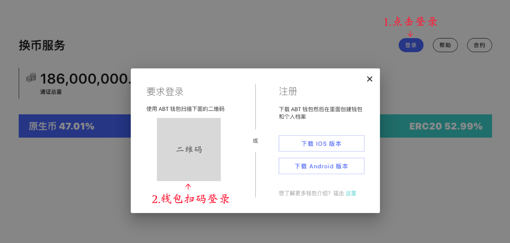
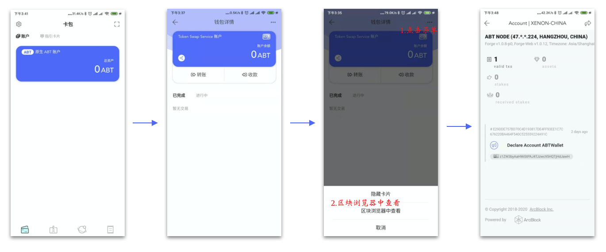
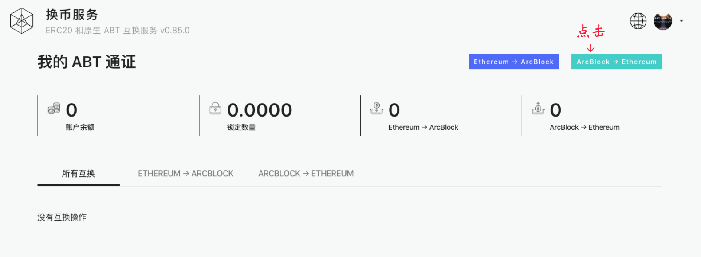
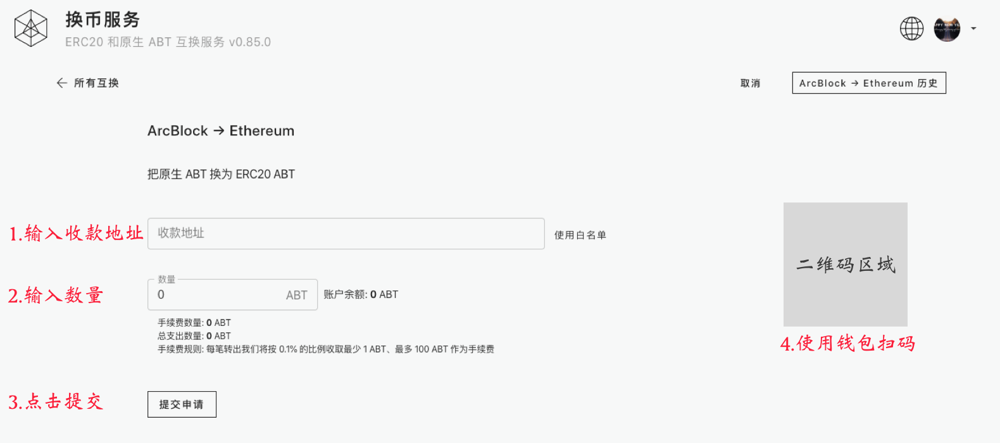
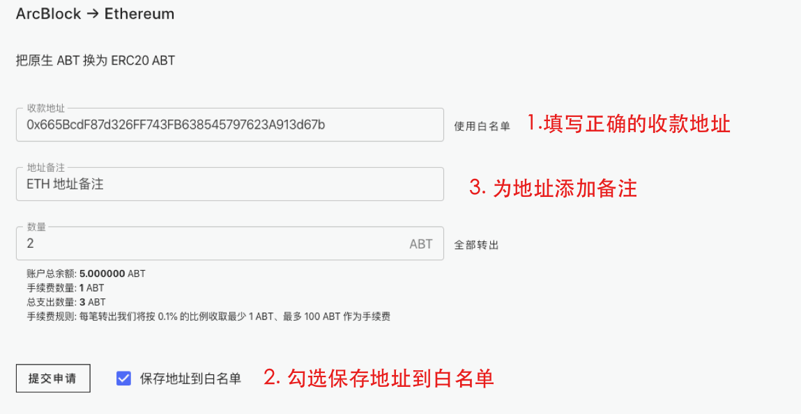
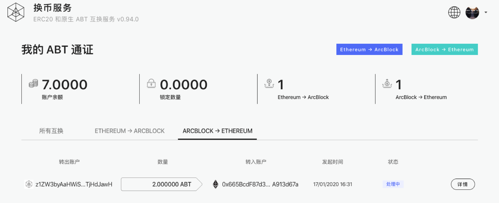
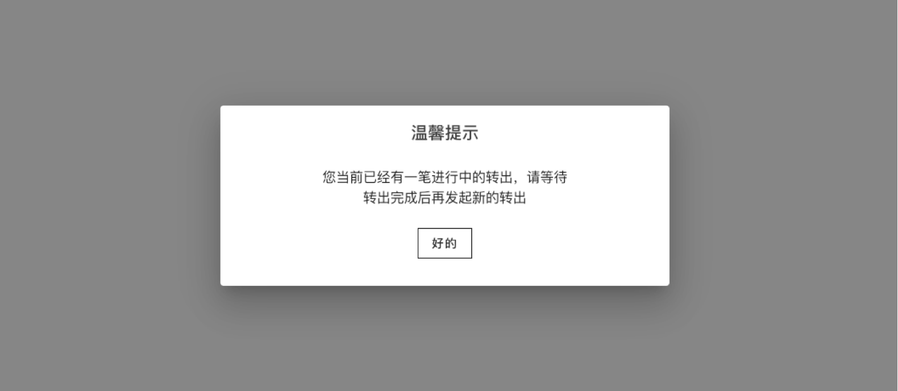
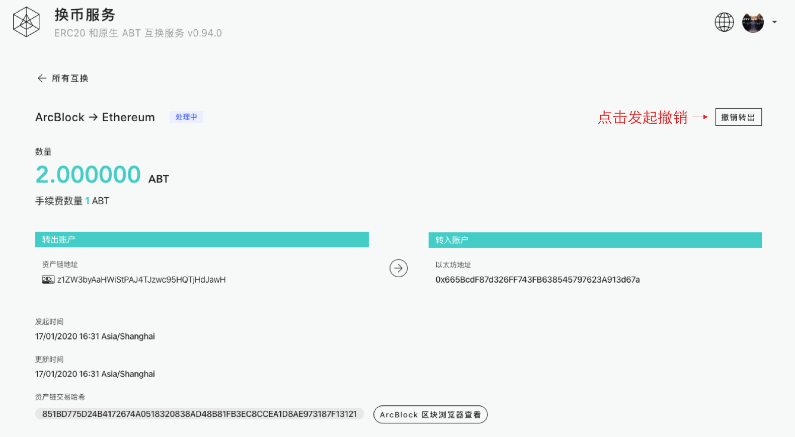
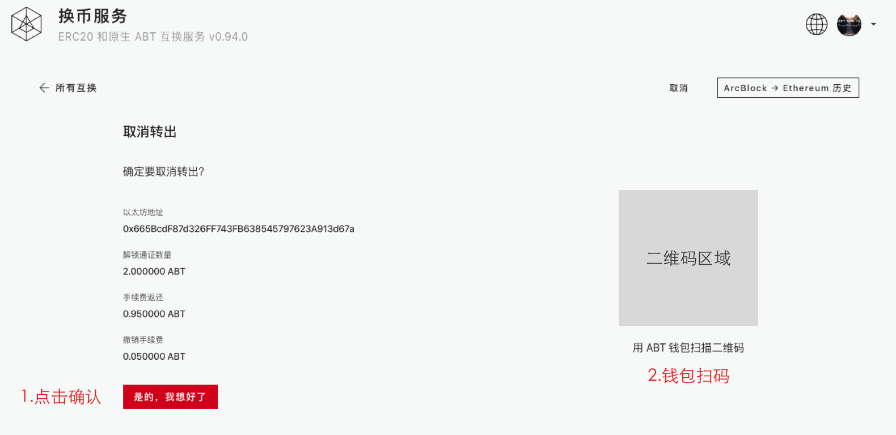
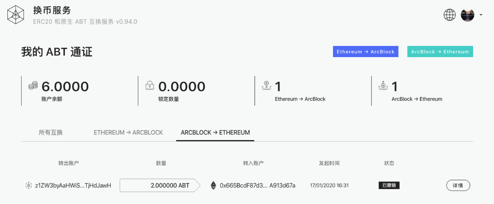

### 第一步，使用钱包登录 `换币服务` 系统

登录成功之后，会在 ABT 钱包中生成一个原生 ABT 账户, 这个账户卡片永远排在所有卡片的第一个

> **请在这一步按上面的步骤做一个检查，确保在链上的账户已经注册成功再继续下面的步骤，否则请联系我们工作人员**

### 第二步，成功登录 `换币服务` 系统之后，点击头部的 `ArcBlock->Ethereum` 按钮进入转出页面

### 第三步，进入转出页面之后，按照下面的步骤完成一次转出操作

1. 输入收款地址
2. 输入转出数量
3. 确认无误之后，点击“提交申请”，生成转出二维码
4. 打开您的 ABT 钱包，扫描二维码，完成签名验证
5. 完成转出申请

系统提供了保存白名单功能，方便用户下次便捷的发起转出申请，保存白名单和使用白名单功能如下：

1. 添加收款地址到白名单

2. 使用白名单

### 第四步，扫码完成转出申请之后，在首页可以查看转出历史的进行状态

在转出没有被系统确认前，用户如果想要取消此次转出，可以按照下面的步骤进行取消转出：

### 转出限制说明

当用户有一个提出申请还在进行中的状态时，系统是不允许用户再进行新的转出申请的，此时进入转出页面会看到如下提示：

## 撤销转出

### 第一步, 在转出历史中点击转出记录的 “详情” 按钮进入转出详情页面

### 第二步, 进入撤销转出申请页面，确认撤销，钱包扫码，完成撤销

### 最后，可以在提出历史查看最新的提出申请状态，成功之后会如下图

