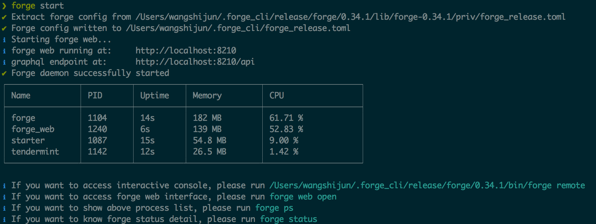
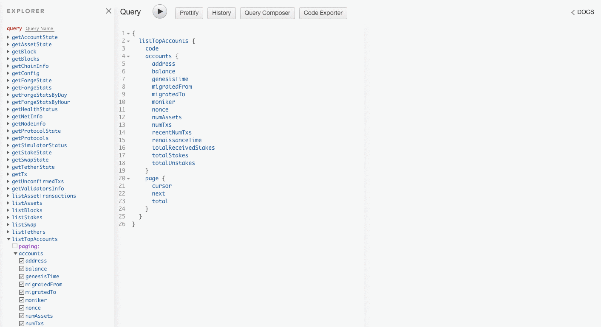
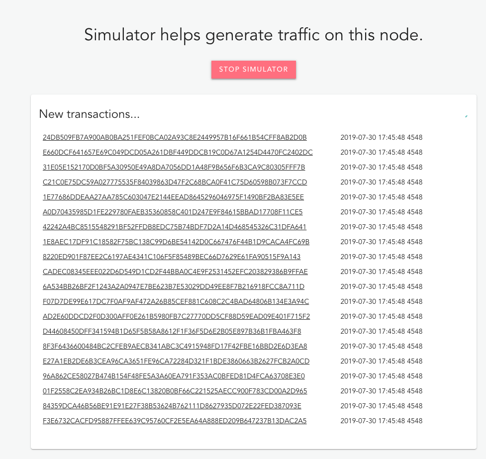
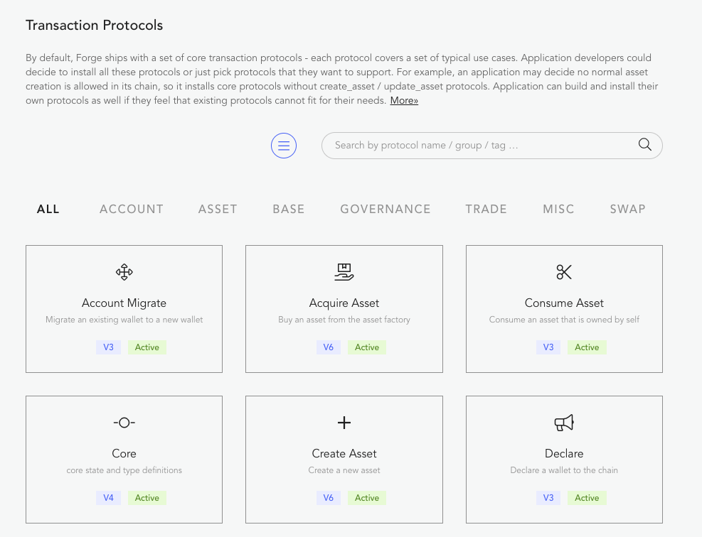
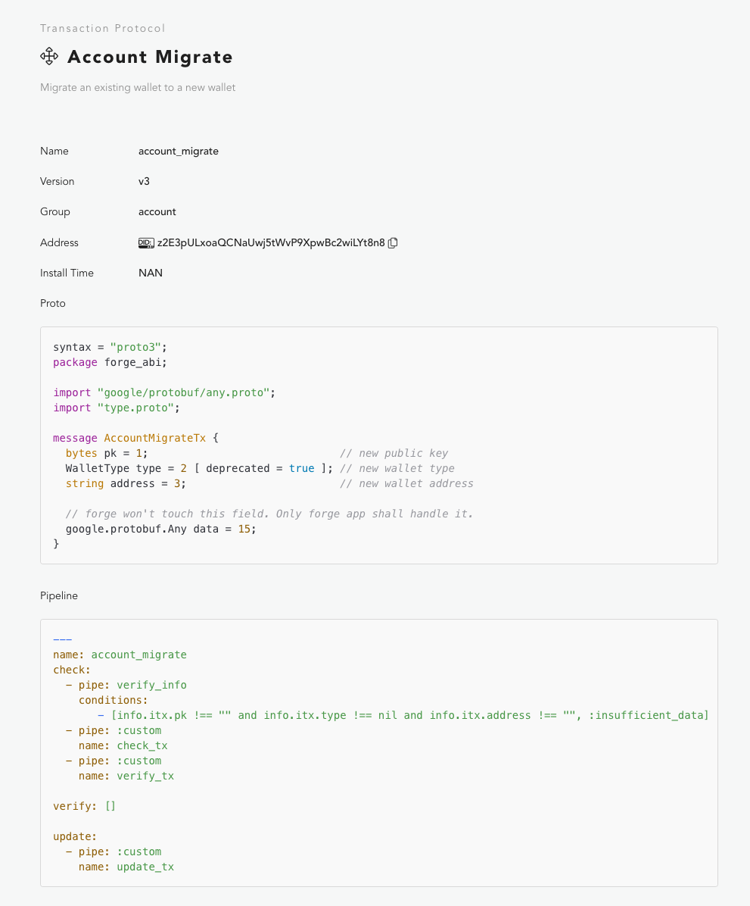

最近 3 个月，我们依然在有节奏的更新 Forge 以及围绕 Forge 的工具链，通过 [Forge CLI](https://github.com/ArcBlock/forge-cli) 可以方便的获取、试用最新版的 Forge。

你读到这篇文章时，最新的 Forge 版本是：

那么，如何获取最新版的 Forge 呢？

如果你是开发者，建议直接使用 [Forge CLI](https://github.com/ArcBlock/forge-cli) 来下载或更新最新版，开始之前，请安装最新版的 [Forge CLI](https://github.com/ArcBlock/forge-cli)：

```shell
npm install -g @arcblock/forge-cli
# 或者
yarn global add @arcblock/forge-cli
```

如果你之前试用过 Forge，并且在本地成功启动过测试链，那么需要先做一下清理工作，因为新版本的 Forge 是无法基于老版本的 Forge 产生的 Chain State 启动的，需要特别说明的是，这种表面的不兼容并不是说 Forge 的版本兼容做的不好，而是区块链数据状态的任何变更都需要基于交易，也就是说 Forge 其实支持从已经运行了一段时间的低版本的链升级到更高的版本，详细的升级步骤后面会写文章单独说明。

如何清理使用低版本的 Forge 启动的链呢？

```shell
# 先停掉运行中的 forge 进程
forge stop --force

# 然后，等 10 秒钟，等待所有的进程结束

# 最后，重置链的状态
forge reset --yes
```

清理完毕之后，执行如下命令安装最新版的 Forge：

```shell
forge install latest --silent

# 对于中国用户，可以使用我们阿里云上的 mirror，加快下载速度
forge install latest --mirror http://arcblock.oss-cn-beijing.aliyuncs.com --silent
```

执行 `forge install` 的时候，如果没有加 `--silent` 参数，Forge CLI 会询问你是否需要自定义本地链的配置，你可以根据需要修改链的名称、币的信息等，具体的配置方法也会单独写文章来解释。

然后重新启动 Forge：

```shell
forge start
```

如果一切顺利，你就有了用最新版的 Forge 启动的测试链了。



## 都有啥新特性？

Forge 内置了控制面板和区块浏览器，通过他，你可以很直观的探索最新版的 Forge 里面包含哪些新特性。

控制面板和区块浏览器的启动方法：

```shell
forge web open
```

接下来，浏览器会为你打开：[http://localhost:8210](http://localhost:8210)，这就是节点的控制面板页面，包含新特性的页面有：

### 1. 增强的 GraphQL 查询界面

本地体验[地址](http://localhost:8210/developer/query)，新版集成了强大的 [graphiql-explorer](https://github.com/OneGraph/graphiql-explorer)，开发者只需要简单的点几下鼠标就能构造链上数据查询语句



### 2. 增强的 Simulator 页面

本地体验[地址](http://localhost:8210/developer/simulator)，可以在网页上控制流量模拟器的开关、查看流量模拟器的状态。



### 3. Transaction Protocol 列表和详情页

Transaction Protocol 就是 Forge 里面的智能合约。

[列表页](http://localhost:8210/node/protocols)列出了每种当前节点上安装的所有 Transaction Protocol 信息：



[详情页](http://localhost:8210/node/protocols/z2E3p4C69sWmsJUBL4ecp9KodeJfZqkfqmKh2)展示了某个 Transaction Protocol 的详情，比如他的处理流水线、链上数据验证和更新逻辑。



实际上 Forge 里面还有大量的细节优化，就留着给你发现吧。

## 如果遇到问题

如果你在获取和使用最新版 Forge 的过程中遇到任何问题，欢迎到 Forge CLI 的[官方仓库](https://github.com/ArcbBlock/forge-cli)来提工单。
