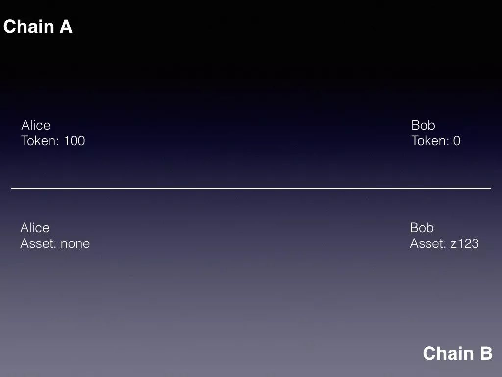
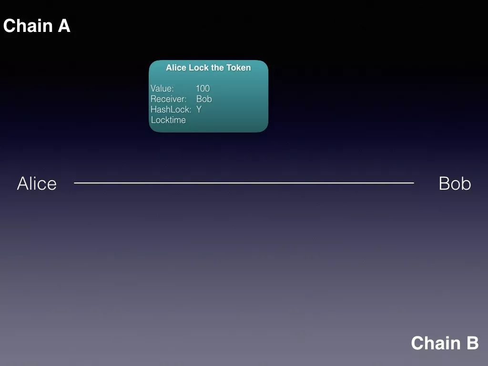
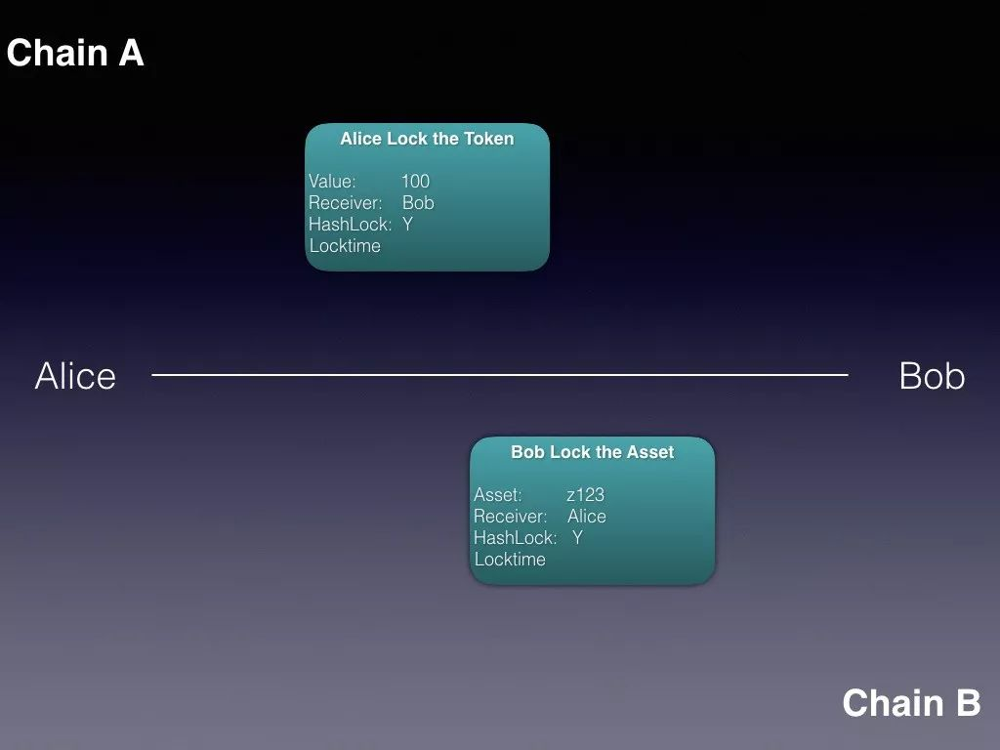
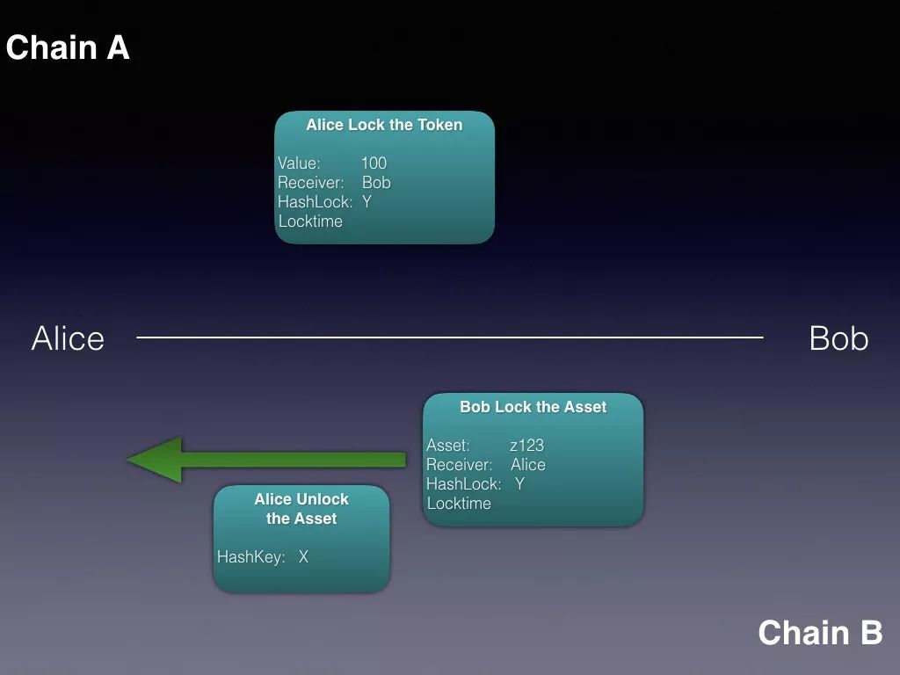
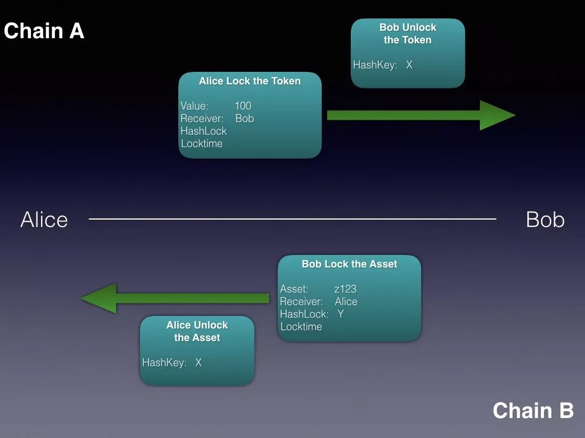
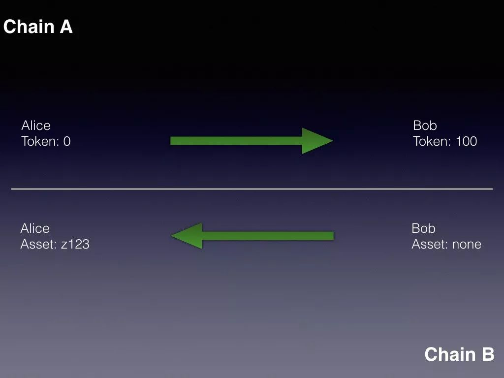
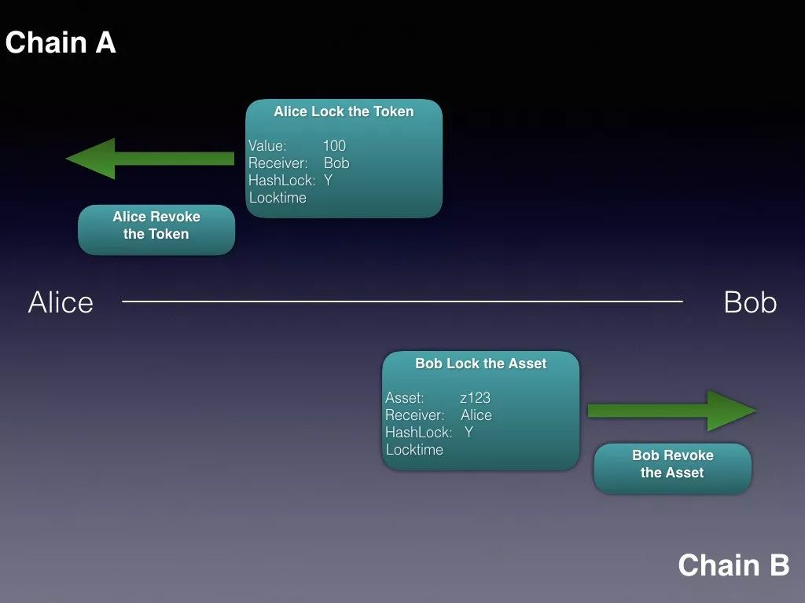

## 跨链是什么？

跨链可以分成很多种情况，比如以太坊的创始人将其归类为：可转移资产（Portable assets）、原子交换（`Atomic Swap`）、跨链预言机（Cross-chain oracles）、资产锁定（Asset encumbrance）、跨链合约（General cross-chain contracts）。

而在本文的讨论中，我们将其分为两大类：

- 同构链跨链：任意两条 Forge 链之间做互换，Forge 原生支持，以原子交换的方式实现，因为这种跨链方式是不依赖中间人的
- 异构链跨链：Forge 链和非 Forge 链之间做互换，需要运行 Token Swap 服务来实现，不在本文讨论的范围之内

## 跨链基本要素

在现实生活中，我们很容易把一个苹果从一个篮子装到另外一个篮子里面，但是在区块链的世界里面，我们无法把一个链上的数据搬到另外一条链上。

**跨链的问题，本质上和传统的跨数据库数据传输没有区别。**我们能做的仅仅只是在一条链上对数据进行一次更改，然后在另外一条链上再对数据做一些更改，两次更改需要满足一定的逻辑关系。

就好比平时跨行转账的时候，并不是工行派一辆运钞车把钱运到农行去，它们仅仅只是在各自的数据库上做了一些改动。

## 跨链的难点

**这个问题的难点就在于，这两次数据改动需要是原子性的，也就是说要么两次改动都成功，要么两次改动都不成功，我们不允许只有一次成功的情况发生。**

在传统的中心化数据库领域，这个问题并不难解决，因为我们可以很容易根据第一个数据库里的数据更改情况来决定是否对第二个数据库做更改，并且很容易回滚第一个数据库。

但是，在区块链的世界中这一点非常难办到，而难点就在于这 **「根据」** 两字。

对于一条链来讲，凡是无法直接从该链上取得的数据，我们都称为链下数据。假设我们有 A，B 两条链，对于链 A 来讲，B 链上的信息它是无法直接取得的，所以是链下信息，反之对于 B 链来讲，A 链上的信息也是链下信息。

在区块链的世界中，很难根据链下信息来做出相应的判断，而其原因在于链下信息源的去中心化。

对于链上的所有信息，该链上的所有节点都已经达成共识，但是我们应该怎么样让所有节点对链下信息达成共识呢？

如果我们只采用单一信息源，那岂不是违背了去中心化这个宗旨？这一个单一的信息源将完全控制整条链。但是如果我们采用多信息源，我们又怎么才能以可接受的代价来让本条链的所有节点就这些信息源达成共识呢？

所以**跨链的本质就是在于获取链下信息**，V 神提出那 5 种情况，其背后都是一个问题，就是获取链下信息。

在讨论了跨链交易的要素和难点之后，我们来看看到底应该如何去设计与实现。我们采用的方法叫原子交换，或者叫原子交换。我们先看看它的大致流程，以及实现上的一些考量，最后我们回过头来看看它是如何解决上面提到的跨链难点的。

## 哈希锁和钥匙

在介绍原子交换之前，我们先引入一个概念：`Hash Lock` 和 `Hash Key` 或者叫哈希锁和哈希钥匙。

一个 `Hash Lock` 其实就是一个随机数的 Hash 值，而这个随机数本身就是哈希钥匙。

假定我们有一个随机数 x，然后我们对它进行一次 Hash 运算，得到它的 Hash 值 y，那么我们就称 y 是 `Hash Lock`，而对应的我们可以称 x 为 `Hash Key` 或者叫哈希钥匙。我们可以有如下形式化的表示：Hash(x) = y.

## 原子交换的步骤

好，有了这个概念之后，下面我们就来谈谈怎么做原子交换。

### 场景设定

我们假定有如下场景：Alice 和 Bob 想做一次跨链交易，Alice 愿意以她在 A 链上的 100 个 token 来买 Bob 在 B 链上的一个 asset，该 asset 的地址为 z123。

那么假定在做原子交换之前，Alice 和 Bob 的状态如下：在 A 链上，Alice 有 100 个 token，Bob 没有 token；在 B 链上，Alice 没有 Asset，而 Bob 有一个 Asset。

在这个基础状态的前提下，我们来看原子交换的流程：

### Alice 锁定

**第一步**，由 Alice 发起，Alice 先产生一个随机数 x 作为哈希钥匙，然后生成相应的哈希锁。Alice 用这个哈希锁把 100 个 token 锁在 A 链上。在锁定的时候要指明如下信息：

1. 待锁定的 token 数量，在此例中为 100
2. 解锁人是谁，在此例中为 Bob
3. 设置一个锁定时间，在这个锁定时间之后，如果 Bob 还没有取走 token 的话，Alice 可以单方面撤走这些 token，但是在锁定时间之前 Alice 不能这么做
4. 用的是哪个哈希锁

锁定好之后，这 100 个 token 就从 Alice 的名下给划走了，确保她不能再使用这些 token。

这条 Transaction 的内容在 A 链上是公开可见的，所以 Bob 可以很清楚的知道里面的所有内容。

### Bob 锁定

**第二步**，Bob 在确定 Alice 已经锁好 token 的情况下，用同样的哈希锁把 asset 锁在 B 链上，同样的，锁定的时候需要指明：

1. 待锁定的 asset 地址，在此例中为 z123
2. 解锁人是谁，在此例中为 Alice
3. 设置一个锁定时间，在这个锁定时间之后，如果还没有取走 asset 的话，Bob 可以单方面撤走这些 asset，但是在锁定时间之前 Bob 不能这么做
4. 和 Alice 用同一把锁

### Alice 取走

**第三步**，由 Alice 先去解锁链上的 asset。 在解锁的时候，Alice 必须提供哈希钥匙，当验证通过之后，Alice 即可取走锁定的资产。

### Bob 取走

**第四步**，由 Bob 解锁 A 链上的 token。 由于 Alice 已经在 B 链上解锁，所以哈希钥匙也被公布了出来，这个时候 Bob 就可以很轻松的知道钥匙是什么，从而完成在 A 链上的解锁，拿到相应的 token。

按照上面的流程，Alice 和 Bob 就可以顺利的完成原子交换，并且最终的状态应该是这样的: 在 A 链上，100 个 token 从 Alice 的账户转移到了 Bob 的账户下；在 B 链上 asset 从 Bob 的账户下转移到了 Alice 的账户下。

### 例外情况

但是，还有另外一种情况，就是在第三步的时候，Alice 如果改变了主意，决定不去取 B 链上的资产。如果是这样的话，那么 Alice 也不会泄露相应的哈希钥匙，所以 Bob 也无法取得 A 链上的 token。在这种情况下，Alice 和 Bob 只需在锁定时间之后，将各自锁定的 token 以及 asset 取回即可。

### 流程小结

下面，我们来总结下这个流程：

1. 首先，整个原子交换是在链上实现，并且自始至终都没有第三方参与，完全由 Alice 和 Bob 完成。
2. Alice 和 Bob 之间不需要互相信任，因为这套机制保证了双方的财产安全。如果 Alice 取走了 asset，那么 Bob 一定知道哈希钥匙从而可以取走 token。如果 Alice 不取走 asset，Bob 也无法得知哈希锁，所以也无法取走 token。
3. 正因为上面的这个特性，我们才给这个方法取名为原子交换。整个交易是原子性的，要么双方都能得到想要的东西，要么双方都得不到。
4. 虽然 Alice 是首先锁定和解锁的那一方，但是这并不代表 Bob 是处于一个被动的局面。Bob 在锁定 asset 之前，可以先查看 Alice 在 A 链上锁定的 token。他需要检查锁定的 token 数量对不对，解锁人是不是他，以及很重要的，那个锁定时间到底是多少。因为在这个锁定时间之后，Alice 是可以单方面撤走 token 的，所以如果这个锁定时间和当前时间很接近的话 Bob 是有可能损失掉资产的。所以 Bob 在锁定资产之前，应该确保这个锁定时间是在当前时间之后的一个合理范围。比如，当前区块高度是 10000，并且平均 15 秒钟一个块，那么一个合理的锁定时间可能是 15760， 也就是说在第 15760 个块之后，Alice 才能单方面撤走 token。这个大致相当于一天的时间。
5. 进一步的，Bob 在锁定资产的时候，也应该设置一个合理的锁定时间，而这个时间应该小于 Alice 设置的锁定时间，比如 Bob 可以设置为 10240。我们仍然假设平均 15 秒一个块，块高从 10000 走到 10240，大概需要一个小时，所以这相当于是只给了 Alice 一个小时的时间做决定是否取走 asset。如果 Alice 取走了 asset，那么 Bob 至少还有 23 小时去取走 token。

上面介绍的是原子交换的大致流程，在有了一个整体概念之后，我们来看看具体在 Forge 上怎么实现。

## Forge 的实现

接下来我们来看看 Forge 里面怎么实现原子交换。

### 锁定：SetupSwap

**第一步是锁定**，我们设计并实现了 [SetUpSwap](../set_up) 这个 Transaction 来让用户锁定 token 和 assets。

在这个 Transaction 中，发送方需要填入 Receiver address， `Hash Lock`, Locktime（锁定时间）, 以及想要锁定的 token 数量和 asset 地址。

链节点在执行这个 Transaction 的时候会验证 Locktime 是否大于当前块高，以及发送者是否持有相应的 token 和 asset。如果不满足条件的话，Transaction 会失败。

当 Transaction 通过后，Forge 会生成一个 SwapState。这个 SwapState 的地址是根据 Transaction Hash 来生成的，**因为 Forge 不允许重复的 Transaction Hash，所以 SwapState 的地址也是不会重复的**。

这一点也同样保证了，每一个 SwapState 是单独的，互不影响的。

SwapState 本身不属于任何账号，它只按照原子交换的规则运行。当 [SetUpSwap](../set_up) 上链之后，相应的信息会记录在 SwapState 上，如 Sender address, Receiver address， Locktime， Hashlock，Token 以及 Asset addresses。其中 Token 和 Assets 是从 Sender 转来的，这样确保发送方无法再更改这些 Token 和 Assets。

### 解锁：RetrieveSwap

**第二步是解锁**，对应的 Transaction 是 [RetrieveSwap](../retrieve)。在这个 Transaction 中，我们需要填入想要取回的 SwapState 的地址，以及相应的 Hashkey.

链节点在执行这个 Transaction 的时候会验证 SwapState 中 Receiver 的地址和此 Transaction 发送者的地址是否一致，Hashkey 是否和 Hashlock 匹配，以及 SwapState 中是否还有 Token 或者 Assets。

当条件满足，Transaction 执行通过之后，Hashkey 会被写入 SwapState 以供所有人查阅。SwapState 中的 token 和 assets 会转移到相应的账户中。

### 撤销：RevokeSwap

如果中途想终止交易，那么就需要撤回锁定的 token 或者 assets。我们用 [RevokeSwap](../revoke) 来实现这一步。

在这个 Transaction 中，我们只需要填入 SwapState 的地址即可。

Forge 会验证 SetUpSwap 和 [RevokeSwap](../revoke) 的发送方是否为同一个人。同时也会验证，当前区块高度是否已经超过 SwapState 里面记录的 Locktime，以及 SwapState 里面是否还有 token 和 assets。

如果 Transaction 成功被执行 SwapState 里面的 token 和 assets 会被转移给 Transaction 发送方，从而达到撤回的效果。

### 细节考量

在整个设计和实现的时候有很多细节需要去思考。

首先，整个原子交换里面最重要的因素就是哈希钥匙，所以对哈希钥匙的保护是我们考虑的第一个点。在具体实现时，和其他 Forge 上的 Transaction 相比，我们做了一个改动。那就是当一个 Forge 节点在验证一个 RetrieveSwap 的时候，如果这个 Transaction 失败了，那么它是不会被记录到链上的，而且也不会被广播给其他节点。这样最大限度的减少 RetrieveSwap 中的 Hashkey 被曝露的范围。

当然，即使这个 Transaction 不被写到链上，不被广播，但是它仍然至少被一个节点验证过，如果这个节点本身就是作恶的节点，那么它完全有可能记录下该 Hashkey。所以为了避免这种情况，合理的设置 Locktime 就显得尤为重要。因为在 Locktime 之前，都只有对应的 Receiver 被允许转走 SwapState 里面的 token 和 assets。那么 Receiver 应该利用这段时间，排查失败的原因并且不断的进行重试。

在实际中，失败的原因可能是网络问题或者是 gas 不够等。为此我们在钱包里面也做了相应的优化。钱包会在用户发送 RetrieveSwap 之前比较当前块高和 Locktime，如果两者过于接近，钱包会有相应提示。

第二个潜在的安全因素是 Hashkey 的大小。 在 SetUpSwap Transaction 中，我们只包含 Hashlock 的值。由于该值是一个 Hash 值，所以大小是固定的。但是我们并不知道 Hashkey 的大小，Hashkey 可以是任何值。在一些极限情况下，一个特别大的 Hashkey 可以导致单方面的 ReceivSwap Transaction 验证失败。所以我们把 Hashkey 的大小限制在 64 字节。
