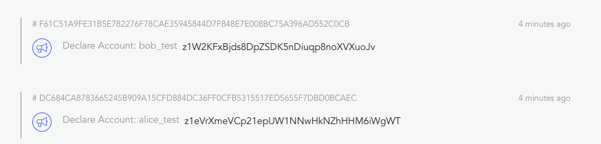

# Javascript SDK

If you are a developer from traditional web development, please checkout [general concepts] first.

Forge Javascript SDK provides basic capability for developers to do the following things:

- Read/Write on-chain data through graphql endpoint: [GraphQLClient]() and grpc endpoint
- Create and manipulate wallets using just javascript: [mcrypto](), [forge-wallet]()
- Derive/validate DID that are used widely in different forge framework components: [did], [did-auth], [did-util]
- Assemble/encode/sign a transaction that can be sent to any forge powered blockchain: [mcrypto]

Next, let's walk through the basic steps to write a simple javascript program that do the following things:

1. Create 2 accounts (`Alice` and `Bob`) on forge powered blockchain, which you can get up and running easily with [forge-cli];
2. Get 25 free tokens(TBA) to the newly created account
3. Transfer 5 token from `Alice` to `Bob`
4. Create an asset(non-fungible token) for `Bob` that can be sold to `Alice` for 10 token
5. Let `Alice` make an exchange of 10 token with `Bob` for the asset

The whole process covers most of the tasks that a typical web application will do, such as:

- Setup a database, every blockchain is a public verifiable database
- Create user accounts (register/login)
- Update state for users (token/asset)
- Trade between users (transfer/exchange)

## 1. Setup a running node

This step is not required to proceed to next steps, because forge javascript sdk is designed to work with any forge powered blockchain.

If you are interested in running a chain node on your local machine, checkout our awesome command line tool: [forge-cli]() and start a node, you can do that within 10 minutes.

Once your chain has started, run `forge web open` to verify that the web dashboard/explorer of your chain is up and running. If the web dashboard of your chain node loads without any errors, means our database is set, we can use `http://127.0.0.1:8210/api` as graphql endpoint.

If you prefer to use existing chain(public sandbox database), please remember to replace endpoint url to our public testing chain endpoint: `https://test.abtnetwork.io/api`.

## 2. Init the javascript object

```shell
mkdir -p /tmp/hell-forge
cd /tmp/hello-forge
npm init -y
```

## 3. Create user accounts(wallets)

Cryptography is hard! So we created a multi-language package called `mcrypto` and utility library `forge-wallet` to help developers manipulate wallets that are compatible with forge.

To create user accounts we need first configure some properties of the accounts.

Add the following dependency:

```shell
npm install @arcblock/forge-wallet @arcblock/mcrypto -S
touch index.js
```

Then, create 2 wallets named `Alice` and `Bob` with random secret key(`edit index.js`):

```javascript
const { types } = require('@arcblock/mcrypto');
const { fromRandom, WalletType } = require('@arcblock/forge-wallet');

const type = WalletType({
  role: types.RoleType.ROLE_ACCOUNT,
  pk: types.KeyType.ED25519,
  hash: types.HashType.SHA3,
});

const alice = fromRandom(type);
const bob = fromRandom(type);

console.log({ alice: alice.toJSON(), bob: bob.toJSON() });
```

Run `node index.js`, we will get:

```text
{ alice:
   { type:
      { role: 'ROLE_ACCOUNT',
        pk: 'ED25519',
        hash: 'SHA3',
        address: 'BASE58' },
     sk:
      '0xc5ef518f75347742858640e5685025dd7259e4417e037d65b68884ca8ea0068f03181ad64f61302de1f12903c99f6fd48da48b941391e0e0c85c6205b43cbd13',
     pk:
      '0x03181ad64f61302de1f12903c99f6fd48da48b941391e0e0c85c6205b43cbd13',
     address: 'z1icz5RNZuPRhDdKWg1GGjN1fcJ5NwccWpd' },
  bob:
   { type:
      { role: 'ROLE_ACCOUNT',
        pk: 'ED25519',
        hash: 'SHA3',
        address: 'BASE58' },
     sk:
      '0x3bd3d37e9bcc1ab61c52cbeb63118962ed43d2877344d2288225caf2cbcab7acfdfcc9a0146cf7f30af327090bbb1def2ddb9c08465623f901977e107df4686b',
     pk:
      '0xfdfcc9a0146cf7f30af327090bbb1def2ddb9c08465623f901977e107df4686b',
     address: 'z1m8hfeWSD4fZcycrHDgpJCRTHi2sowPXBt' } }
```

> Please note that, forge supports many wallet types, the above wallet type is a typical one, it's ok to stick with it when testing. For all supported wallet types please refer to [enums](./types/enum)

Before sending any data to forge powered blockchain, we should be aware that, all transaction must be signed with a wallet (secretKey/publicKey pair).

## 4. Register user on the chain

Similar to user registration in traditional web applications, forge requires an wallet to declare itself on the chain before generating any further activities such as staking, voting and sending transaction.

To register `Alice` and `Bob` on the chain, we will use GraphQLClient:

Add `@arcblock/graphql-client` as dependency:

```terminal
yarn add @arcblock/graphql-client moment
```

Then, create an instance of GraphQLClient and `sendDeclareTx`:

```javascript
const { types } = require('@arcblock/mcrypto');
const { fromRandom, WalletType } = require('@arcblock/forge-wallet');
const GraphQLClient = require('@arcblock/graphql-client');

const type = WalletType({
  role: types.RoleType.ROLE_ACCOUNT,
  pk: types.KeyType.ED25519,
  hash: types.HashType.SHA3,
});

const alice = fromRandom(type);
const bob = fromRandom(type);

const host = 'http://127.0.0.1:8210';
const client = new GraphQLClient({ endpoint: `${host}/api` });

function registerUser(userName, userWallet) {
  return client.sendDeclareTx({
    tx: {
      itx: {
        moniker: userName,
      },
    },
    wallet: userWallet,
  });
}

(async () => {
  try {
    let hash = await registerUser('alice_test', alice);
    console.log('create account for alice on chain', hash);

    hash = await registerUser('bob_test', bob);
    console.log('create account for bob on chain', hash);
  } catch (err) {
    if (Array.isArray(err.errors)) {
      console.log(err.errors);
    }
    console.error(err);
  }
})();
```

Run `node index.js` again, we will get:

```terminal
create account for alice on chain DC684CA8783665245B909A15CFD884DC36FF0CFB5315517ED5655F7DBD0BCAEC
create account for bob on chain F61C51A9FE31B5E782276F78CAE35945844D7F848E7E008BC75A396AD552C0CB
```

Open explorer: `http://localhost:8210/node/explorer/txs`, we can see that, the 2 accounts are registered on the chain:



> Here are are using `sendDeclareTx` to write data to the blockchain, many other data types are supported, please refer to [GraphQLClient](/forge/sdks/javascript/latest/GraphQLClient.html) for full list of API.

## 5. Get 25 token for `Alice` and `Bob`

### 5.1 Default account balance

The most important usage of blockchain is recording state and transfers of value, value are presented with token, forge also support that, if we inspect the account we just created with the following code, we can see there balance is `0`:

```diff
diff --git a/index.js b/index.js
@@ -13,6 +13,7 @@ const bob = fromRandom(type);

 const host = 'http://127.0.0.1:8210';
 const client = new GraphQLClient({ endpoint: `${host}/api` });
+const sleep = timeout => new Promise(resolve => setTimeout(resolve, timeout));

 (async () => {
   try {
@@ -35,6 +36,10 @@ const client = new GraphQLClient({ endpoint: `${host}/api` });
       wallet: bob,
     });
     console.log('create account for bob on chain', hash);
+
+    await sleep(3000);
+    const { state: aliceState } = await client.getAccountState({ address: alice.toAddress() });
+    console.log('alice.balance', aliceState.balance);
   } catch (err) {
```

> Here we are using `getAccountState` to read data from the blockchain, we can also use GraphQLClient to read transaction/block/asset/chain info, please refer to [GraphQLClient](/forge/sdks/javascript/latest/GraphQLClient.html) for full list of API.

### 5.2 Get free token

Forge provides an special type for developers to get test tokens for free, let's see the code:

```patch
diff --git a/index.js b/index.js
@@ -1,6 +1,7 @@
 const { types } = require('@arcblock/mcrypto');
 const { fromRandom, WalletType } = require('@arcblock/forge-wallet');
 const GraphQLClient = require('@arcblock/graphql-client');
+const moment = require('moment');

 const type = WalletType({
   role: types.RoleType.ROLE_ACCOUNT,
@@ -26,7 +27,24 @@ function registerUser(userName, userWallet) {
   });
 }

+function getFreeToken(userWallet) {
+  return client.sendPokeTx({
+    tx: {
+      nonce: 0,
+      itx: {
+        date: moment(new Date().toISOString())
+          .utc()
+          .format('YYYY-MM-DD'),
+        address: 'zzzzzzzzzzzzzzzzzzzzzzzzzzzzzzzzzzzz',
+      },
+    },
+    wallet: userWallet,
+  });
+}
+
 (async () => {
+  console.log('alice.address(userId)', alice.toAddress());
+  console.log('bob.address(userId)', bob.toAddress());
   try {
     let hash = await registerUser('alice_test', alice);
     console.log('create account for alice on chain', hash);
@@ -34,9 +52,18 @@ function registerUser(userName, userWallet) {
     hash = await registerUser('bob_test', bob);
     console.log('create account for bob on chain', hash);

-    await sleep(3000);
+    await sleep(5000);
     const { state: aliceState } = await client.getAccountState({ address: alice.toAddress() });
     console.log('alice.balance', aliceState.balance);
+
+    hash = await getFreeToken(alice);
+    console.log('get token for alice: ', hash);
+    hash = await getFreeToken(bob);
+    console.log('get token for bob: ', hash);
+
+    await sleep(5000);
+    const { state: aliceStateNew } = await client.getAccountState({ address: alice.toAddress() });
+    console.log('alice.balanceNew', aliceStateNew.balance);
   } catch (err) {
     if (Array.isArray(err.errors)) {
       console.log(err.errors);
```

Then, run `node index.js` again, we will get:

```terminal
alice.address(userId) z1WrEtEV8QfVqfdVpMgP84zjqsAyvu9JQJx
bob.address(userId) z1gnRfzPLsvMzbnETWToC2KkZPS8DAUbu64
create account for alice on chain F229BAD518FBFF992DBA427EB41BB2FA4C47B737887A69148B2158EA6B270EDF
create account for bob on chain 983A330A062DE5D6939B77BC5C95443C1B879850FAF2B07C48381E7D1D0B9584
alice.balance 0
get token for alice:  9236928CBFD03E3B5C2DBD0963E0C0F1D9CECF48CB76612AE8B97136CCC3A33F
get token for bob:  C9C3A24FB12746F4E8049AD7088B9FADE92D5991152BA14B7C86B0DBDE92E01E
alice.balanceNew 250000000000000000
```

### 5.3 Format account balance

You may notice that the token balance for `Alice` is a very large number, we can format that to human readable number with help of `@arcblock/forge-util`.

> For all utility methods of `@arcblock/forge-util`, please refer to the [documentation](/forge/sdks/javascript/latest/module-@arcblock_forge-util.html)

```terminal
yarn add @arcblock/forge-util
```

Then change `index.js` to format account balance:

```patch
diff --git a/index.js b/index.js
@@ -1,5 +1,6 @@
 const { types } = require('@arcblock/mcrypto');
 const { fromRandom, WalletType } = require('@arcblock/forge-wallet');
+const { fromUnitToToken } = require('@arcblock/forge-util');
 const GraphQLClient = require('@arcblock/graphql-client');
 const moment = require('moment');

@@ -64,6 +65,7 @@ function getFreeToken(userWallet) {
     await sleep(5000);
     const { state: aliceStateNew } = await client.getAccountState({ address: alice.toAddress() });
     console.log('alice.balanceNew', aliceStateNew.balance);
+    console.log('alice.balanceNew.readable', fromUnitToToken(aliceStateNew.balance));
   } catch (err) {
```

Run `node index.js` again, we can see that `Alice` got 25 token:

```terminal
alice.balanceNew 250000000000000000
alice.balanceNew.readable 25
```

> Forge allows developers to customize the token name/symbol/decimal on each chain, refer to [configuration](../core/configuration.md) for details.

## 6. Transfer 5 token from `Alice` to `Bob`
