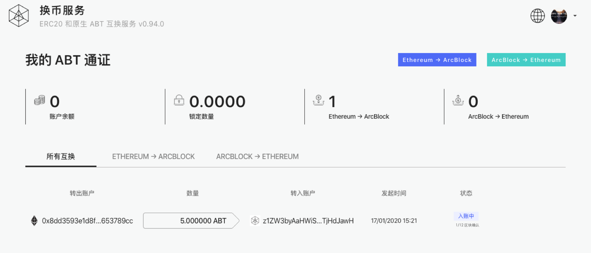

### 1. Login in swap service with your ABT wallet

After you have successfully logged in, you will see a native ABT account that has been automatically generated in your ABT wallet, and this account card will always be the first of all your active cards in your wallet.  

> **Please check the above steps at this step to ensure that the account on the chain has been successfully registered before proceeding to the next step, otherwise please contact our staff**

### 2. Open the `Ethereum->ArcBlock` page

> What is the swap address? The swap address is an ETH account randomly generated by you based on your current asset chain DID account. This account is associated with your asset chain DID account one by one

### 3. Inspect the deposit address

Users only need to swap ERC20 ABT to this swap address, and can use any third-party wallet that supports ERC20 swap to complete this step.

> **In order to ensure the safety and accuracy of your swap, we suggest that you only swap a small amount of ERC20 ABT for testing and confirm that it is correct before swapping a larger amount.**

### 4. Track the swap status in swap history

