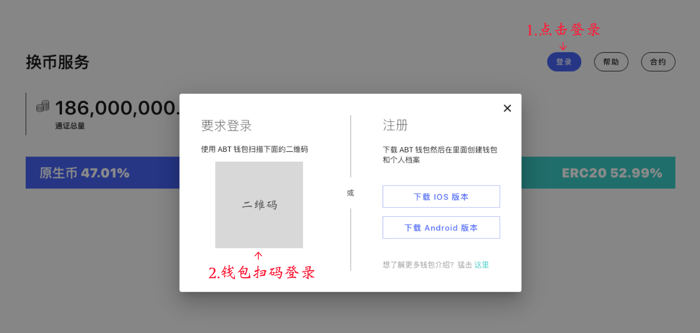
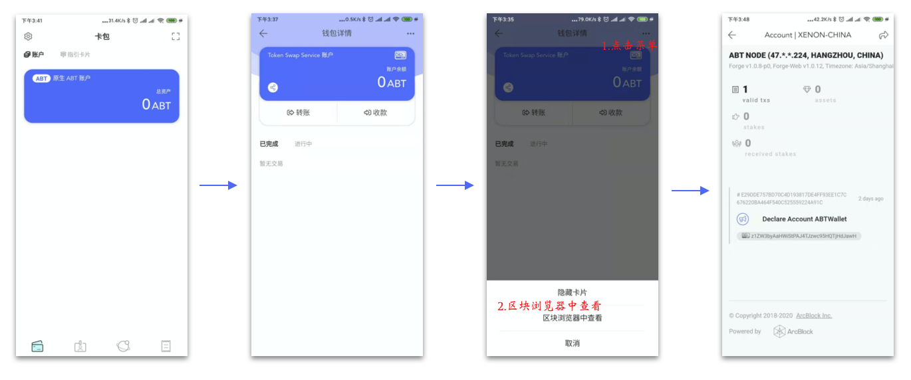
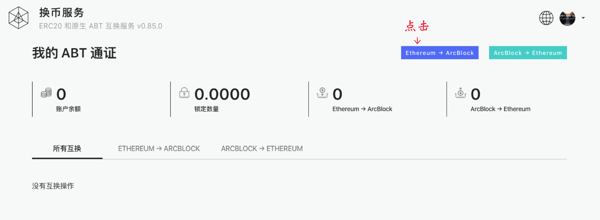
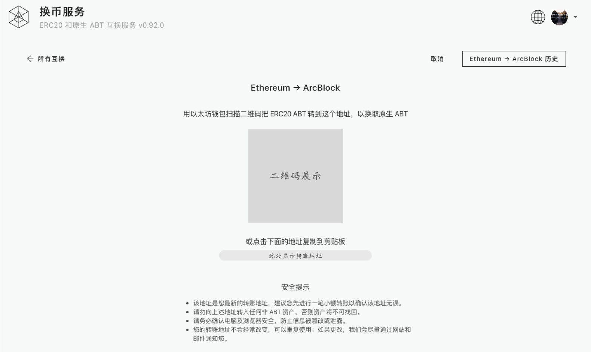
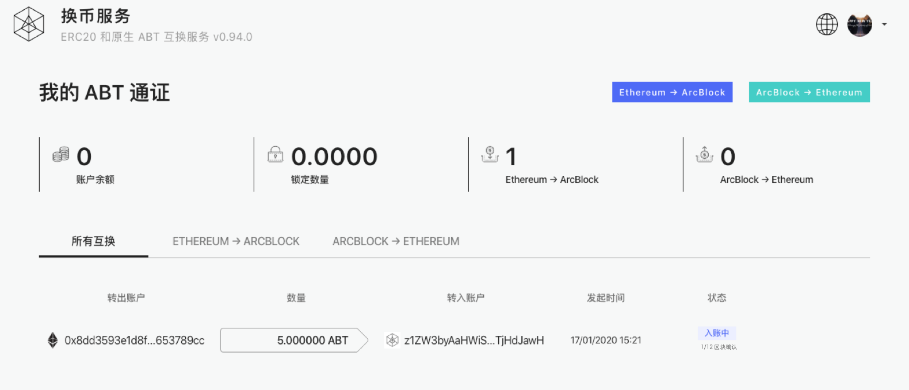

### 第一步，使用钱包登录 `换币服务` 系统

登录成功之后，会在 ABT 钱包中生成一个原生 ABT 账户, 这个账户卡片永远排在所有卡片的第一个

> **请在这一步按上面的步骤做一个检查，确保在链上的账户已经注册成功再继续下面的步骤，否则请联系我们工作人员**

### 第二步，成功登录`换币服务`系统之后，点击头部的 `Ethereum->ArcBlock` 按钮进入转账地址的展示页面

> 什么是转账地址？转账地址是我们根据您当前的资产链 DID 账户随机生成的一个 ETH 账户，这个账户和您的资产链 DID 账户一一关联

### 第三步，进入页面之后，会看到 ETH 转账地址及其二维码

用户只需要往这个转账地址转入 ERC20 ABT 即可，可以使用任何支持 ERC20 转账的三方钱包完成此操作。

> **为了取保您的资产安全准确的转入，可以先转入少量的 ERC20 ABT 进行测试，确认无误之后再转入更大额的数量**

### 第四步，当你向转账地址转入 ERC20 ABT 之后，可以在转入历史记录中追踪转入状态

