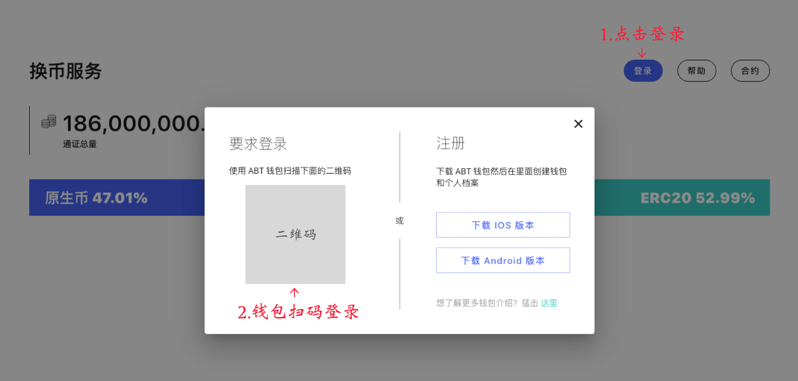

### 1. Login to token swap service

After login, a native ABT account will be automatically generated in your ABT wallet, and this account will always be displayed on the top.

### 2. Open `ArcBlock->Ethereum` Page

### 3. Fill the form

1.  Enter recipient address, which must be valid ETH address. Note, if you enter the wrong address your token(s) will be lost.
2.  Enter the number of tokens for swapping
3.  Click "Submit" to generate the authentication QR code
4.  Open your ABT wallet, scan the QR code, and complete the signature verification

Token Swap supports saving recipient to your contact list, which is convenient for users to initiate repeat swaps:

3.1  Adding address to Contact List

3.2  Using Your Contact List

### 4. Track swapping progress

### Swapping out limitations

When the user has a swapping-out in progress, the system does not allow you to make a new "swapping out" request. You will see the following prompt:

## Revoke swapping

Before the swapping is done, you are able to cancel your swap request. Note, there may be a small cancellation fee each time you request to cancel a swap.  Here are the steps to cancel:

### 1. Open swapping detail page

### 2. Open cancel swapping page

### 3. Track cancellation progress

