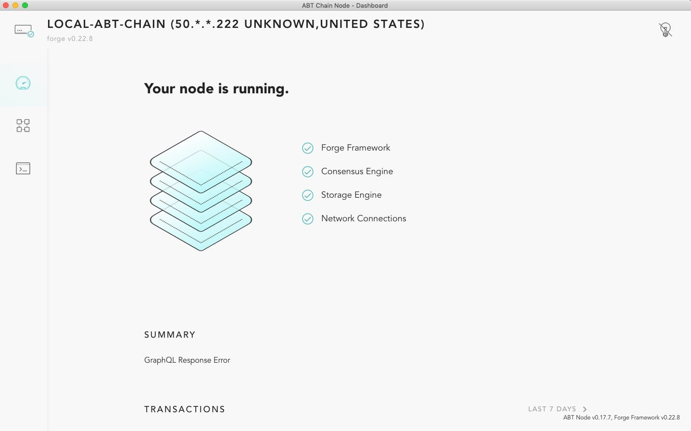
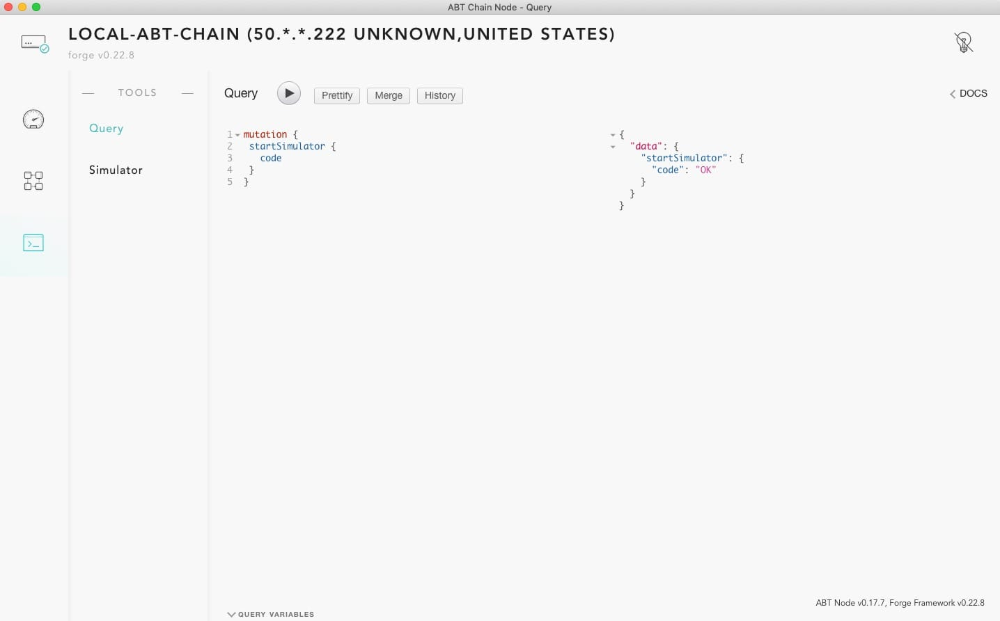

# ABT Chain Node

ABT Chain Node is a user-friendly application that enables you to start and
manage a Forge node. The app is currently in Beta.

This page shows you how to install the desktop version
of the ABT Chain Node app for Mac OS X&reg; and Ubuntu&reg; and start a node.

**Note**: For instructions about starting a Forge node on the command line, see
[Force CLI](http://docs.arcblock.io/forge/tools/forge_cli.html#install-forge-cli).

**Note**: For the most up-to-date build, use Forge v0.22.8.

## Download the app

The following downloads are available.

### For Chinese users:

- **Mac OS X**: [ABT Chain Node v0.7.2 OS X
  build](http://arcblock.oss-cn-beijing.aliyuncs.com/forge/0.7.2/ABTChainNode-0.7.2.dmg)
- **Ubuntu**: [ABT Chain Node v0.7.2 Ubuntu
  build](https://arcblock.oss-cn-beijing.aliyuncs.com/forge/0.7.2/ABTChainNode_0.7.2_amd64.deb)

### For global users:

- **Mac OS X**: [ABT Chain Node v0.7.2 OS X
  build](http://releases.arcblock.io/node/ABTChainNode-0.7.2.dmg)
- **Ubuntu**: [ABT Chain Node v0.7.2 Ubuntu
  build](http://releases.arcblock.io/node/ABTChainNode_0.7.2_amd64.deb)

## Open the ABT Chain Node app on Mac OS X

After you download the **.dmg** file, drag it to your **Applications folder**.

If you double-click on the application to try to run it for the first time, a
warning similar to the one in the following image displays:


This warning displays because the current preview version of the ABT Chain Node
app is not yet registered with Apple. For more information, see [macOS Sierra:
Open an app from an unidentified
developer](https://support.apple.com/kb/ph25088?locale=en_US).

If you see this warning, use the following steps to open the app:

1. In Finder, right-click on the app and select **Open** from the menu, as shown
   in the following image:

   

2. Next, in the pop-up window that displays, click **Open** again to allow the
   app to run:

   


When the ABT Chain Node application opens, the following screen displays and
indicates that it is spinning up a Forge node:


When the node is running, the dashboard displays, as shown in the following
image:


It shows an overview of your blockchain, including the number of blocks,
transactions, and other information.

## Potential errors

This section describes potential errors that might occur when you first install
the ABT Chain Node app.

### GraphQL error

Rather than displaying an overview of your blockchain, the node might display a
GraphQL error similar to the one in the following image:



If this error message displays, press **CMD + R** to refresh the page, which
should resolve the issue.

## ABT Chain Node cannot start

Some users might encounter the error shown in the following image:


If you see this error, it is highly likely that you need to install
required toolchains. You can install these dependencies by running the following
command in a Terminal window:

```bash
brew install automake libtool pkg-config libffi gmp openssl
```

This command installs OpenSSL and other cryptography-related tools.
If Homebrew is not installed on your computer, follow the first three steps in
[Install Forge on OS X](../install/macos.html). Then, rerun the ABT Chain Node
app.

**Note**: El Captain and lower versions of the OS X operating system are not
supported.

A newly started node has just a few transactions. To generate more transactions, you can start the simulator with the integrated API playground:



## Features

### Join a network

Use the following steps to join your blockchain to a network:

<aside class="warning">
Joining a new network wipes out your local data. If you want to preserve your
data, ensure that you create a backup. All of the data that the ABT Chain Node
app creates is stored in `~/.forge_desktop`.
</aside>

1. From the application menu (the **ABT Chain Node** menu in the top navigation
   bar), select **Join Another Network**, as shown in the following image:

   

2. Click **Proceed** and input a network URL, as shown in the following image:

   

   You can currently select one of the following networks:

   - **Bromine (A test that runs the latest nightly build
     version)**: https://bromine.abtnetwork.io/api

     **Note**: Because Bromine runs with a nightly build, we cannot guarantee
     that it is always online.

   - **Titanium**: https://titanium.abtnetwork.io/api

3. Click **OK**.

Your local data is wiped out. After Forge restarts, your node begins
to sync with remote node.

### Reset chain state

Resetting chain state stops the node and deletes all of the network data on
disk.

<aside class="warning">
Resetting chain state wipes out your local data. If you want to preserve your
data, ensure that you create a backup. All of the data that the ABT Chain Node
app creates is stored in `~/.forge_desktop`.
</aside>

Use the following steps to reset chain state:

1. From the application menu, select **Reset Chain State**.

   A pop-up window prompts you to confirm this action, as shown in the
   following image:

   

2. Click **Proceed** to continue.

   All of your existing data is wiped out.

3. In the application menu, select **Quit**.

   **Note**: If you do not quit the application, the chain continues to follow
   the current configuration.

4. Start ABT Chain Node again to run a completely refreshed node.
