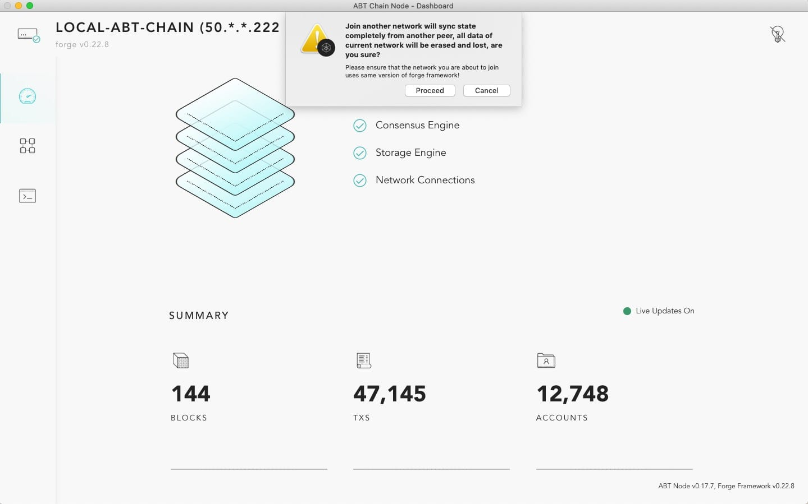

# ABT Chain Node

ABT Chain Node is a non-developer, user-friendly application that can start/manage a forge node. It is currently a preview version. For MAC OSX and Ubuntu user, we build desktop edition to manage node start/stop automatically.

The most up to date build is using forge v0.22.8:

For Chinese users:

* OSX: [ABT Chain Node v0.7.2 OSX build](http://arcblock.oss-cn-beijing.aliyuncs.com/forge/0.7.2/ABTChainNode-0.7.2.dmg)
* Ubuntu: [ABT Chain Node v0.7.2 Ubuntu build](https://arcblock.oss-cn-beijing.aliyuncs.com/forge/0.7.2/ABTChainNode_0.7.2_amd64.deb)

For global users:

* OSX: [ABT Chain Node v0.7.2 OSX build](http://releases.arcblock.io/ABTChainNode-0.7.2.dmg)
* Ubuntu: [ABT Chain Node v0.7.2 Ubuntu build](https://releases.arcblock.io/ABTChainNode_0.7.2_amd64.deb)

## Features

### Join a network

From application menu ("ABT Chain Node" next to the apple icon on top left corner), select "Join Another Network", then follow instructions to complete:

Then click "Proceed" and input a network URL:

Currently the choices are:

* https://bromine.abtnetwork.io/api
* https://titanium.abtnetwork.io/api

Note bromine runs with a nightly build so we can't guarantee it is always online.

Once you have provided the url, click "OK", your local data will be wiped out and after forge restart, your node will start syncing with remote node.

### Reset chain state

From application menu, select "Reset Chain State", then follow instructions to complete.

Once you click "Proceed", you will lose all existing data. You can then click "Quit" and start ABT Chain Node again to have a completely refresh node. If you didn't quit, the chain will follow the current configuration.

::: warning

Please be aware that joining a new network / reset chain state means your local data will be wiped out. If you'd like to preserve your data, please back it up and restore it later. All the data generated by ABT chain node is stored in `~/.forge_desktop`.

:::
