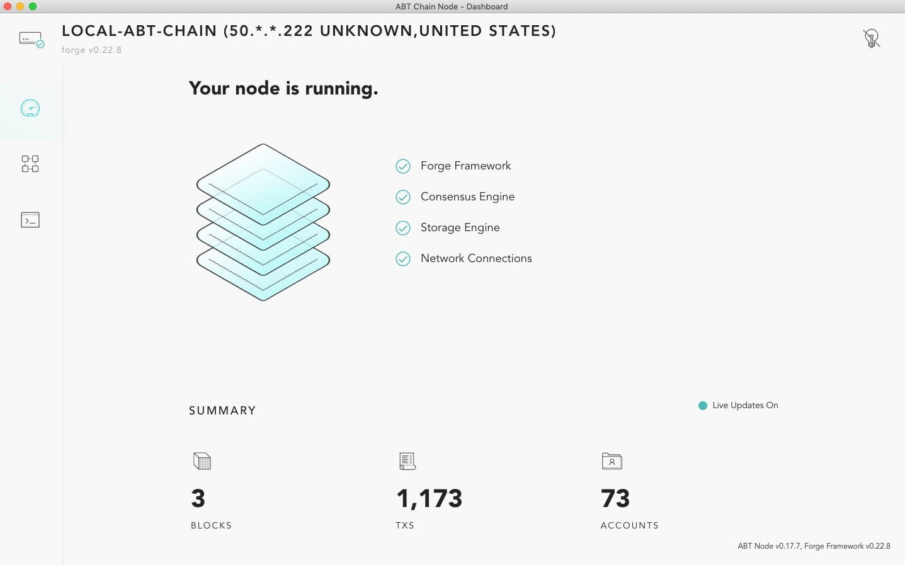
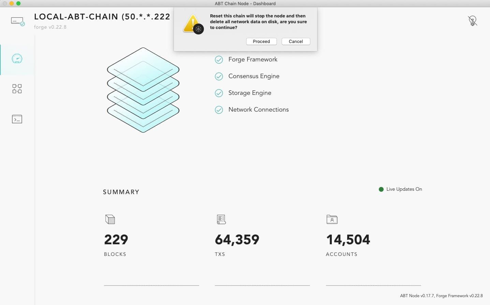

ABT Chain Node is a user-friendly application that can start/manage a forge node. It is currently a preview version. For MAC OSX and Ubuntu user, we build desktop edition to manage node start/stop automatically.

The most up to date build is :

For Chinese users:

- OSX: [ABTChainNode.dmg](https://releases.arcblockio.cn/forge/latest/ABTChainNode.dmg)
- Ubuntu: [ABTChainNode_amd64.deb](https://releases.arcblockio.cn/forge/latest/ABTChainNode.deb)

For global users:

- OSX: [ABTChainNode.dmg](http://releases.arcblock.io/forge/latest/ABTChainNode.dmg)
- Ubuntu: [ABTChainNode_amd64.deb](http://releases.arcblock.io/forge/latest/ABTChainNode.deb)

::: warning

Because both [forge-cli](./forge_cli) and ABT Chain Node starts a node on your local machine, if you are already running a node with forge-cli, things may not go as expected when you start ABT Chain Node. For developers, we recommend using [forge-cli](./forge_cli) to manage your local node.

:::

If you are OSX user, once you downloaded the dmg file and dragged it to application folder, when you try to run it for the first time, it will give you a warning like this:


This is because the current preview version of the ABT Chain Node has not yet registered with Apple. You can find more information with this KB: [https://support.apple.com/kb/ph25088?locale=en_US](https://support.apple.com/kb/ph25088?locale=en_US).

So don't worry about it for now. You can find the app in the finder, right click it and select "Open" from the menu:


Then click "Open" again in the popup window to allow it:


Then ABT Chain Node shall be successfully opened like this:


and wait a moment you will see the running node like this:



If you see node shows certain GraphQL error like this:


don't panic, just click `Command + R` to refresh the page, then it shall work.

A newly started node will have just a few transactions, if you want to generate some transactions, you can start the simulator with integrated API playground:


## If you stuck...

If you stuck and got error like this:


It is highly likely that your osx lacks of the necessary tool chains. If you have homebrew in your system, open a terminal and run this command:

```bash
brew install automake libtool pkg-config libffi gmp openssl
```

This is to install openssl and other tools for cryptographic related functions. If you don't have homebrew installed, please follow the first 3 steps in this doc: [Install Forge on OSX](../install/macos.html).

Then rerun the ABTChainNode app. It should work. If not, please let us know. Note that OSX El Captain and lower version is not supported.

## Features

### Join a network

From application menu ("ABT Chain Node" next to the apple icon on top left corner), select "Join Another Network", then follow instructions to complete:


Then click "Proceed" and input a network URL:


Currently the choices are:

- https://bromine.abtnetwork.io/api
- https://titanium.abtnetwork.io/api

Note bromine runs with a nightly build so we can't guarantee it is always online.

Once you have provided the url, click "OK", your local data will be wiped out and after forge restart, your node will start syncing with remote node.

::: warning

Because both `Bromine` and `Titanium` network have simulation traffic on them since these 2 chains was brought up, if you are joining these 2 networks, high CPU usage by your local node because it's in fast-sync mode to catch up with the network.

:::

### Reset chain state

From application menu, select "Reset Chain State", then follow instructions to complete.



Once you click "Proceed", you will lose all existing data. You can then click "Quit" and start ABT Chain Node again to have a completely refresh node. If you didn't quit, the chain will follow the current configuration.

::: warning

Please be aware that joining a new network / reset chain state means your local data will be wiped out. If you'd like to preserve your data, please back it up and restore it later. All the data generated by ABT chain node is stored in `~/.forge_desktop`.

:::
