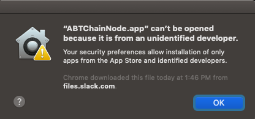
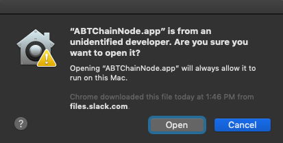
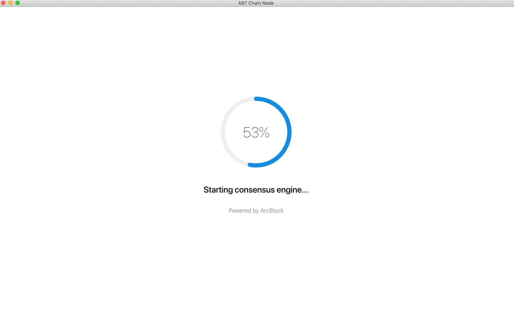
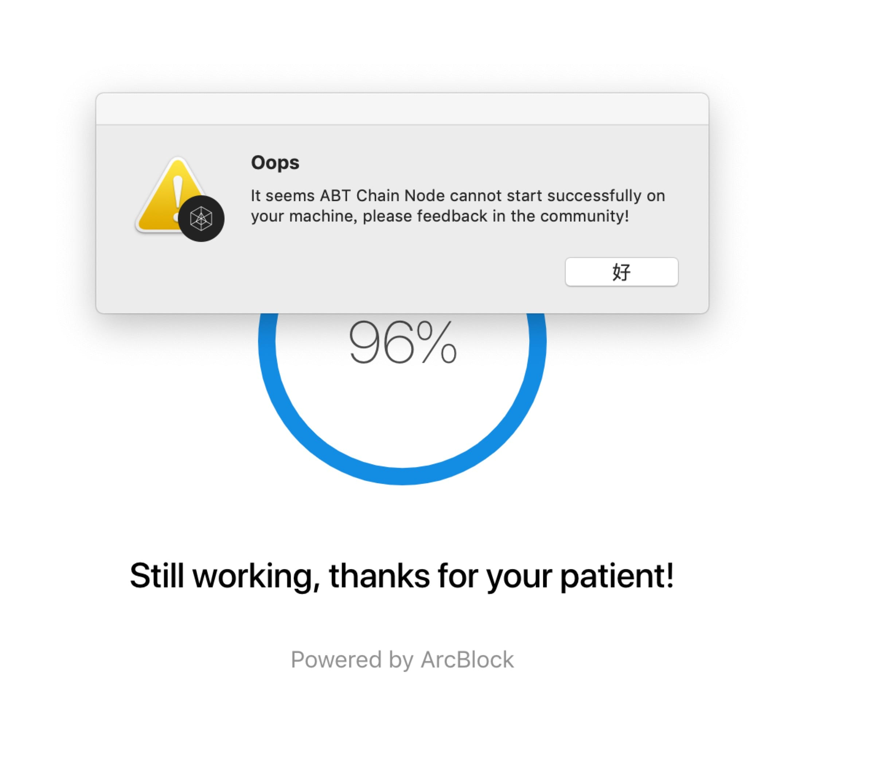

ABT 链节点是一个用户友好型应用程序，可以开始/管理 forge 节点。它目前为预览版本。对于 MAC OSX 和 Ubuntu 用户，我们创建了桌面版以自动管理节点开始/停止。

最新的构建使用 forge v0.22.8：

对中国用户：

- OSX：[ABT 链节点 v0.7.2 OSX 构建](http://arcblock.oss-cn-beijing.aliyuncs.com/forge/0.7.2/ABTChainNode-0.7.2.dmg)
- Ubuntu：[ABT 链节点 v0.7.2 Ubuntu 构建](https://arcblock.oss-cn-beijing.aliyuncs.com/forge/0.7.2/ABTChainNode_0.7.2_amd64.deb)

对全球用户：

- OSX：[ABT 链节点 v0.7.2 OSX 构建](http://releases.arcblock.io/node/ABTChainNode-0.7.2.dmg)
- Ubuntu：[ABT 链节点 v0.7.2 Ubuntu 构建](http://releases.arcblock.io/node/ABTChainNode_0.7.2_amd64.deb)

如果您是 OSX 用户，在下载 dmg 文件并将其拖入应用程序文件夹后，当您尝试第一次运行它时，会出现以下警告：



这是因为 ABT 链节点的当前娱乐版本尚未在 Apple 注册。如需获取更多信息，您可以查看此 KB：[https://support.apple.com/kb/ph25088?locale=en_US](https://support.apple.com/kb/ph25088?locale=en_US)。

所以，目前请不要担心。您可以通过查找找到应用程序，右键点击并选择菜单中的“打开”：


然后在弹出窗口再次点击“打开”，以允许运行：



然后，ABT 链节点就会如下成功打开：



然后等待片刻，您将看到运行节点如下：


如果您看到节点显示特定 GraphQL 错误，如下所示：


请别慌，只需点击`Command + R`刷新页面，然后它即可正常工作。

新开始的节点只会有几笔交易，如果您想生成一些交易，可以通过集成 API 操场开始模拟器：


## 如果遇到问题

如果遇到问题并受到如下错误：



很可能是因为您的 osx 缺少必要的工具链。如果您的系统中有 homebrew，可打开终端并运行以下命令：

```bash
brew install automake libtool pkg-config libffi gmp openssl
```

这可以安装密码算法相关函数的 openssl 和其他工具。如果您没有安装 homebrew，请按照以下文件的前 3 步操作：[在 OSX 安装 Forge](../install/macos.html)。

然后，返回 ABTChainNode 应用程序。应该就可以了。如果还是不行，请告诉我们。请注意，程序不支持 OSX El Captain 和更低版本。

## 特征

### 加入网络

从应用程序菜单（左上角苹果图标旁的“ABT 链节点”），选择“加入另一个网络”，然后按以下说明完成操作：


然后点击“继续”并输入网络 URL：


目前选择为：

- https://bromine.abtnetwork.io/api
- https://titanium.abtnetwork.io/api

请注意，bromine 每晚更新，所以我们不能保证它始终在线。

提供 url 后，点击“OK”，您的本地数据将被擦除，在 forge 重启后，您的节点会与远程节点同步。

### 重置链状态

从应用程序菜单，选择“重置链状态”，然后安装说明完成操作。


点击“继续”后，您将丢失所有现有数据。然后，您可以点击“退出”并重启 ABT 链节点，以获得完全刷新的节点。如果您没有退出，链会按照当前配置运行。

::: warning
请注意，加入新网络/重置链状态意味着，您的本地数据将被擦除。如果您想保存自己的数据，请将其备份并随后恢复。ABT 链节点生成的所有数据都存储在`~/.forge_desktop`。
:::

<!--stackedit_data:
eyJoaXN0b3J5IjpbMTc0NjgxNzIyMSwxOTU2ODkwODQ4LC0xNz
IwNTUxOTMxXX0=
-->
