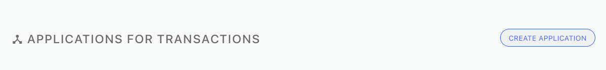
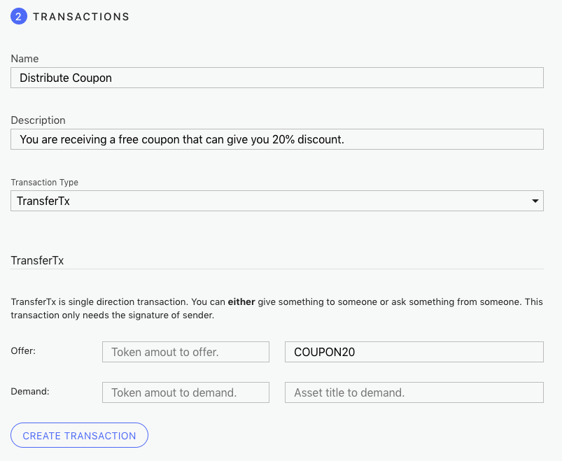

# DApps Workshop

The DApps Workshop lets developers create and test different types of transaction workflows and DID-based authentication requirements for any Forge-built application.

Today, DApps Workshop includes support for:

- Trade-related transactions
- Prebuild workflows and process/rules for all supported Tx types including multi-transaction scenarios
- DID-based authentication including identity Types, DSA (Digital Signature algorithm) algorithms and Hash functions
- Configurable metadata
- Defining required claims including profiles and agreements
- ABT Wallet mobile authentication

## How to run

- [Install Forge CLI](https://docs.arcblock.io/forge/latest/tools/forge_cli.html#install-forge-cli)
- Run command `forge init`, users form China, please run `forge init --mirror http://arcblock.oss-cn-beijing.aliyuncs.com`
- Run command `forge start` to start a Forge chain locally.
- Run command `forge workshop start`
- Then `forge workshop open` or just visit [http://localhost:8807](http://localhost:8807)

[Watch a demo of here](https://youtu.be/4sGgS9dcvxc)

## How to use

DApps Workshop is a place where you can quickly create and test prototypes of your applications. Here you can see how the ABT wallet and your application will work together to finish the authentication process and to process various transactions supported by Forge. You can create different application prototypes to experience these two aspects separately.

### Authentication

This part of DApps Workshop lets you see how the ABT wallet and a forge-built application will interact with each other to finish the authentication process under DID Authentication Protocol.

- Step 1: Click the button under Authentication section.
  
- Step 2: Choose the DID type, DSA algorithm and the Hash algorithm to generate a DID.
  
- Step 3: Input the basic information of your application prototype.
  
- Step 4: Choose the profiles for users to provide and agreements for users to sign during the authentication process.
  
- Step 5: Scan the QR code in the ABT wallet to finish the authentication process.
  
- Step 6: If the authentication process finished successfully, you would be able to see the user information on the web page.
  
- Step 7: Instead of using the ABT wallet, you can also use the web wallet to test the authentication process.

### Transaction

This part of DApps Workshop lets you quickly create a prototype of a Forge application and lets you to see how the ABT wallet and your application will work together to finish various transactions through workflows.

- Step 1: Go to the Transactions section.
  

- Step 2: Click the CREATE APPLICATION button.
  

- Step 3: Fill up the following fields for an application prototype. The first three fields will affect how your application looks like on the ABT wallet.
  
  - `Name`: The name of your application.
  - `Description`: The detailed description of your applications.
  - `Icon URL`: The URL to the logo of your application.
  - `Deep link Path`: The deep link path used by ABT wallet. We suggest you to use the default value for now.
  - Click `SAVE & CONTINUE`.

- Step 4: Create a transaction.
  
  - Select `TransferTx` in Transaction Type drop down menu.
  - Input a name and a description for this transaction. Users will see this information on ABT wallet.
  - Input `COUPON20` in "Asset to offer" field.
  - Click `Create Transaction` button.

- Step 5: Use wallet to send transaction.

  - **Make sure your ABT wallet and the workshop server are inside the sane local network.**
  - Open your ABT wallet
  - Scan the QR code of this TransferTx
  - Follow the guide to finish this transaction.
  - Now you should see an account declared for this application, and there is an asset representing the coupon belongs to this account.

- Step 6: One more transaction.
  
  - Select `ExchangeTx` in Transaction Type drop down menu.
  - Input a name and description for this transaction.
  - Input `CELLPHONE` in field "Asset to offer", input `80` in field "Token to demand" and input `COUPON20` in field "Asset to demand".
  - Click `Create Transaction` button.

- Step 7: Use the wallet to finish this transaction. After you finish the transaction, you will give 80 TBA tokens and the coupon asset to the application but will receive a new asset representing a cellphone.

[learn more about setting up a transaction POC here](https://youtu.be/-QZOQ6SiAvI)
  
#### Explanation to Transactions

  - `PokeTx`: This transaction gives tokens to accounts for free. But an account can only receive tokens through this transaction once a day. If your account does not have any tokens to do transactions, this one will be very helpful.

  - `TransferTx`: This transaction is one-way transfer. You can use this transaction to give tokens and/or assets to wallet users or to ask them for token and/or assets. In the previous example we used this transaction to mimic a coupon distribution process.

  - `ExchangeTx`: This is a two-way transfer meaning both the application and the user are giving something to the other. In the previous example, we used this transaction to mimic the process to purchase a cellphone with a coupon. You can create another `ExchangeTx` which offers the same cellphone asset but only demands 100 tokens. This will give you a more realistic prototype where the `COUPON20` asset does bring 20% discount to users.

  - `UpdateAssetTx` and `ConsumeAssetTx`: Both of these two transactions are used to modify the asset in a certain way. The former one can update the data inside an asset, for example, change how many times a coupon asset can be used. The latter one is used to consume an asset. For example, once a ticket asset is consumed, it is not updatable nor transferable any more.

  - `Proof of Holding`: This operation does not send any transaction to the blockchain. This is designed to let the application ask users to prove they have the ownership of something. Now we support asking people to prove they at least have a certain amount of token and/or asking people is possess of a certain asset.
