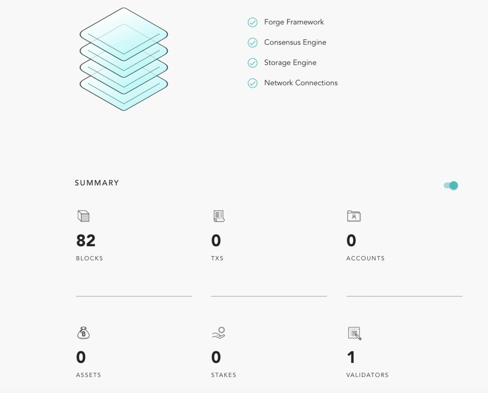
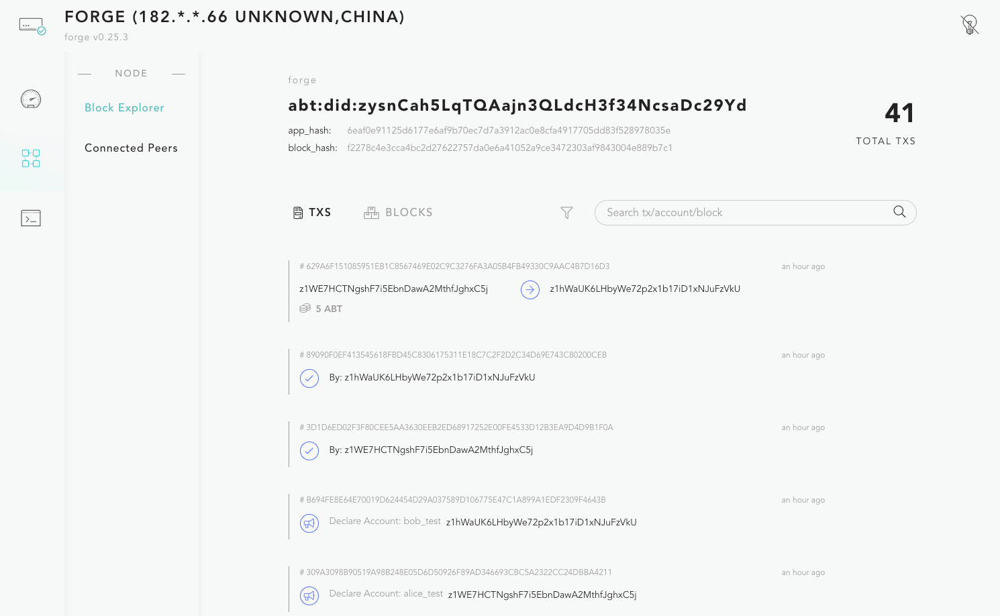
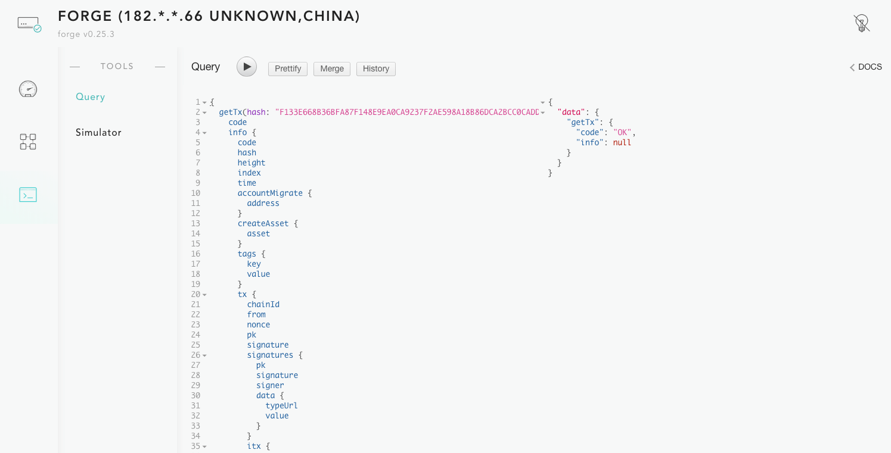

Unlike most of the blockchain products, Forge ships with a web interface that contains rich functionalities.

## Main components of Fore Web

After launching your node with `forge web open`, you will see that the application sidebar includes several primary components:

- The Dashboard
- Node Management
- Developer tools.

- The Dashboard: is the summary of information about the chain data stored on this node, as well as the health status of this node including the current state of the node, storage, consensus and more.
- Node Management:
  - Block Explorer: a convenient tool to view all transactions happening on your chain, and new blocks being generated. You can always view the ABT Network status as well we https://explorer.abtnetwork.io for information about the entire network.
  - Connected peers: other nodes connected to your chain node. Since ABT Blockchains Node is just a member in the ABT chain, it needs to sync data from other chain nodes. This connected peer map shows the location of the nodes that are currently being synced.
- Developer Tools: This area allows developers to easily debug your application, as well as simulate transactions, test and run different decentralized identity (DID) scenarios and a place to make GraphQL requests to query data. More info about Graphql is here.

## How to use the Dashboard?

Anytime you log in to your ABT Blockchain Node, the “dashboard view” is the default view showing you the current status of your node. There are several important details shown to you that you should be aware of:

- Node health status: An interactive diagram where you can see the real-time health status of the different layers of your ABT Node
  Node info summary: summary of all the data in this node
- Transactions: a time-series diagram of all the transactions on your node
- Top accounts: information about top accounts on this node, sorted by their account balance
- Top validators: information about top validators on this chain.

## How to explore your chain data?

Every node stores the data of the entire chain, including all transactions and accounts. Access to this information gives you a complete picture of what activities have been happening on the chain. To answer questions like: who transferred that money to my account, which account is the most active one on this chain, etc, all you need is an ABT Blockchain Node.

There are two primary ways to explore your chain data - block explorer and developer tools - that can support different use cases and give you different options on how to access and use the data being presented to you.

**Block Explorer:**

- Pros:
  - Convenient and easy to use
  - Easy to understand, doesn’t require extra knowledge
  - similar to traditional search engine
- Cons:
  - Less flexibility
  - Only search for account/tx etc

**Developer tools:**

- Pros:
  - Very flexible to query anything you want and define the response you want to get
  - More control over the request and response
- Cons:
  - Requires extra GraphQL knowledge to use and understand

If you want to learn more about how to build a blockchain application, please visit our “Getting Started” documentation [here](../../intro/quickstart).
