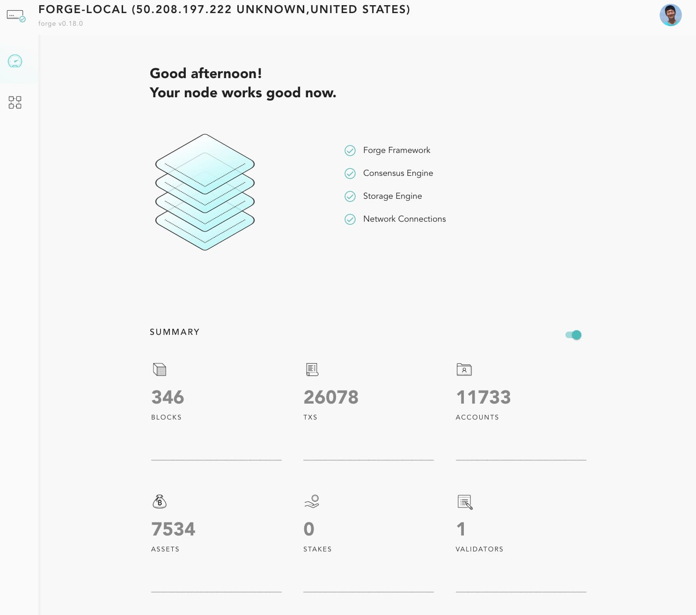
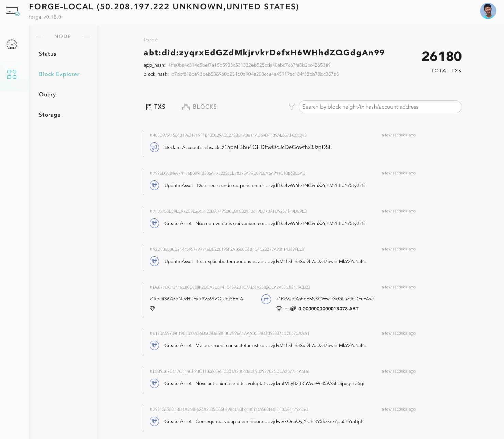

## 快速入门

::: 建议

如果您是 MAC OSX 或 ubuntu 用户，我们为您准备了一个桌面版本（预览版），可以准备好节点并使其尽快开始运行。请访问[ABT Chain Node](../tools/abt_chain_node.md)获取更多信息。

:::

如果您想快速尝试 Forge 框架，可随意安装 Forge CLI 工具：

```bash
$ npm install -g @arcblock/forge-cli
```

然后，您可以进行`forge init`以从我们的发布中下载最新的 forge 资产：

```bash
$ forge init
✔ initialized cache dir for forge-cli: /Users/tchen/.forge_cli/cache
✔ initialized release dir for forge-cli: /Users/tchen/.forge_cli/release
ℹ Detected platform is: darwin
✔ Latest forge release version: v0.18.2
✔ Release asset info fetch success forge_darwin_amd64.tgz
ℹ Downloading forge_darwin_amd64.tgz |████████████████████████████████████████ 100% || 88.17/88.17 MB
✔ Downloaded forge_darwin_amd64.tgz to /tmp/forge_darwin_amd64.tgz
✔ Expand release asset /tmp/forge_darwin_amd64.tgz to /Users/tchen/.forge_cli/release/forge/0.18.2
✔ Extract forge config from /Users/tchen/.forge_cli/release/forge/0.18.2/lib/forge_sdk-0.17.0/priv/forge_release.toml
✔ Forge config written to /Users/tchen/.forge_cli/forge_release.toml
✔ Release asset info fetch success forge_starter_darwin_amd64.tgz
ℹ Downloading forge_starter_darwin_amd64.tgz |████████████████████████████████████████ 100% || 12.19/12.19 MB
✔ Downloaded forge_starter_darwin_amd64.tgz to /tmp/forge_starter_darwin_amd64.tgz
✔ Expand release asset /tmp/forge_starter_darwin_amd64.tgz to /Users/tchen/.forge_cli/release/forge_starter/0.18.2
✔ Release asset info fetch success simulator_darwin_amd64.tgz
ℹ Downloading simulator_darwin_amd64.tgz |████████████████████████████████████████ 100% || 18.81/18.81 MB
✔ Downloaded simulator_darwin_amd64.tgz to /tmp/simulator_darwin_amd64.tgz
✔ Expand release asset /tmp/simulator_darwin_amd64.tgz to /Users/tchen/.forge_cli/release/simulator/0.18.2
✔ Congratulations! forge initialized successfully!

Now you can start a forge node with forge start
```

请注意，forge 目前尚处在非常早期的阶段，我们只构建了 osx 和 ubuntu 16.04 构件。我们会尽快为更多平台提供构件。

如果您试图在 ubuntu 16.04 机器上安装 forge，请查看[Ubuntu 安装指南](../install/ubuntu.md)。

完成初始化后，forge-cli 会将构件放入`~/.forge_cli`文件夹：

```bash
$ tree .forge_cli -L 4
.forge_cli
├── cache
├── forge_release.toml
└── release
    ├── forge
    │   ├── 0.18.2
    │   │   ├── bin
    │   │   ├── erts-10.2.3
    │   │   ├── lib
    │   │   └── releases
    │   └── release.yml
    ├── forge_starter
    │   └── 0.18.2
    │       ├── bin
    │       ├── erts-10.2
    │       ├── lib
    │       └── releases
    └── simulator
        ├── 0.18.2
        │   ├── bin
        │   ├── erts-10.2
        │   ├── lib
        │   └── releases
        └── release.yml
```

一共为您安装了 3 个应用程序和 2 个配置文件：

- forge：forge 核心功能的 erlang 版本。
- forge_starter：带开始/重启/升级 forge 的 erlang 版本。您可将其视为专门构件的简化系统。`forge`文件夹下的`release.yml`由 forge 启动器用于启动当前的 forge 版本，如果此版本不可成功启动，则 forge 启动器会退回至`release.yml`中定义的旧版本。
- 模拟器：一个帮助生成模拟数据的 erlang 版本。基本来说，它会创建一万个钱包并在钱包间随机进行各种类型的 tx。

`forge_release.toml`是 forge 的主要配置，您可以编辑此文件以调整 forge 的行为。目前，我们只使用默认配置。如需了解关于配置的更多信息，请查看[Forge 配置指南](../core/configuration.md)。

然后，您便可以运行`forge start`以启动 forge 了：

```bash
08:33 $ forge start
✔ Forge daemon successfully started
┌───────────────┬──────────┬───────────────┬───────────────┬────────────────────┐
│ Name          │ PID      │ Uptime        │ Memory        │ CPU                │
├───────────────┼──────────┼───────────────┼───────────────┼────────────────────┤
│ starter       │ 37339    │ 5s            │ 82.1 MB       │ 25.00 %            │
│ forge         │ 37520    │ 4s            │ 473 MB        │ 139.75 %           │
│ ipfs          │ 37696    │ 2s            │ 18 MB         │ 4.50 %             │
│ tendermint    │ 37701    │ 2s            │ 18.2 MB       │ 6.00 %             │
└───────────────┴──────────┴───────────────┴───────────────┴────────────────────┘

ℹ If you want to access interactive console, please run /Users/tchen/.forge_cli/release/forge/0.18.2/bin/forge remote_console
```

默认情况下，forge 作为守护进程启动，且会引出共识引擎和存储引擎——目前，我们分别使用 tendermint/ipfs。

所有数据（共识 db、forge 状态 db、存储）、配置和日志存储于在`forge_release.toml`定义的路径中。默认情况下，其位于`~/.forge_release`下。您可随意将路径修改为`/var/data/forge`或`/mnt/forge`等。在本文件中，为了简便，我们将用`$FORGE_HOME`代表本路径。

祝贺您！现在您的本地 forge 节点已成功启动了！如需了解`forge-cli`支持的命令的更多信息，请访问：[Forge CLI](../tools/forge_cli.md)。

## Forge 日志

日志是 forge 和其用户之间的重要界面。forge 启动后，您便可在以下位置追踪日志：

- forge 日志：在`$FORGE_HOME/core/logs`下。有三个日志文件：
  - error.log：所有警告和错误。适合了解 forge 上出现的错误。
  - transaction.log：与交易处理相关的日志。
  - mempool.log：与 mempool 处理相关的日志。
- 共识日志：在`$FORGE_HOME/tendermint/logs`下。
- 存储日志：在`$FORGE_HOME/storage/logs`下。
- forge 应用程序日志：在`$FORGE_HOME/app/logs`下。

如需了解关于 forge 日志的详细信息，请查看：[Forge 日志](../core/log.md)。

## Forge 网页

现在，您对 forge 的启动有了基本的了解，您可能想看看如何在 forge 内获取交易和存储数据概览。在您的`forge_release.toml`配置中，forge 网页默认启动，因此，你可以直接前往浏览器并打开`http://localhost:8210`。您会看到如下页面：


目前，forge 网页有以下功能：

- 控制面板：为您提供链上发生事件的概览。
- 区块探索器：查看和搜索链上数据/状态。
- RPC 操场：为你提供操场，与 forge 提供的 RPC 互动。

如需了解关于 forge 网页的更多信息，请前往：[Forge 网页](../tools/forge_web.md)。

## 发送交易

forge 网页非常棒，但是空白数据可能让您心烦。如需生成一些模拟交易，我们为您提供一个名为`forge-simulator`的工具，以生成钱包，为您提供便利。您只需运行：

```bash
$ forge simulator start
```

模拟器将启动，一段时间之后，在您的 forge 网页，便可以看到交易生成。模拟器首先会创建 10,000 个钱包，然后会在钱包间发送交易。

一段时间后，您的 forge 网页控制面板会如下所示：



forge 区块探索器则拥有您可查看的数据：



如需了解关于 forge 模拟器的更多信息，请访问：[Forge 模拟器](../tools/forge_simulator.md)。

## 创建钱包和发送您自己的 tx

现在，您可以创建自己的钱包并发送自己的 tx 了。我们前往[发送您的首个 tx](./transaction.md)

## Forge SDK

如果您想立刻开始编程，我们为您准备了 SDK：

- [Forge JavaScript/NodeJS SDK](../sdk/javascript.md)
- [Forge Python SDK](../sdk/python.md)
- [Forge Elixir SDK](../sdk/elixir.md)

## 想了解更多信息吗

请看看[Forge 内有什么](./inside-forge.md)！

<!--stackedit_data:
eyJoaXN0b3J5IjpbMTI5NzA1NzkxOSwzNDkwMjQ5NjMsMjA3MT
A3ODI0MiwtMTg5NjM5MDA0NywtMTA1ODExMjk2NiwtMTE5NjM0
MTkyNCwxMTMzMTQyOTk3LC03MTk4MDg3NjgsMTg3MDEwNTgxNi
wyMDE4OTYxMzEwLDgyMzYzMDEyXX0=
-->
