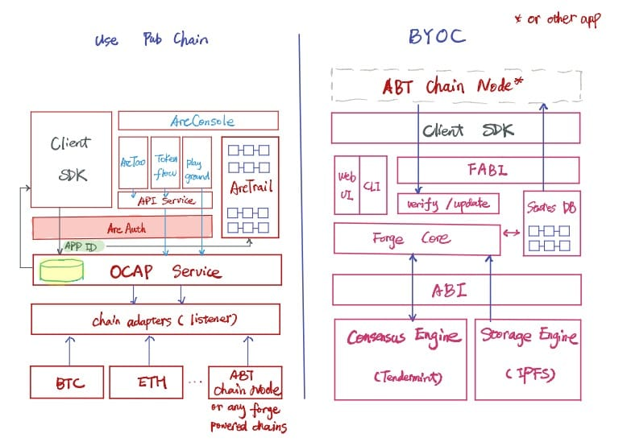

# 关于 Forge 的更多信息

现在您应该对 Forge 有了一定的了解。我们来深入看一下。

在 ArcBlock，我们提供的解决方案可使开发者轻松地通过公共链（如 BTC、ETH）和应用程序链（BYOC——带您自己的链）构建 dApps：

Forge 专为希望拥有自己的专属链，而非将一切挤在已经拥挤不堪的以太坊的去中心化应用程序提供服务。

在我们的构思中，在 Forge 上构建链应该和在 Rails 上创建网页应用程序一样简单。这就是为什么我们构建了包含多种特征的完整架构：

- 内置可置换共识引擎。目前，我们使用[tendermint](https://tendermint.com/docs/)。只要遵守 ABCI 协议和落实的共识引擎协议，您就可以运行不同的共识引擎。
- 内置可置换存储引擎（试验）。目前，我们使用[ipfs](https://ipfs.io/)。与共识引擎相同，它遵守存储引擎协议。
- 内置 MPT 支持的状态 db。用于存储全球复制的数据。
- 可容纳大量的对 dApp 开发有帮助的交易的交易层。再次说明，Forge 的目的是帮助开发者创建应用程序，而不仅是作为一个资产链（尽管它可被完美地用作纯资产链）。
- 强大的 CLI，可减轻大部分日常工作
- 即用 UI，以探索链并管理账户/状态

## Forge 支持的交易

forge 支持的交易有很多。我们可以将其分为 4 组：

- 资产相关：帮助创建和操控不可替代资产。
- 声明相关：声明链中内容。
- 转移相关：在账户间转移代币和资产。
- 线上治理相关：创建调查、投票、抵押/取消抵押、签到、升级等。

### 资产相关 tx

资产是 Forge 中的一个重要概念，用户可用它创建可被转移、使用和证明所有权的独特数字资产。资产可以是票券、证书、游戏中的工具等。为支持资产，Forge 提供以下交易：

- create_asset：使用户可以创建资产。
- update_asset：使用户可以更新拥有的资产。
- consume_asset：使用户可以在特定的场合中使用资产。例如，在电影院入口使用电影票。

### 声明相关 tx

用户可通过声明资产以将资产上链。

- declare：在链中注册钱包。
- declare_node：在链中声明节点。
- declare_file：在链中声明文件（存储于存储引擎）。

### 转移相关 tx

在 Forge 中，用户可转移或交换资产/代币：

- 转移：从一个账户向另一个账户转移代币和资产。
- 交换：在账户间交换代币/资产。可用于以下场景中：
  - 投标服务。一群人可以发送交换 tx 以对资产投标，且资产所有者可选择自己喜欢的那一个并签署，以完成交易。
  - 电子商务。资产所有者可为资产的交换交易标价，任何对该价格感兴趣的人可以签署此 tx 以完成交易。

如需了解交易的更多信息，请查看[Forge 交易](../txs)。

<!--stackedit_data:
eyJoaXN0b3J5IjpbLTE2MzYwOTk1MDgsLTYwNTMwMzczNywxOT
c3NTQ4NDQ0LC03OTY2MDk2MjcsLTY4MzIzNDI0XX0=
-->
