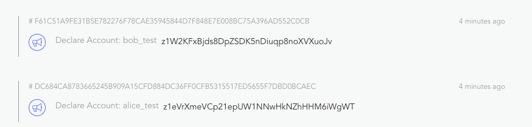

如果您是来自传统网页开发的开发者，不熟悉区块链，请先查看[一般概念](../intro/concepts.md)。

Forge Javascript SDK 方便开发者在 forge 上构建应用程序，它提供精炼简单的 api，帮助开发者完成以下任务：

- 只使用 javascript 创建并操控钱包：[@arcblock/mcrypto](https://docs.arcblock.io/forge/sdks/javascript/latest/module-@arcblock_mcrypto.html)，[@arcblock/forge-wallet](https://docs.arcblock.io/forge/sdks/javascript/latest/module-@arcblock_forge-wallet.html)
- 通过[GraphQLClient](https://docs.arcblock.io/forge/sdks/javascript/latest/GraphQLClient.html)或[GRpcClient](https://docs.arcblock.io/forge/sdks/javascript/latest/GRpcClient.html)读/写链上数据
- 导出/验证在不同 forge 成分中广泛使用的 DID：[@arcblock/did](https://docs.arcblock.io/forge/sdks/javascript/latest/module-@arcblock_did.html)，[@arcblock/did-util](https://docs.arcblock.io/forge/sdks/javascript/latest/module-@arcblock_did-util.html)
- 组装/编码/签署可发送至任何 forge 支持的区块链的交易

现在，我们来看看详细指南，告诉您如何写简单的 javascript 程序，而且这些程序在其他区块链平台上可能需要数天或数周才能完成：

1. 在 forge 支持的区块链上创建两个用户账户（`Alice`和`Bob`），您可通过[forge-cli](../tools/forge_cli.md)轻松设置并运行；
2. 为新创建的账户获取 25 个免费账户
3. 从`Alice`向`Bob`转移 5 个代币，检查余额

整个流程覆盖典型网络应用程序可进行的所有任务，例如：

- 设置数据库，每个区块链都是一个公共可验证的数据库
- 创建用户账户（注册/登录）
- 为用户升级状态（代币/资产）
- 用户间交易（转移/交换）

## 开始

### 1. 设置运行节点

您无需设置即可继续到下一步，因为 forge javascript sdk 的设计使其可搭配任何 forge 支持的区块链使用。

如果您对在本地机器上运行链节点感兴趣，请花 10 分钟看看我们非常棒的命令线工具：[forge-cli](../tools/forge_cli.md)并开始节点。

您的链节点开始后，运行`forge web open`以验证链的网页控制面板/探索器已启动并运行。如果链节点的网页控制面板无错误加载，则表明控制面板已设置完毕，我们可以使用`http://127.0.0.1:8210/api`作为 graphql 端点。

如果您更希望使用现有链（公共沙箱数据库），请记住在我们的公共测试链端点以下方代码替换端点：`https://test.abtnetwork.io/api`。

### 2. 启动 javascript 项目

```bash
mkdir -p /tmp/hell-forge
cd /tmp/hello-forge
npm init -y
```

### 3. 创建用户账户（钱包）

密码编码很难！所以我们创建了一个多语言的数据包，名为`mcrypto`和实用工具图书馆`forge-wallet`，帮助开发者操控与 forge 兼容的钱包。

为了创建用户账户，我们首先需要配置账户的一些属性。

添加以下依赖：

```bash
yarn add @arcblock/forge-wallet @arcblock/mcrypto -S
touch index.js
```

然后，创建 2 个名为`Alice`和`Bob`的钱包，包含随机密钥 (`edit index.js`)：

```javascript
const { types } = require("@arcblock/mcrypto");
const { fromRandom, WalletType } = require("@arcblock/forge-wallet");

const type = WalletType({
  role: types.RoleType.ROLE_ACCOUNT,
  pk: types.KeyType.ED25519,
  hash: types.HashType.SHA3
});

const alice = fromRandom(type);
const bob = fromRandom(type);

console.log({ alice: alice.toJSON(), bob: bob.toJSON() });
```

运行`node index.js`，我们会得到：

```text
{ alice:
   { type:
      { role: 'ROLE_ACCOUNT',
        pk: 'ED25519',
        hash: 'SHA3',
        address: 'BASE58' },
     sk:
      '0xc5ef518f75347742858640e5685025dd7259e4417e037d65b68884ca8ea0068f03181ad64f61302de1f12903c99f6fd48da48b941391e0e0c85c6205b43cbd13',
     pk:
      '0x03181ad64f61302de1f12903c99f6fd48da48b941391e0e0c85c6205b43cbd13',
     address: 'z1icz5RNZuPRhDdKWg1GGjN1fcJ5NwccWpd' },
  bob:
   { type:
      { role: 'ROLE_ACCOUNT',
        pk: 'ED25519',
        hash: 'SHA3',
        address: 'BASE58' },
     sk:
      '0x3bd3d37e9bcc1ab61c52cbeb63118962ed43d2877344d2288225caf2cbcab7acfdfcc9a0146cf7f30af327090bbb1def2ddb9c08465623f901977e107df4686b',
     pk:
      '0xfdfcc9a0146cf7f30af327090bbb1def2ddb9c08465623f901977e107df4686b',
     address: 'z1m8hfeWSD4fZcycrHDgpJCRTHi2sowPXBt' } }
```

> 请注意，forge 支持很多钱包类型，开发者可选择希望使用的任何类型，上述钱包类型是典型的组合型，即使在生产中，也可以继续选择这个。如需了解所有支持的钱包类型，请参考[enums](../types/enum.md)

### 4. 在链上注册用户

与传统网页应用程序上的用户注册相似，forge 需要钱包（用户账户）在链上进行自我声明，然后方可接受任何活动，如抵押、投票和从该钱包发出交易。

如需在链上注册`Alice`和`Bob`，我们将使用[GraphQLClient](https://docs.arcblock.io/forge/sdks/javascript/latest/GraphQLClient.html)：

将`@arcblock/graphql-client`作为依赖添加：

```bash
yarn add @arcblock/graphql-client moment
```

然后，创建`GraphQLClient`实例，然后在该实例调用`sendDeclareTx`：

```javascript
const { types } = require("@arcblock/mcrypto");
const { fromRandom, WalletType } = require("@arcblock/forge-wallet");
const GraphQLClient = require("@arcblock/graphql-client");

const type = WalletType({
  role: types.RoleType.ROLE_ACCOUNT,
  pk: types.KeyType.ED25519,
  hash: types.HashType.SHA3
});

const alice = fromRandom(type);
const bob = fromRandom(type);

const host = "http://127.0.0.1:8210";
const client = new GraphQLClient({ endpoint: `${host}/api` });

function registerUser(userName, userWallet) {
  return client.sendDeclareTx({
    tx: {
      itx: {
        moniker: userName
      }
    },
    wallet: userWallet
  });
}

(async () => {
  try {
    let hash = await registerUser("alice_test", alice);
    console.log("register alice tx:", hash);

    hash = await registerUser("bob_test", bob);
    console.log("register bob tx:", hash);
  } catch (err) {
    if (Array.isArray(err.errors)) {
      console.log(err.errors);
    }
    console.error(err);
  }
})();
```

再次运行`node index.js`，我们将得到：

```bash
register alice tx: DC684CA8783665245B909A15CFD884DC36FF0CFB5315517ED5655F7DBD0BCAEC
register bob tx: F61C51A9FE31B5E782276F78CAE35945844D7F848E7E008BC75A396AD552C0CB
```

打开探索器：`http://localhost:8210/node/explorer/txs`，我们可以看到，这两个账户已在链上注册：



> 上述截图来自[forge-web](../tools/forge_web.md)，保护链的内置网页控制面板和区块探索器。

> 在此使用`sendDeclareTx`向区块链写数据，支持很多其他[交易类型](../txs/README.md)。如需查看完整交易发出方式列表，请访问[GraphQLClient](https://docs.arcblock.io/forge/sdks/javascript/latest/GraphQLClient.html)。

### 5. 为`Alice`和`Bob`获得 25 颗代币

区块链最重要的用途是记录状态和转移价值，价值以代币形式展示，forge 也支持这个功能。

#### 5.1 默认账户余额

如果我们查看刚刚创建的账户，可以看到余额为`0`：

```diff
diff --git a/index.js b/index.js
@@ -13,6 +13,7 @@ const bob = fromRandom(type);

 const host = 'http://127.0.0.1:8210';
 const client = new GraphQLClient({ endpoint: `${host}/api` });
+const sleep = timeout => new Promise(resolve => setTimeout(resolve, timeout));

 (async () => {
   try {
@@ -35,6 +36,10 @@ const client = new GraphQLClient({ endpoint: `${host}/api` });
       wallet: bob,
     });
+
+    await sleep(5000);
+    const { state: aliceState } = await client.getAccountState({ address: alice.toAddress() });
+    console.log('alice.balance', aliceState.balance);
   } catch (err) {
```

> 在此，我们使用`getAccountState`从区块链读取数据，我们也可以使用 GraphQLClient 读取交易/区块/资产/链信息，请参考[GraphQLClient](https://docs.arcblock.io/forge/sdks/javascript/latest/GraphQLClient.html)获取完整的 API 列表。
> 您可能也会注意到，我们等了 5 秒才查看爱丽丝的账户，这是因为，5 秒是 forge 的区块生产暂停时间，即交易由链执行并包含在区块上最多需要 5 秒，这个暂停时间可在您的[forge config](../core/configuration.md)中配置。

#### 5.2 获取免费代币

Forge 为开发者提供特别交易类型，以免费检测代币：

```diff
diff --git a/index.js b/index.js
@@ -1,6 +1,7 @@
 const { types } = require('@arcblock/mcrypto');
 const { fromRandom, WalletType } = require('@arcblock/forge-wallet');
 const GraphQLClient = require('@arcblock/graphql-client');
+const moment = require('moment');

 const type = WalletType({
   role: types.RoleType.ROLE_ACCOUNT,
@@ -26,7 +27,24 @@ function registerUser(userName, userWallet) {
   });
 }

+function getFreeToken(userWallet) {
+  return client.sendPokeTx({
+    tx: {
+      nonce: 0,
+      itx: {
+        date: moment(new Date().toISOString())
+          .utc()
+          .format('YYYY-MM-DD'),
+        address: 'zzzzzzzzzzzzzzzzzzzzzzzzzzzzzzzzzzzz',
+      },
+    },
+    wallet: userWallet,
+  });
+}
+
 (async () => {
+  console.log('alice.address(userId)', alice.toAddress());
+  console.log('bob.address(userId)', bob.toAddress());
   try {
     let hash = await registerUser('alice_test', alice);
@@ -34,9 +52,18 @@ function registerUser(userName, userWallet) {

     const { state: aliceState } = await client.getAccountState({ address: alice.toAddress() });
     console.log('alice.balance', aliceState.balance);
+
+    hash = await getFreeToken(alice);
+    console.log('get token for alice: ', hash);
+    hash = await getFreeToken(bob);
+    console.log('get token for bob: ', hash);
+
+    await sleep(5000);
+    const { state: aliceStateNew } = await client.getAccountState({ address: alice.toAddress() });
+    console.log('alice.balanceNew', aliceStateNew.balance);
   } catch (err) {
     if (Array.isArray(err.errors)) {
       console.log(err.errors);
```

然后，再次运行`node index.js`，我们将得到：

```bash
alice.address(userId) z1WrEtEV8QfVqfdVpMgP84zjqsAyvu9JQJx
bob.address(userId) z1gnRfzPLsvMzbnETWToC2KkZPS8DAUbu64
create account for alice on chain F229BAD518FBFF992DBA427EB41BB2FA4C47B737887A69148B2158EA6B270EDF
create account for bob on chain 983A330A062DE5D6939B77BC5C95443C1B879850FAF2B07C48381E7D1D0B9584
alice.balance 0
get token for alice:  9236928CBFD03E3B5C2DBD0963E0C0F1D9CECF48CB76612AE8B97136CCC3A33F
get token for bob:  C9C3A24FB12746F4E8049AD7088B9FADE92D5991152BA14B7C86B0DBDE92E01E
alice.balanceNew 250000000000000000
```

#### 5.3 格式账户余额

您可以注意到，`Alice`的代币余额数子很大，使用大数字的原因是，这是区块链的决定性要求，我们可以将这个大数字格式化为人类可读的字符串，包含`@arcblock/forge-util`提供的函数。

> 如需获取`@arcblock/forge-util`的所有实用方式，请参考[文件](https://docs.arcblock.io/forge/sdks/javascript/latest/module-@arcblock_forge-util.html)

```bash
yarn add @arcblock/forge-util
```

改变`index.js`以格式化账户余额：

```diff
diff --git a/index.js b/index.js
@@ -1,5 +1,6 @@
 const { types } = require('@arcblock/mcrypto');
 const { fromRandom, WalletType } = require('@arcblock/forge-wallet');
+const { fromUnitToToken } = require('@arcblock/forge-util');
 const GraphQLClient = require('@arcblock/graphql-client');
 const moment = require('moment');

@@ -64,6 +65,7 @@ function getFreeToken(userWallet) {
     await sleep(5000);
     const { state: aliceStateNew } = await client.getAccountState({ address: alice.toAddress() });
     console.log('alice.balanceNew', aliceStateNew.balance);
+    console.log('alice.balanceNew.readable', fromUnitToToken(aliceStateNew.balance));
   } catch (err) {
```

再次运行`node index.js`，我们可以看到，`Alice`有 25 个代币：

```bash
alice.balanceNew 250000000000000000
alice.balanceNew.readable 25
```

> Forge allows developers to customize the token name/symbol/decimal on each chain, refer to [configuration](../core/configuration.md) for details.

### 6. 从`Alice`向`Bob`转移 5 颗代币

现在，`Alice`和`Bob`都可以在链上花钱了，我们让`Alice向`Bob`转移 5 颗代币。

在进行实际转移前，我们先做一下代码重构：提取账户余额，检查将被重新使用的帮助者函数：

```diff
diff --git a/index.js b/index.js
@@ -43,6 +43,11 @@ function getFreeToken(userWallet) {
   });
 }

+async function checkBalance(userName, userWallet) {
+  const { state } = await client.getAccountState({ address: userWallet.toAddress() });
+  console.log(`${userName}.balance`, fromUnitToToken(state.balance));
+}
+
 (async () => {
   console.log('alice.address(userId)', alice.toAddress());
   console.log('bob.address(userId)', bob.toAddress());
@@ -54,8 +59,8 @@ function getFreeToken(userWallet) {
     console.log('create account for bob on chain', hash);

     await sleep(5000);
-    const { state: aliceState } = await client.getAccountState({ address: alice.toAddress() });
-    console.log('alice.balance', aliceState.balance);
+    await checkBalance('alice.initial', alice);
+    await checkBalance('bob.initial', bob);

     hash = await getFreeToken(alice);
     console.log('get token for alice: ', hash);
@@ -64,8 +69,8 @@ function getFreeToken(userWallet) {

     await sleep(5000);
     const { state: aliceStateNew } = await client.getAccountState({ address: alice.toAddress() });
-    console.log('alice.balanceNew', aliceStateNew.balance);
-    console.log('alice.balanceNew.readable', fromUnitToToken(aliceStateNew.balance));
+    await checkBalance('alice.getToken', alice);
+    await checkBalance('bob.getToken', bob);
   } catch (err) {
     if (Array.isArray(err.errors)) {
       console.log(err.errors);
```

代币转移只是函数调用：

```diff
diff --git a/index.js b/index.js
@@ -1,6 +1,6 @@
 const { types } = require('@arcblock/mcrypto');
 const { fromRandom, WalletType } = require('@arcblock/forge-wallet');
-const { fromUnitToToken } = require('@arcblock/forge-util');
+const { fromUnitToToken, fromTokenToUnit } = require('@arcblock/forge-util');
 const GraphQLClient = require('@arcblock/graphql-client');

@@ -52,16 +52,17 @@ async function checkBalance(userName, userWallet) {
     await checkBalance('alice.getToken', alice);
     await checkBalance('bob.getToken', bob);
+
+    // Transfer
+    hash = await client.sendTransferTx({
+      tx: {
+        itx: {
+          to: bob.toAddress(),
+          value: fromTokenToUnit(5),
+        },
+      },
+      wallet: alice,
+    });
+    console.log('transfer hash', hash);
+
+    await sleep(5000);
+    await checkBalance('alice.transfer', alice);
+    await checkBalance('bob.transfer', bob);
   } catch (err) {
     if (Array.isArray(err.errors)) {
```

运行`node index.js`，我们会得到：

```bash
alice.address(userId) z1WE7HCTNgshF7i5EbnDawA2MthfJghxC5j
bob.address(userId) z1hWaUK6LHbyWe72p2x1b17iD1xNJuFzVkU
register alice 309A3098B90519A98B248E05D6D50926F89AD346693CBC5A2322CC24DBBA4211
register bob B694FE8E64E70019D624454D29A037589D106775E47C1A899A1EDF2309F4643B
alice.initial.balance 0
bob.initial.balance 0
get token for alice:  3D1D6ED02F3F80CEE5AA3630EEB2ED68917252E00FE4533D12B3EA9D4D9B1F0A
get token for bob:  89090F0EF413545618FBD45C8306175311E18C7C2F2D2C34D69E743C80200CEB
alice.getToken.balance 25
bob.getToken.balance 25
transfer hash 629A6F151085951EB1C8567469E02C9C3276FA3A05B4FB49330C9AAC4B7D16D3
alice.transfer.balance 20
bob.transfer.balance 30
```

现在，我们完成了 Forge Javascript SDK 的第一个程序，您已经很熟悉在 forge 支持的区块链上写程序的基础步骤了。

目前，完整的源代码是：

```javascript
const { types } = require("@arcblock/mcrypto");
const { fromRandom, WalletType } = require("@arcblock/forge-wallet");
const { fromUnitToToken, fromTokenToUnit } = require("@arcblock/forge-util");
const GraphQLClient = require("@arcblock/graphql-client");
const moment = require("moment");

const type = WalletType({
  role: types.RoleType.ROLE_ACCOUNT,
  pk: types.KeyType.ED25519,
  hash: types.HashType.SHA3
});

const alice = fromRandom(type);
const bob = fromRandom(type);

const host = "http://127.0.0.1:8210";
const client = new GraphQLClient({ endpoint: `${host}/api` });
const sleep = timeout => new Promise(resolve => setTimeout(resolve, timeout));

function registerUser(userName, userWallet) {
  return client.sendDeclareTx({
    tx: {
      itx: {
        moniker: userName
      }
    },
    wallet: userWallet
  });
}

function getFreeToken(userWallet) {
  return client.sendPokeTx({
    tx: {
      nonce: 0,
      itx: {
        date: moment(new Date().toISOString())
          .utc()
          .format("YYYY-MM-DD"),
        address: "zzzzzzzzzzzzzzzzzzzzzzzzzzzzzzzzzzzz"
      }
    },
    wallet: userWallet
  });
}

async function checkBalance(userName, userWallet) {
  const { state } = await client.getAccountState({
    address: userWallet.toAddress()
  });
  console.log(`${userName}.balance`, fromUnitToToken(state.balance));
}

(async () => {
  console.log("alice.address(userId)", alice.toAddress());
  console.log("bob.address(userId)", bob.toAddress());
  try {
    // Register
    let hash = await registerUser("alice_test", alice);
    console.log("register alice", hash);
    hash = await registerUser("bob_test", bob);
    console.log("register bob", hash);

    await sleep(5000);
    await checkBalance("alice.initial", alice);
    await checkBalance("bob.initial", bob);

    // Get token
    hash = await getFreeToken(alice);
    console.log("get token for alice: ", hash);
    hash = await getFreeToken(bob);
    console.log("get token for bob: ", hash);

    await sleep(5000);
    const { state: aliceStateNew } = await client.getAccountState({
      address: alice.toAddress()
    });
    await checkBalance("alice.getToken", alice);
    await checkBalance("bob.getToken", bob);

    // Transfer
    hash = await client.sendTransferTx({
      tx: {
        itx: {
          to: bob.toAddress(),
          value: fromTokenToUnit(5)
        }
      },
      wallet: alice
    });
    console.log("transfer hash", hash);

    await sleep(5000);
    await checkBalance("alice.transfer", alice);
    await checkBalance("bob.transfer", bob);
  } catch (err) {
    if (Array.isArray(err.errors)) {
      console.log(err.errors);
    }
    console.error(err);
  }
})();
```

## 想了解更多吗

以下是帮助您获取更多信息的资源：

- [Forge Javascript SDK API 参考](https://docs.arcblock.io/forge/sdks/javascript/latest/)
- [GraphQLClient 高级示例](https://github.com/ArcBlock/forge-js/tree/master/packages/graphql-client/examples)
- [GRpcClient 高级示例](https://github.com/ArcBlock/forge-js/tree/master/packages/grpc-client/examples)

此外，我们正在设计更多可帮助您掌握在 forge 构建应用程序的文件，请不要错过！

## 要报告问题吗

如果您在任何步骤遇到问题，请在我们的[GitHub Repo](https://github.com/ArcBlock/forge-js/issues)报告问题

<!--stackedit_data:
eyJoaXN0b3J5IjpbLTIwMzg5MDgwMjksMjAwMzQyNjMxLDE5OT
A1MDE2NjcsLTEzOTc1ODQ5NjAsMTg4NTEzNTgyMywtOTkxNDgy
OTUyXX0=
-->
